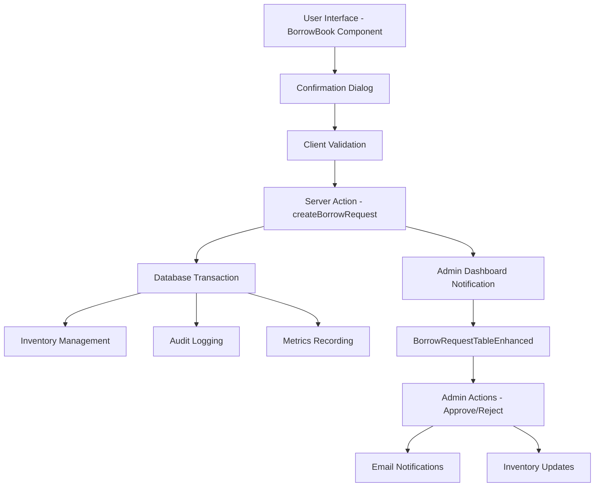
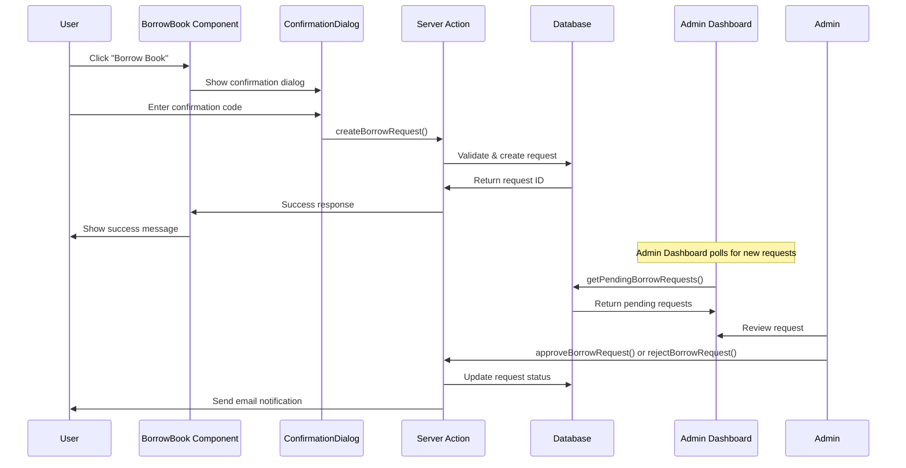
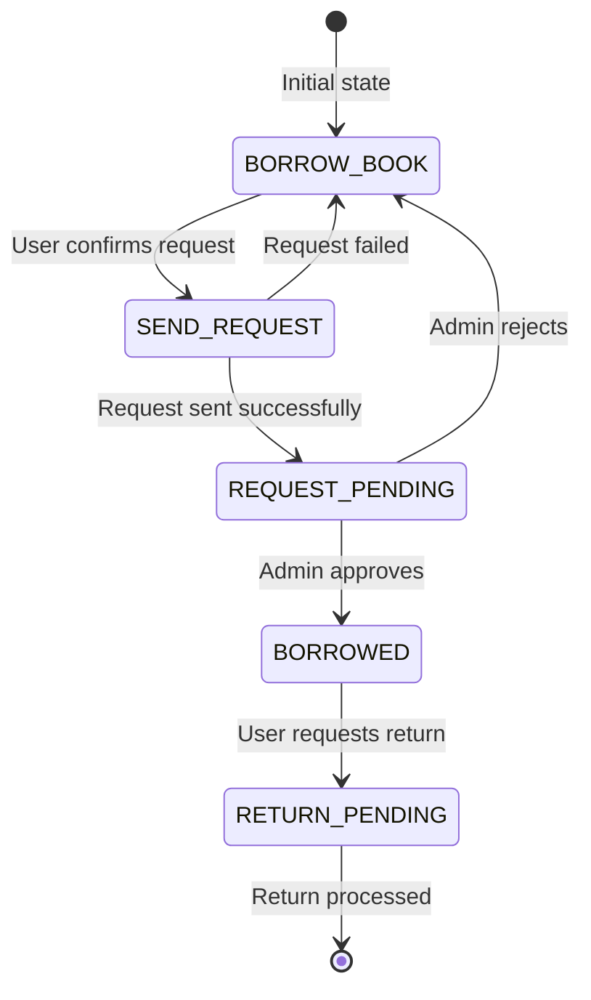
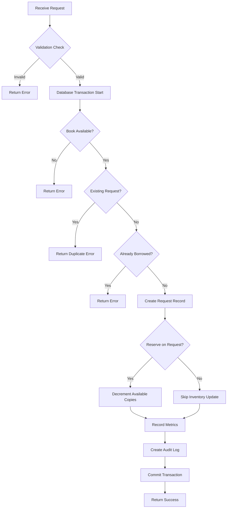
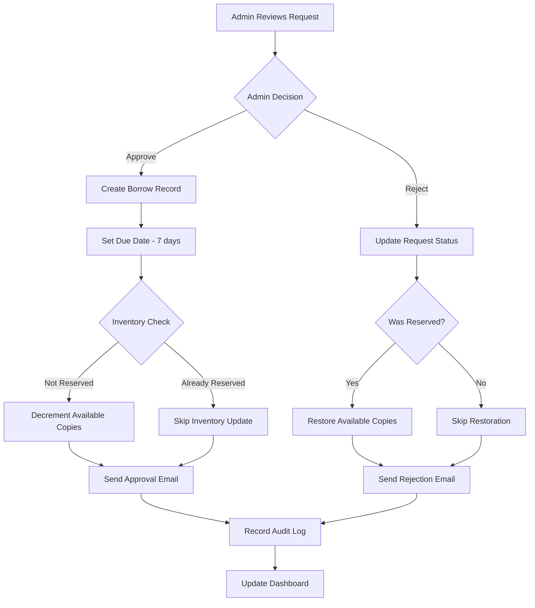
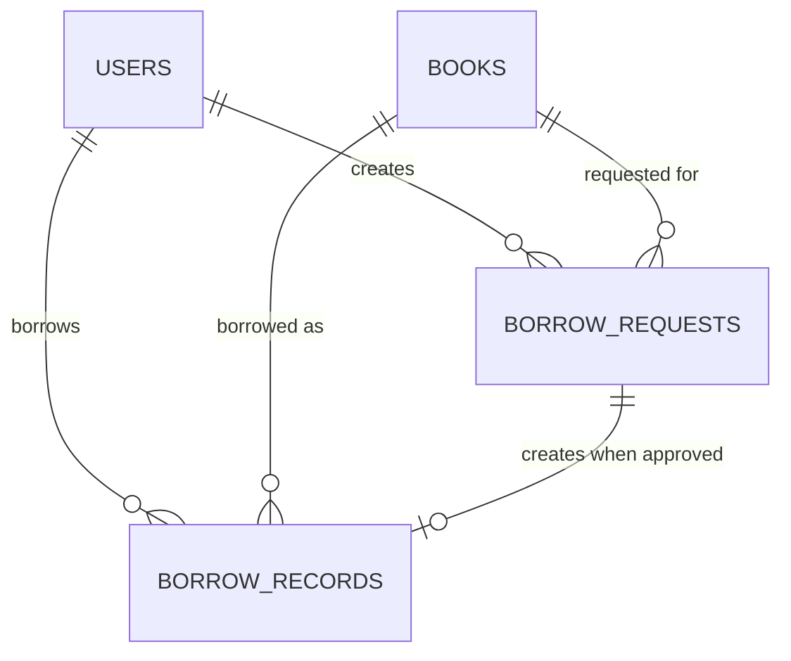

# Borrow Request Flow Design

## Overview

This document outlines the design for the borrow request functionality in the university Learning Management System (LMS). The system allows users to request books through a button click with confirmation code validation, and routes these requests to the admin dashboard for approval or rejection.

## Architecture

### System Components

The borrow request flow involves several key components working together:



### Data Flow Architecture



## Component Architecture

### BorrowBook Component

The main interface component responsible for handling user interactions:

**Component State Management:**

- `buttonState`: Manages the current state of the borrow button
- `borrowRecordId`: Tracks active borrow record
- `dueDate`: Stores the due date for borrowed books
- `showBorrowDialog`: Controls confirmation dialog visibility

**State Transitions:**



**Button States and Behaviors:**
| State | Display | Action | Clickable |
|-------|---------|--------|-----------|
| BORROW_BOOK | "Borrow Book" | Show confirmation dialog | Yes |
| SEND_REQUEST | "Sending Request..." | Loading state | No |
| REQUEST_PENDING | "Request Pending" | Show status message | No |
| BORROWED | "Return Request" | Show return dialog | Yes |
| RETURN_PENDING | "Return Pending" | Show status message | No |
| NOTIFY_ME | "Notify Me" / "Cancel Notification" | Toggle notification | Yes |

### ConfirmationDialog Component

Handles user confirmation with validation:

**Validation Logic:**

- Accepts "confirm" keyword
- Accepts partial book title matches
- Minimum 5 characters required
- Case-insensitive comparison

**Props Interface:**

```typescript
interface ConfirmationDialogProps {
  open: boolean;
  onOpenChange: (open: boolean) => void;
  title: string;
  description: string;
  placeholder: string;
  onConfirm: (confirmationText: string) => void;
  confirmButtonText: string;
}
```

### Admin Dashboard Components

**BorrowRequestTableEnhanced Features:**

- Real-time request display
- Search and filter functionality
- Bulk action capabilities
- Status indicators with timestamps
- User and book information display

**Table Columns:**

- User information (name, email, university ID)
- Book details (title, author, cover)
- Request timestamp
- Action buttons (Approve/Reject)

## Business Logic Layer

### Request Creation Flow

**Server Action: createBorrowRequest**



**Validation Rules:**

1. Confirmation text minimum 5 characters
2. Book exists and is available
3. No pending request for same book
4. User doesn't already have book borrowed
5. User meets borrowing eligibility criteria

**Inventory Management:**

- **Reserve on Request**: If enabled, inventory is decremented immediately upon request
- **Reserve on Approval**: If disabled, inventory is decremented only when admin approves

### Request Processing Flow

**Admin Actions:**



**Approval Process:**

1. Validate request exists and is pending
2. Create borrow record with 7-day due date
3. Update request status to "APPROVED"
4. Handle inventory based on reservation policy
5. Send email notification to user
6. Record audit trail

**Rejection Process:**

1. Validate request exists and is pending
2. Update request status to "REJECTED"
3. Restore inventory if previously reserved
4. Send email notification with optional admin notes
5. Record audit trail

## Data Models & ORM Mapping

### Database Schema

**Borrow Requests Table:**

```sql
CREATE TABLE borrow_requests (
    id UUID PRIMARY KEY DEFAULT gen_random_uuid(),
    user_id UUID NOT NULL REFERENCES users(id),
    book_id UUID NOT NULL REFERENCES books(id),
    status VARCHAR(20) NOT NULL DEFAULT 'PENDING',
    requested_at TIMESTAMP DEFAULT NOW(),
    approved_at TIMESTAMP,
    rejected_at TIMESTAMP,
    due_date DATE,
    borrow_record_id UUID REFERENCES borrow_records(id),
    admin_notes TEXT,
    idempotency_key VARCHAR(255)
);
```

**Borrow Records Table:**

```sql
CREATE TABLE borrow_records (
    id UUID PRIMARY KEY DEFAULT gen_random_uuid(),
    user_id UUID NOT NULL REFERENCES users(id),
    book_id UUID NOT NULL REFERENCES books(id),
    borrow_date TIMESTAMP DEFAULT NOW(),
    due_date DATE NOT NULL,
    return_date DATE,
    status VARCHAR(20) NOT NULL DEFAULT 'BORROWED',
    created_at TIMESTAMP DEFAULT NOW()
);
```

**Entity Relationships:**



### Drizzle ORM Integration

**Schema Definitions:**

```typescript
export const borrowRequests = pgTable("borrow_requests", {
  id: uuid("id").primaryKey().defaultRandom(),
  userId: uuid("user_id")
    .notNull()
    .references(() => users.id),
  bookId: uuid("book_id")
    .notNull()
    .references(() => books.id),
  status: varchar("status", { length: 20 }).notNull().default("PENDING"),
  requestedAt: timestamp("requested_at").defaultNow(),
  // ... other fields
});

export const borrowRecords = pgTable("borrow_records", {
  id: uuid("id").primaryKey().defaultRandom(),
  userId: uuid("user_id")
    .notNull()
    .references(() => users.id),
  bookId: uuid("book_id")
    .notNull()
    .references(() => books.id),
  borrowDate: timestamp("borrow_date").defaultNow(),
  dueDate: date("due_date").notNull(),
  status: varchar("status", { length: 20 }).notNull().default("BORROWED"),
  // ... other fields
});
```

## API Endpoints Reference

### Request Management APIs

**Create Borrow Request**

- **Endpoint**: Server Action `createBorrowRequest`
- **Method**: POST (Server Action)
- **Authentication**: Required (User session)
- **Rate Limiting**: Applied via middleware

**Request Schema:**

```typescript
interface CreateBorrowRequestParams {
  userId: string;
  bookId: string;
  confirmationText: string;
  idempotencyKey?: string;
}
```

**Response Schema:**

```typescript
interface CreateBorrowRequestResponse {
  success: boolean;
  data?: BorrowRequest;
  error?: string;
}
```

**Get Pending Requests**

- **Endpoint**: Server Action `getPendingBorrowRequests`
- **Method**: GET (Server Action)
- **Authentication**: Required (Admin role)

**Response Schema:**

```typescript
interface PendingRequestsResponse {
  success: boolean;
  data?: Array<{
    request: BorrowRequest;
    user: UserInfo;
    book: BookInfo;
  }>;
  error?: string;
}
```

**Approve/Reject Requests**

- **Endpoints**: `approveBorrowRequest`, `rejectBorrowRequest`
- **Method**: POST (Server Actions)
- **Authentication**: Required (Admin role)

### Authentication Requirements

**User Authentication:**

- Valid session required for all borrow operations
- User ID extracted from session
- Rate limiting applied based on IP address

**Admin Authentication:**

- Admin role verification via database query
- Session validation for admin actions
- Audit logging for all admin operations

## Middleware & Interceptors

### Rate Limiting

**Implementation:**

```typescript
// Rate limiting in middleware
const ip = (await headers()).get("x-forwarded-for") || "127.0.0.1";
const { success } = await ratelimit.limit(ip);
if (!success) return redirect("/too-fast");
```

**Limits:**

- Per-IP rate limiting
- Prevents abuse and DoS attacks
- Configurable thresholds

### Session Management

**Middleware Chain:**

1. Authentication verification
2. Role-based access control
3. Rate limiting
4. Request processing

**Session Validation:**

```typescript
const session = await auth();
if (!session?.user?.id) redirect("/sign-in");
```

### Error Handling

**Global Error Boundaries:**

- Transaction rollback on database errors
- User-friendly error messages
- Audit logging for failures
- Graceful degradation

**Error Response Format:**

```typescript
interface ErrorResponse {
  success: false;
  error: string;
  code?: string;
}
```

## Testing Strategy

### Unit Testing

**Component Testing:**

- BorrowBook component state management
- ConfirmationDialog validation logic
- Button state transitions
- Error handling scenarios

**Server Action Testing:**

- Database transaction integrity
- Validation rule enforcement
- Inventory management logic
- Email notification delivery

**Test Coverage Areas:**

1. Request creation with various validation scenarios
2. Admin approval/rejection workflows
3. Inventory management edge cases
4. Error handling and rollback scenarios
5. Rate limiting behavior
6. Authentication and authorization

### Integration Testing

**End-to-End Workflow Testing:**

1. User creates borrow request
2. Request appears in admin dashboard
3. Admin processes request
4. User receives notification
5. Inventory is updated correctly

**Database Integration:**

- Transaction rollback scenarios
- Concurrent request handling
- Data integrity constraints
- Migration compatibility

### Testing Framework

**Tools Used:**

- Jest for unit testing
- Next.js testing utilities
- Database transaction testing
- Mock email service testing

**Test Structure:**

```typescript
describe("Borrow Request Flow", () => {
  describe("createBorrowRequest", () => {
    it("should create request with valid input");
    it("should reject invalid confirmation code");
    it("should prevent duplicate requests");
    // ... more test cases
  });
});
```
