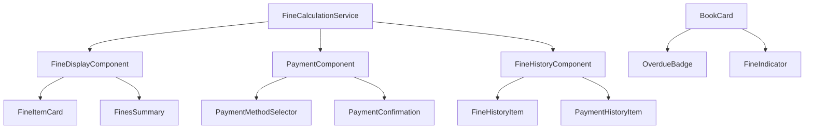
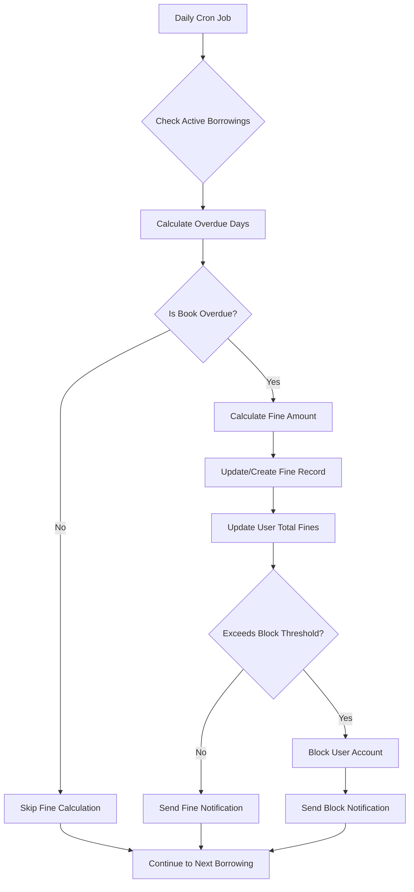
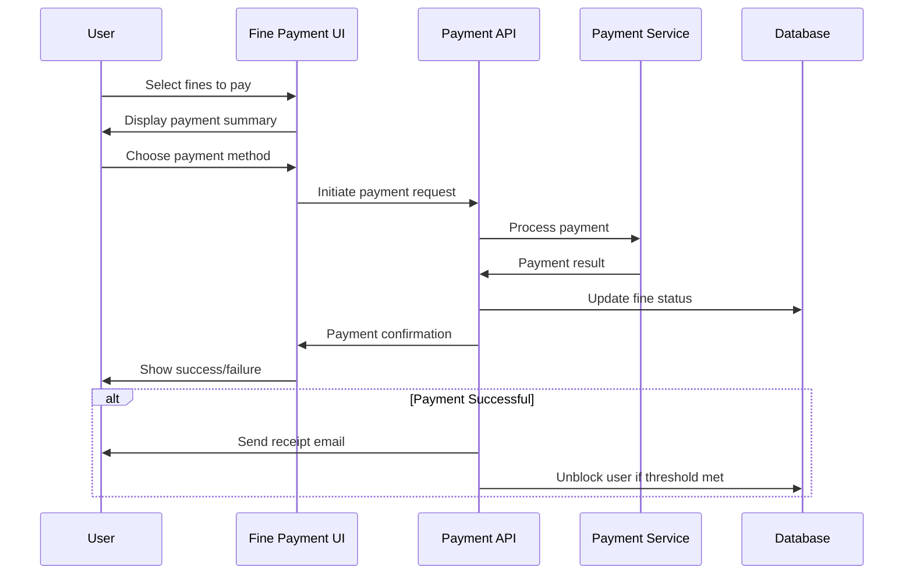

# Fine Calculation Workflow Design

## Overview

This design document outlines the fine calculation workflow for the University Learning Management System (LMS) that handles overdue book returns and fine payments. The system will automatically calculate and accumulate fines for users who fail to return borrowed books on time, providing a comprehensive payment mechanism to resolve outstanding debts.

## Technology Stack & Dependencies

- **Frontend**: Next.js 15.5.2 with React 19.1.0
- **Language**: TypeScript 5.x
- **Styling**: Tailwind CSS v3.4.17 with Shadcn UI components
- **Form Management**: react-hook-form with zod validation
- **Database**: To be integrated (PostgreSQL recommended)
- **Payment Integration**: Stripe/PayPal (to be configured)
- **Scheduling**: Cron jobs for daily fine calculation

## Architecture

### Data Models & Schema Extensions

#### Enhanced Book Borrowing Model

```typescript
interface BookBorrowing {
  id: string;
  bookId: string;
  userId: string;
  borrowDate: Date;
  dueDate: Date;
  returnDate?: Date | null;
  status: "active" | "returned" | "overdue";
  renewalCount: number;
  maxRenewals: number;
  createdAt: Date;
  updatedAt: Date;
}
```

#### Fine Management Model

```typescript
interface Fine {
  id: string;
  borrowingId: string;
  userId: string;
  bookId: string;
  dailyFineRate: number;
  overdueDays: number;
  totalAmount: number;
  accumulatedDate: Date;
  status: "active" | "paid" | "waived";
  createdAt: Date;
  updatedAt: Date;
}
```

#### Payment Transaction Model

```typescript
interface PaymentTransaction {
  id: string;
  userId: string;
  fineIds: string[];
  totalAmount: number;
  paymentMethod: "stripe" | "paypal" | "cash" | "bank_transfer";
  transactionId?: string;
  status: "pending" | "completed" | "failed" | "cancelled";
  paidAt?: Date;
  createdAt: Date;
}
```

#### Enhanced User Model Extensions

```typescript
interface User {
  // ... existing fields
  totalOutstandingFines: number;
  isBlocked: boolean;
  blockReason?: string;
  lastFineCalculation?: Date;
}
```

### Component Architecture

#### Core Fine Management Components



#### Fine Calculation Engine



### Fine Calculation Logic

#### Daily Fine Accumulation Algorithm

```typescript
interface FineCalculationConfig {
  dailyFineRate: number; // Default: $0.50 per day
  gracePeriod: number; // Default: 1 day
  maxFinePerBook: number; // Default: book replacement cost
  blockThreshold: number; // Default: $50.00
  reminderSchedule: number[]; // [3, 7, 14] days before due
}

class FineCalculationService {
  calculateDailyFine(borrowing: BookBorrowing, book: Book): number {
    const today = new Date();
    const overdueDays = this.getOverdueDays(borrowing.dueDate, today);

    if (overdueDays <= this.config.gracePeriod) {
      return 0;
    }

    const chargeableDays = overdueDays - this.config.gracePeriod;
    const calculatedFine = chargeableDays * this.config.dailyFineRate;

    return Math.min(calculatedFine, this.config.maxFinePerBook);
  }

  private getOverdueDays(dueDate: Date, currentDate: Date): number {
    const diffTime = currentDate.getTime() - dueDate.getTime();
    return Math.max(0, Math.ceil(diffTime / (1000 * 60 * 60 * 24)));
  }
}
```

### User Interface Architecture

#### Fine Management Dashboard

```typescript
// Components/FinesDashboard.tsx
interface FinesDashboardProps {
  userId: string;
}

const FinesDashboard: React.FC<FinesDashboardProps> = ({ userId }) => {
  return (
    <div className="fine-dashboard-container">
      <FinesSummaryCard totalFines={totalFines} />
      <ActiveFinesList fines={activeFines} />
      <PaymentSection onPayment={handlePayment} />
      <FineHistorySection userId={userId} />
    </div>
  );
};
```

#### Enhanced BookCard with Fine Indicators

```typescript
// Enhanced BookCard component
const BookCard: React.FC<BookCardProps> = ({
  book,
  isLoanedBook,
  borrowing,
  fine,
}) => {
  const daysOverdue = calculateOverdueDays(borrowing?.dueDate);
  const showFineWarning = daysOverdue > 0;

  return (
    <li className={cn(isLoanedBook && "xs:w-52 w-full")}>
      {/* Existing book display logic */}

      {isLoanedBook && (
        <div className="mt-3 w-full">
          <div className="book-loaned">
            {daysOverdue > 0 ? (
              <div className="overdue-indicator flex items-center gap-2">
                <AlertCircle className="h-4 w-4 text-red-500" />
                <p className="text-red-500 font-medium">
                  {daysOverdue} days overdue
                </p>
              </div>
            ) : (
              <div className="due-date-indicator flex items-center gap-2">
                <Calendar className="h-4 w-4 text-blue-500" />
                <p className="text-light-100">
                  {getDaysUntilDue(borrowing?.dueDate)} days left to return
                </p>
              </div>
            )}
          </div>

          {fine && fine.totalAmount > 0 && (
            <div className="fine-alert mt-2 p-2 bg-red-50 rounded border-l-4 border-red-500">
              <p className="text-red-700 text-sm font-medium">
                Outstanding Fine: ${fine.totalAmount.toFixed(2)}
              </p>
            </div>
          )}

          <div className="action-buttons mt-3 space-y-2">
            <Button className="book-btn w-full">Download receipt</Button>
            {fine && fine.totalAmount > 0 && (
              <Button
                variant="outline"
                className="w-full border-red-500 text-red-500 hover:bg-red-50"
                onClick={() => handlePayFine(fine.id)}
              >
                Pay Fine (${fine.totalAmount.toFixed(2)})
              </Button>
            )}
          </div>
        </div>
      )}
    </li>
  );
};
```

### Fine Payment Workflow

#### Payment Process Flow



#### Payment Component Implementation

```typescript
// Components/PaymentComponent.tsx
const PaymentComponent: React.FC<{
  selectedFines: Fine[];
  onPaymentSuccess: () => void;
}> = ({ selectedFines, onPaymentSuccess }) => {
  const totalAmount = selectedFines.reduce(
    (sum, fine) => sum + fine.totalAmount,
    0
  );

  return (
    <div className="payment-container">
      <PaymentSummary fines={selectedFines} totalAmount={totalAmount} />

      <PaymentMethodSelector
        onMethodSelect={setPaymentMethod}
        availableMethods={["stripe", "paypal"]}
      />

      <PaymentForm
        amount={totalAmount}
        method={paymentMethod}
        onSuccess={handlePaymentSuccess}
        onError={handlePaymentError}
      />
    </div>
  );
};
```

### Routing & Navigation

#### New Routes for Fine Management

```typescript
// app/(root)/fines/page.tsx - User fines dashboard
// app/(root)/fines/payment/page.tsx - Payment processing
// app/(root)/fines/history/page.tsx - Fine payment history
// app/admin/fines/page.tsx - Admin fine management
// app/admin/fines/reports/page.tsx - Fine reports and analytics
```

#### Navigation Integration

```typescript
// Updated navigation with fines link
export const navigationLinks = [
  {
    href: "/library",
    label: "Library",
  },
  {
    img: "/icons/fine.svg",
    selectedImg: "/icons/fine-fill.svg",
    href: "/fines",
    label: "My Fines",
    badge: userHasOutstandingFines ? "!" : undefined,
  },
  {
    img: "/icons/user.svg",
    selectedImg: "/icons/user-fill.svg",
    href: "/my-profile",
    label: "My Profile",
  },
];
```

### State Management Strategy

#### Fine Management State

```typescript
// lib/stores/fineStore.ts
interface FineState {
  userFines: Fine[];
  totalOutstandingAmount: number;
  paymentHistory: PaymentTransaction[];
  isLoading: boolean;
  error: string | null;
}

const useFineStore = create<FineState>((set, get) => ({
  userFines: [],
  totalOutstandingAmount: 0,
  paymentHistory: [],
  isLoading: false,
  error: null,

  fetchUserFines: async (userId: string) => {
    set({ isLoading: true });
    try {
      const fines = await api.getUserFines(userId);
      set({
        userFines: fines,
        totalOutstandingAmount: calculateTotalFines(fines),
        isLoading: false,
      });
    } catch (error) {
      set({ error: error.message, isLoading: false });
    }
  },

  processPayment: async (fineIds: string[], paymentData: PaymentData) => {
    // Payment processing logic
  },
}));
```

### API Integration Layer

#### Fine Management API Endpoints

```typescript
// lib/api/fines.ts
export const fineAPI = {
  // Get user's active fines
  getUserFines: (userId: string) =>
    fetch(`/api/users/${userId}/fines`).then((res) => res.json()),

  // Process fine payment
  payFines: (fineIds: string[], paymentData: PaymentData) =>
    fetch("/api/fines/payment", {
      method: "POST",
      body: JSON.stringify({ fineIds, paymentData }),
    }).then((res) => res.json()),

  // Get fine calculation history
  getFineHistory: (userId: string) =>
    fetch(`/api/users/${userId}/fines/history`).then((res) => res.json()),

  // Admin: Get all fines with filters
  getAllFines: (filters: FineFilters) =>
    fetch(`/api/admin/fines?${new URLSearchParams(filters)}`).then((res) =>
      res.json()
    ),

  // Admin: Waive fine
  waiveFine: (fineId: string, reason: string) =>
    fetch(`/api/admin/fines/${fineId}/waive`, {
      method: "PATCH",
      body: JSON.stringify({ reason }),
    }).then((res) => res.json()),
};
```

### Background Services Architecture

#### Automated Fine Calculation Service

```typescript
// lib/services/fineCalculationService.ts
class FineCalculationService {
  async calculateDailyFines(): Promise<void> {
    const activeBorrowings = await this.getActiveBorrowings();

    for (const borrowing of activeBorrowings) {
      const book = await this.getBookById(borrowing.bookId);
      const existingFine = await this.getActiveFine(borrowing.id);

      const newFineAmount = this.calculateFineAmount(borrowing, book);

      if (newFineAmount > 0) {
        await this.updateOrCreateFine(borrowing, newFineAmount);
        await this.updateUserTotalFines(borrowing.userId);
        await this.checkAndApplyUserBlocking(borrowing.userId);
      }
    }

    await this.sendFineNotifications();
  }

  private async checkAndApplyUserBlocking(userId: string): Promise<void> {
    const userTotalFines = await this.getUserTotalFines(userId);

    if (userTotalFines >= this.config.blockThreshold) {
      await this.blockUser(userId, "Outstanding fines exceed limit");
      await this.sendBlockNotification(userId);
    }
  }
}
```

#### Notification Service Integration

```typescript
// lib/services/notificationService.ts
class NotificationService {
  async sendFineNotification(userId: string, fine: Fine): Promise<void> {
    const user = await this.getUserById(userId);
    const book = await this.getBookById(fine.bookId);

    const emailContent = {
      to: user.email,
      subject: "Library Fine Notice",
      template: "fine-notification",
      data: {
        userName: user.fullName,
        bookTitle: book.title,
        fineAmount: fine.totalAmount,
        daysOverdue: fine.overdueDays,
        paymentLink: `${process.env.BASE_URL}/fines/payment?fine=${fine.id}`,
      },
    };

    await this.emailService.send(emailContent);
  }

  async sendPaymentConfirmation(
    userId: string,
    transaction: PaymentTransaction
  ): Promise<void> {
    // Payment confirmation email logic
  }
}
```

### Testing Strategy

#### Unit Testing for Fine Calculations

```typescript
// __tests__/services/fineCalculation.test.ts
describe("FineCalculationService", () => {
  test("should calculate correct fine for overdue book", () => {
    const borrowing = {
      dueDate: new Date("2024-01-01"),
      // ... other properties
    };

    const currentDate = new Date("2024-01-05"); // 4 days overdue
    const expectedFine = 1.5; // 3 chargeable days * $0.50 (after 1 day grace)

    const calculatedFine = service.calculateDailyFine(
      borrowing,
      book,
      currentDate
    );

    expect(calculatedFine).toBe(expectedFine);
  });

  test("should not exceed maximum fine per book", () => {
    const borrowing = {
      dueDate: new Date("2024-01-01"),
    };

    const currentDate = new Date("2024-02-01"); // 31 days overdue
    const maxFine = 25.0; // Book replacement cost

    const calculatedFine = service.calculateDailyFine(
      borrowing,
      book,
      currentDate
    );

    expect(calculatedFine).toBeLessThanOrEqual(maxFine);
  });
});
```

#### Integration Testing for Payment Flow

```typescript
// __tests__/integration/paymentFlow.test.ts
describe("Payment Flow Integration", () => {
  test("should complete payment and update fine status", async () => {
    const fineIds = ["fine-1", "fine-2"];
    const paymentData = {
      method: "stripe",
      token: "test-token",
    };

    const result = await fineAPI.payFines(fineIds, paymentData);

    expect(result.status).toBe("completed");
    expect(result.transactionId).toBeDefined();

    // Verify fines are marked as paid
    const updatedFines = await fineAPI.getUserFines(userId);
    const paidFines = updatedFines.filter((f) => fineIds.includes(f.id));

    paidFines.forEach((fine) => {
      expect(fine.status).toBe("paid");
    });
  });
});
```

### Configuration Management

#### Fine Calculation Configuration

```typescript
// lib/config/fineConfig.ts
export const fineConfig = {
  dailyFineRate: parseFloat(process.env.DAILY_FINE_RATE || "0.50"),
  gracePeriod: parseInt(process.env.GRACE_PERIOD_DAYS || "1"),
  maxFinePerBook: parseFloat(process.env.MAX_FINE_PER_BOOK || "25.00"),
  blockThreshold: parseFloat(process.env.USER_BLOCK_THRESHOLD || "50.00"),
  reminderSchedule: [3, 7, 14], // Days before due date
  paymentMethods: {
    stripe: {
      enabled: process.env.STRIPE_ENABLED === "true",
      publicKey: process.env.STRIPE_PUBLIC_KEY,
    },
    paypal: {
      enabled: process.env.PAYPAL_ENABLED === "true",
      clientId: process.env.PAYPAL_CLIENT_ID,
    },
  },
};
```
