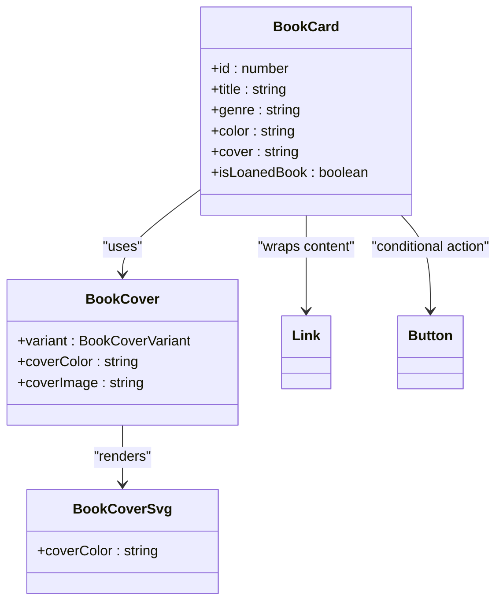

# Book Card Component

<cite>
**Referenced Files in This Document**   
- [BookCard.tsx](file://components/BookCard.tsx)
- [types.d.ts](file://types.d.ts)
- [BookCover.tsx](file://components/BookCover.tsx)
- [BookCoverSvg.tsx](file://components/BookCoverSvg.tsx)
- [BookList.tsx](file://components/BookList.tsx)
- [BookOverview.tsx](file://components/BookOverview.tsx)
- [globals.css](file://app/globals.css)
</cite>

## Table of Contents
1. [Introduction](#introduction)
2. [Props Interface and Data Structure](#props-interface-and-data-structure)
3. [Internal Composition and Visual Design](#internal-composition-and-visual-design)
4. [Usage Examples and Contextual Reuse](#usage-examples-and-contextual-reuse)
5. [Accessibility Features](#accessibility-features)
6. [Hover Effects and Interactive Behavior](#hover-effects-and-interactive-behavior)
7. [Responsive Behavior Across Devices](#responsive-behavior-across-devices)
8. [Troubleshooting Common Issues](#troubleshooting-common-issues)
9. [Extensibility and Customization Points](#extensibility-and-customization-points)

## Introduction
The **BookCard** component is a reusable UI element designed to represent an individual book within the university library management system. It serves as a visual and interactive card used in both **BookOverview** and **BookList** components, providing consistent styling and behavior across different contexts. The component displays essential book information such as title, genre, and cover image, while also supporting conditional rendering for loaned books with return deadlines and downloadable receipts. Built using React and Next.js, it leverages Tailwind CSS for responsive design and integrates with SVG-based 3D-like cover styling for enhanced visual appeal.

**Section sources**
- [BookCard.tsx](file://components/BookCard.tsx#L1-L48)

## Props Interface and Data Structure
The **BookCard** component receives its data through props that conform to the **Book** interface defined in `types.d.ts`. This interface ensures type safety and consistency across the application.

### Book Interface Definition
```typescript
interface Book {
  id: number;
  title: string;
  author: string;
  genre: string;
  rating: number;
  total_copies: number;
  available_copies: number;
  description: string;
  color: string;
  cover: string;
  video: string;
  summary: string;
  createdAt?: Date | null;
}
```

### Component Props
The **BookCard** destructures the following props:
- **id**: Unique identifier for the book (used in routing)
- **title**: Title of the book (displayed prominently)
- **genre**: Genre category (displayed below title)
- **color**: Background color for the book cover (passed to **BookCoverSvg**)
- **cover**: URL of the book's cover image (passed to **BookCover**)
- **isLoanedBook**: Optional boolean flag (default: `false`) that triggers conditional rendering for loaned books

The component uses the `cn()` utility from `@/lib/utils` to conditionally apply Tailwind classes based on the `isLoanedBook` state, enabling dynamic layout adjustments.

**Section sources**
- [types.d.ts](file://types.d.ts#L1-L15)
- [BookCard.tsx](file://components/BookCard.tsx#L6-L15)

## Internal Composition and Visual Design
The **BookCard** is composed of several nested components that work together to create a visually rich and interactive book representation.

### Component Hierarchy


**Diagram sources**
- [BookCard.tsx](file://components/BookCard.tsx#L1-L48)
- [BookCover.tsx](file://components/BookCover.tsx#L1-L52)
- [BookCoverSvg.tsx](file://components/BookCoverSvg.tsx#L1-L55)

### 3D-Like Cover Styling
The visual depth of the book cover is achieved through a combination of **BookCover** and **BookCoverSvg** components:
- **BookCoverSvg** renders an SVG with multiple layered paths to simulate shadows, spine, and page edges
- The SVG uses the `coverColor` prop to dynamically style the book's front and spine
- A **Next.js Image** component overlays the SVG with the actual book cover image
- Absolute positioning and z-indexing ensure the image appears "inside" the SVG frame

### Tailwind Class Application
The **BookCover** component supports multiple variants (`extraSmall`, `small`, `medium`, `regular`, `wide`) through a `variantStyles` mapping object. These classes are defined in `globals.css` and control the dimensions of the book cover for different display contexts.

**Section sources**
- [BookCover.tsx](file://components/BookCover.tsx#L1-L52)
- [BookCoverSvg.tsx](file://components/BookCoverSvg.tsx#L1-L55)
- [globals.css](file://app/globals.css#L47-L65)

## Usage Examples and Contextual Reuse
The **BookCard** component is designed for reuse across different parts of the application, maintaining consistent styling through Tailwind classes.

### In BookList Component
The **BookList** component renders multiple **BookCard** instances in a grid layout:
```tsx
<ul className="book-list">
  {books.map((book) => (
    <BookCard key={book.title} {...book} />
  ))}
</ul>
```
The `book-list` class in `globals.css` applies responsive spacing and wrapping behavior.

### In BookOverview Component
While **BookOverview** does not directly use **BookCard**, it uses **BookCover** in "wide" variant to display a larger version of the book, demonstrating the shared visual language:
```tsx
<BookCover variant="wide" coverColor={color} coverImage={cover} />
```

### Conditional Rendering for Loaned Books
When `isLoanedBook` is true, additional UI elements are rendered:
- A calendar icon with return deadline text
- A "Download receipt" button styled with the `book-btn` class

This pattern allows the same component to serve both catalog browsing and user loan management contexts.

**Section sources**
- [BookList.tsx](file://components/BookList.tsx#L1-L23)
- [BookOverview.tsx](file://components/BookOverview.tsx#L1-L73)
- [BookCard.tsx](file://components/BookCard.tsx#L1-L48)

## Accessibility Features
The **BookCard** component incorporates several accessibility features to ensure usability for all users:

- **Semantic HTML**: Uses `<li>` within a `<ul>` for proper list semantics
- **Keyboard Navigation**: Wrapped in a `<Link>` component, making it focusable and activatable via keyboard
- **Image Alt Text**: The cover image includes `alt="book cover"` for screen readers
- **Icon Labels**: The calendar icon is accompanied by descriptive text ("11 days left to return")
- **Color Contrast**: Text colors (`text-white`, `text-light-100`) are chosen for sufficient contrast against dark backgrounds

No ARIA attributes are explicitly used, relying instead on native HTML semantics and Next.js routing for accessibility.

**Section sources**
- [BookCard.tsx](file://components/BookCard.tsx#L1-L48)
- [BookCover.tsx](file://components/BookCover.tsx#L1-L52)

## Hover Effects and Interactive Behavior
The **BookCard** itself does not implement explicit hover effects, but inherits interactive behavior from its parent components and styling:

- **Link Wrapper**: The entire card is wrapped in a Next.js `Link`, which provides default browser focus and hover states
- **Button Hover**: The "Download receipt" button uses Tailwind's `hover:bg-primary/90` class for visual feedback
- **Transition Effects**: The **BookCover** component includes `transition-all duration-300` for smooth size changes

No custom hover animations or JavaScript-based interactions are implemented directly within **BookCard**, maintaining a lightweight and performant component.

**Section sources**
- [BookCard.tsx](file://components/BookCard.tsx#L1-L48)
- [globals.css](file://app/globals.css#L51-L54)

## Responsive Behavior Across Devices
The **BookCard** component is designed to be responsive, adapting its layout based on screen size using Tailwind's breakpoint system.

### Responsive Class Usage
- **xs:w-52**: Applies a fixed width on extra-small screens when `isLoanedBook` is true
- **xs:max-w-40**: Controls maximum width of text content on small screens
- **max-xs:justify-between**: Adjusts spacing in **BookList** on very small screens
- **xs:h-[404px]**: Scales cover height on larger screens

The component uses relative units and flexible layouts to ensure readability and usability across mobile, tablet, and desktop devices. The `line-clamp-1` class prevents text overflow in titles and genres.

**Section sources**
- [BookCard.tsx](file://components/BookCard.tsx#L1-L48)
- [globals.css](file://app/globals.css#L39-L54)

## Troubleshooting Common Issues
### Broken Images
If the book cover image fails to load:
- Ensure the `cover` URL is valid and accessible
- Verify the image server is operational
- Check CORS settings if hosting externally
- The component uses a placeholder URL (`https://placehold.co/400x600.png`) as fallback in **BookCover**

### Layout Shifts
To prevent layout shifts during image loading:
- The **BookCover** component uses fixed aspect ratios via Tailwind classes
- The SVG background provides a consistent visual frame before the image loads
- Consider adding `loading="lazy"` to the Image component for performance

### Conditional Rendering Bugs
When `isLoanedBook` behavior appears incorrect:
- Ensure the prop is properly passed from parent components
- Verify the `cn()` utility function is working correctly
- Check for CSS conflicts with `w-full` and flex classes

**Section sources**
- [BookCard.tsx](file://components/BookCard.tsx#L1-L48)
- [BookCover.tsx](file://components/BookCover.tsx#L1-L52)

## Extensibility and Customization Points
The **BookCard** component can be extended in several ways:

### Adding New Actions
To add a "Borrow" button for available books:
```tsx
{!isLoanedBook && available_copies > 0 && (
  <Button className="book-btn">Borrow</Button>
)}
```

### Adding Tooltips
Integrate with UI libraries to add tooltips showing book details on hover.

### Status Indicators
Enhance availability status with color-coded badges:
- Green for "Available"
- Red for "Out of Stock"
- Yellow for "Low Stock"

### Animation Enhancements
Add subtle hover animations using Tailwind's animation classes or Framer Motion for more complex effects.

The component's modular design and use of standard props make it easy to extend while maintaining consistency across the application.

**Section sources**
- [BookCard.tsx](file://components/BookCard.tsx#L1-L48)
- [types.d.ts](file://types.d.ts#L1-L15)