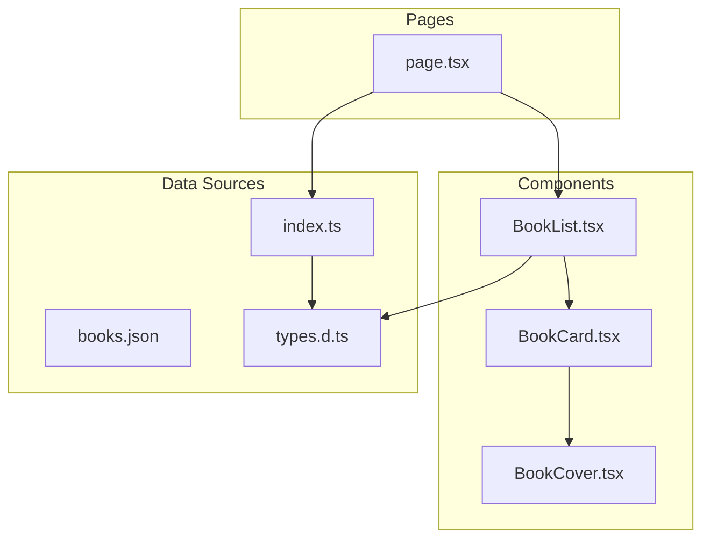
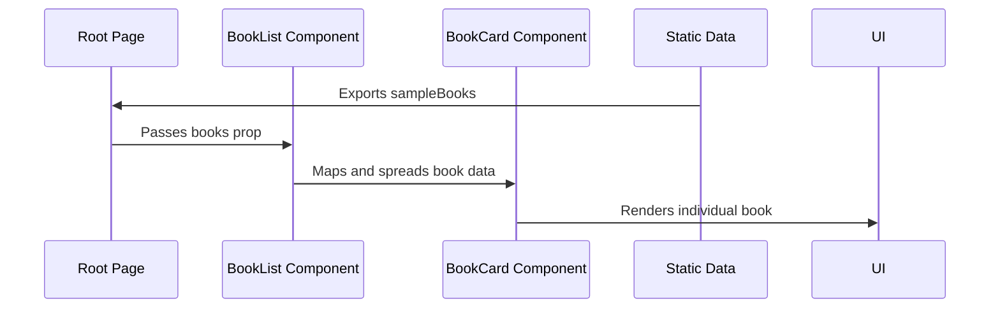
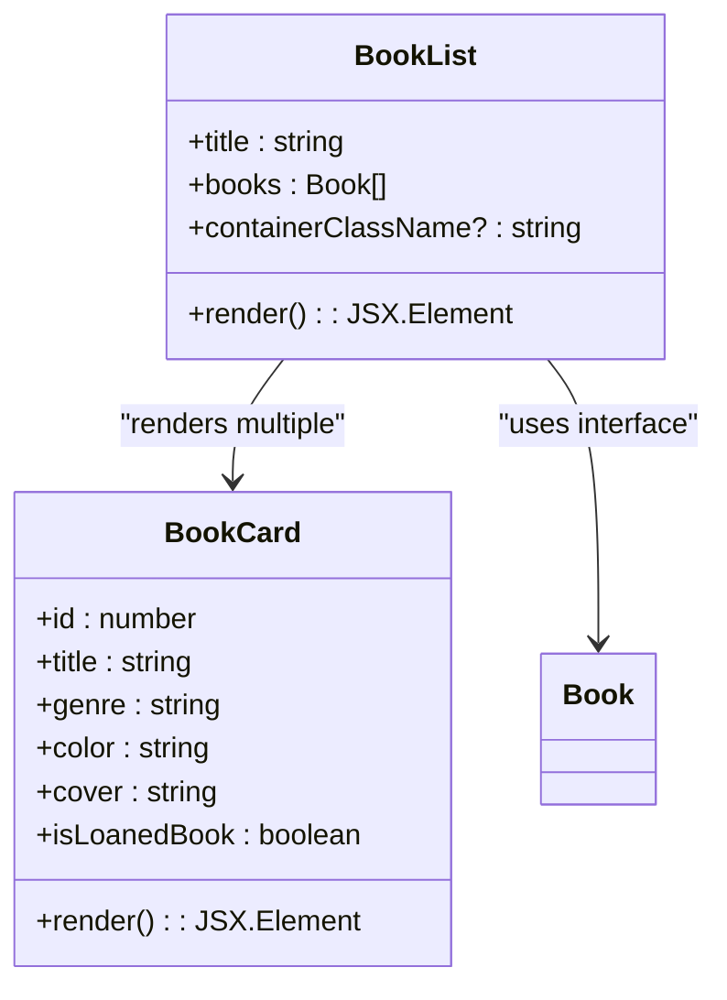
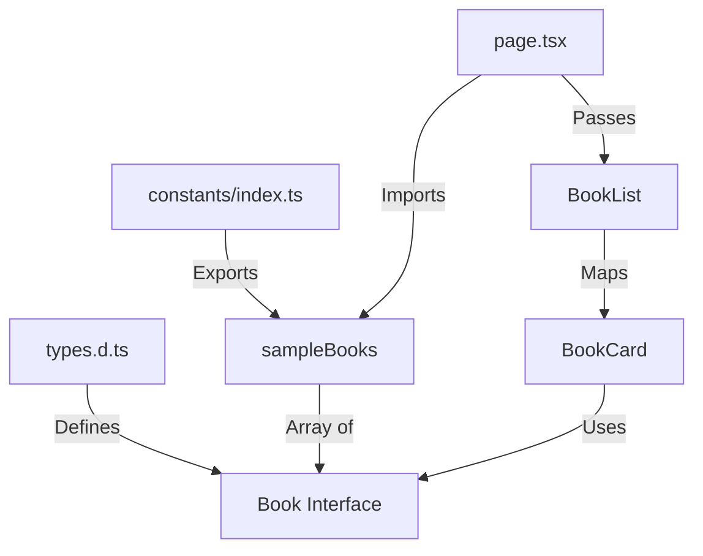
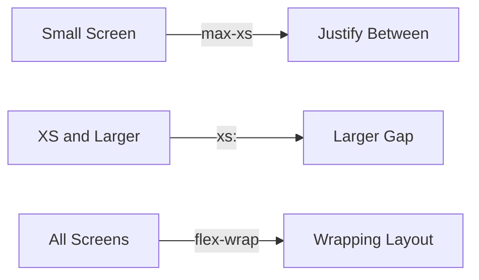

# Book List Component

<cite>
**Referenced Files in This Document**   
- [BookList.tsx](file://components/BookList.tsx)
- [types.d.ts](file://types.d.ts)
- [BookCard.tsx](file://components/BookCard.tsx)
- [index.ts](file://constants/index.ts)
- [page.tsx](file://app/(root)/page.tsx)
- [globals.css](file://app/globals.css)
</cite>

## Table of Contents
1. [Introduction](#introduction)
2. [Project Structure](#project-structure)
3. [Core Components](#core-components)
4. [Architecture Overview](#architecture-overview)
5. [Detailed Component Analysis](#detailed-component-analysis)
6. [Data Flow and Type Safety](#data-flow-and-type-safety)
7. [Responsive Layout Implementation](#responsive-layout-implementation)
8. [Performance Considerations](#performance-considerations)
9. [Extension Opportunities](#extension-opportunities)
10. [Conclusion](#conclusion)

## Introduction
The BookList component is a central UI element in the university library management system, responsible for rendering a collection of books in a visually appealing and accessible format. This document provides a comprehensive analysis of the component's implementation, data flow, styling, and potential for future enhancements. The component leverages React's functional component pattern with TypeScript for type safety and integrates with static data sources to display book information through reusable BookCard components.

## Project Structure
The project follows a Next.js application structure with a clear separation of concerns. The BookList component resides in the components directory and is consumed by page-level components in the app directory. Static data is organized in the constants and public directories, while type definitions are maintained in a root-level types file.



**Diagram sources**
- [BookList.tsx](file://components/BookList.tsx)
- [BookCard.tsx](file://components/BookCard.tsx)
- [index.ts](file://constants/index.ts)
- [types.d.ts](file://types.d.ts)
- [page.tsx](file://app/(root)/page.tsx)

**Section sources**
- [BookList.tsx](file://components/BookList.tsx)
- [page.tsx](file://app/(root)/page.tsx)

## Core Components
The BookList component serves as a container for multiple BookCard instances, receiving book data as a prop and mapping over it to generate individual book representations. It accepts three props: title (for the section heading), books (an array of Book objects), and containerClassName (for custom styling). The component uses a semantic `<section>` element with a heading and an unordered list to maintain accessibility standards.

```tsx
export const BookList = ({ title, books, containerClassName }: Props) => {
  return (
    <section className={containerClassName}>
      <h2 className="font-bebas-neue text-4xl text-light-100">{title}</h2>
      <ul className="book-list">
        {books.map((book) => (
          <BookCard key={book.title} {...book} />
        ))}
      </ul>
    </section>
  );
};
```

**Section sources**
- [BookList.tsx](file://components/BookList.tsx#L1-L23)

## Architecture Overview
The architecture follows a unidirectional data flow pattern where data originates from static files, is consumed by page components, and passed down to presentational components. The BookList acts as an intermediate container that orchestrates the rendering of individual BookCard components.



**Diagram sources**
- [BookList.tsx](file://components/BookList.tsx)
- [page.tsx](file://app/(root)/page.tsx)
- [BookCard.tsx](file://components/BookCard.tsx)

## Detailed Component Analysis

### BookList Component Analysis
The BookList component is a functional React component that uses TypeScript interfaces for type safety. It receives book data as a prop and renders it using a list structure. The component is designed to be reusable with different sets of books and customizable styling through the containerClassName prop.



**Diagram sources**
- [BookList.tsx](file://components/BookList.tsx#L1-L23)
- [types.d.ts](file://types.d.ts#L1-L14)
- [BookCard.tsx](file://components/BookCard.tsx#L1-L47)

**Section sources**
- [BookList.tsx](file://components/BookList.tsx#L1-L23)

### BookCard Component Analysis
The BookCard component receives individual book data and renders it with appropriate styling and interactivity. It uses the `cn` utility for conditional class names and includes a conditional rendering block for loaned books. The component wraps the book representation in a Next.js Link component for navigation to individual book details.

```tsx
const BookCard = ({
  id,
  title,
  genre,
  color,
  cover,
  isLoanedBook = false,
}: Book) => (
  <li className={cn(isLoanedBook && "xs:w-52 w-full")}>
    <Link href={`/books/${id}`}>
      <BookCover coverColor={color} coverImage={cover} />
      <div className={cn("mt-4", !isLoanedBook && "xs:max-w-40 max-w-28")}>
        <p className="book-title">{title}</p>
        <p className="book-genre">{genre}</p>
      </div>
      {isLoanedBook && (
        <div className="mt-3 w-full">
          <div className="book-loaned">
            <Image src="/icons/calendar.svg" alt="calendar" width={18} height={18} />
            <p className="text-light-100">11 days left to return</p>
          </div>
          <Button className="book-btn">Download receipt</Button>
        </div>
      )}
    </Link>
  </li>
);
```

**Section sources**
- [BookCard.tsx](file://components/BookCard.tsx#L1-L47)

## Data Flow and Type Safety
The data flow begins with the Book interface defined in types.d.ts, which establishes the contract for book data throughout the application. Two data sources provide book information: the static books.json file in the public directory and the sampleBooks array in constants/index.ts. The root page imports sampleBooks and passes them to the BookList component.



**Diagram sources**
- [types.d.ts](file://types.d.ts#L1-L14)
- [index.ts](file://constants/index.ts#L165-L193)
- [page.tsx](file://app/(root)/page.tsx#L3-L14)
- [BookList.tsx](file://components/BookList.tsx#L1-L23)
- [BookCard.tsx](file://components/BookCard.tsx#L1-L47)

**Section sources**
- [types.d.ts](file://types.d.ts#L1-L14)
- [index.ts](file://constants/index.ts#L165-L193)

## Responsive Layout Implementation
The BookList component achieves responsive design through a combination of Tailwind CSS utility classes and custom CSS. The layout adapts to different screen sizes using flexbox and responsive prefixes.

```css
.book-list {
  @apply mt-10 flex flex-wrap gap-5 max-xs:justify-between xs:gap-10;
}
```

The CSS applies:
- `flex` and `flex-wrap` for a flexible, wrapping layout
- `gap-5` for spacing between items on small screens
- `xs:gap-10` for increased spacing on extra-small and larger screens
- `max-xs:justify-between` for spacing items evenly on screens smaller than the xs breakpoint

The BookCard component also uses responsive classes:
- `xs:max-w-40 max-w-28` for title container width
- Conditional width classes based on the isLoanedBook prop



**Diagram sources**
- [globals.css](file://app/globals.css#L86-L89)
- [BookList.tsx](file://components/BookList.tsx#L13)
- [BookCard.tsx](file://components/BookCard.tsx#L15-L16)

**Section sources**
- [globals.css](file://app/globals.css#L86-L89)

## Performance Considerations
The current implementation has several performance characteristics and optimization opportunities:

### Current Implementation Analysis
- **Key Prop Usage**: The BookList uses `book.title` as the key prop in the map function, which could lead to issues if titles are not unique. Using `book.id` would be more reliable.
- **Re-render Optimization**: The component uses a simple functional component without memoization, meaning it will re-render whenever its parent re-renders, regardless of whether the books prop has changed.
- **Virtualization Potential**: With a large number of books, the current implementation renders all books at once, which could impact performance. Implementing virtualization (rendering only visible items) would improve performance for large datasets.

### Recommended Optimizations
```tsx
// Use React.memo for re-render optimization
export const BookList = React.memo(({ title, books, containerClassName }: Props) => {
  return (
    <section className={containerClassName}>
      <h2 className="font-bebas-neue text-4xl text-light-100">{title}</h2>
      <ul className="book-list">
        {books.map((book) => (
          <BookCard key={book.id} {...book} />
        ))}
      </ul>
    </section>
  );
});
```

**Section sources**
- [BookList.tsx](file://components/BookList.tsx#L1-L23)

## Extension Opportunities
The BookList component can be extended with additional functionality for filtering, searching, and sorting.

### Filtering and Sorting Implementation
```tsx
interface Props {
  title: string;
  books: Book[];
  containerClassName?: string;
  filterGenre?: string;
  sortBy?: 'title' | 'author' | 'rating';
  searchQuery?: string;
}

export const BookList = ({ 
  title, 
  books, 
  containerClassName,
  filterGenre,
  sortBy,
  searchQuery
}: Props) => {
  const filteredAndSortedBooks = useMemo(() => {
    let result = [...books];
    
    // Apply search filter
    if (searchQuery) {
      const query = searchQuery.toLowerCase();
      result = result.filter(book => 
        book.title.toLowerCase().includes(query) || 
        book.author.toLowerCase().includes(query)
      );
    }
    
    // Apply genre filter
    if (filterGenre) {
      result = result.filter(book => book.genre === filterGenre);
    }
    
    // Apply sorting
    if (sortBy) {
      result.sort((a, b) => {
        if (a[sortBy] < b[sortBy]) return -1;
        if (a[sortBy] > b[sortBy]) return 1;
        return 0;
      });
    }
    
    return result;
  }, [books, filterGenre, sortBy, searchQuery]);
  
  return (
    <section className={containerClassName}>
      <h2 className="font-bebas-neue text-4xl text-light-100">{title}</h2>
      <ul className="book-list">
        {filteredAndSortedBooks.map((book) => (
          <BookCard key={book.id} {...book} />
        ))}
      </ul>
    </section>
  );
};
```

This extension would allow for dynamic filtering and sorting while maintaining performance through useMemo for expensive operations.

**Section sources**
- [BookList.tsx](file://components/BookList.tsx)

## Conclusion
The BookList component effectively renders a collection of books by mapping over data from static sources and generating BookCard instances. It demonstrates good practices in component design, type safety through TypeScript interfaces, and responsive layout using Tailwind CSS. While the current implementation is functional, there are opportunities for improvement in key prop selection, re-render optimization, and support for large datasets through virtualization. The component is well-positioned for extension with filtering, searching, and sorting capabilities to enhance user experience in a production library system.