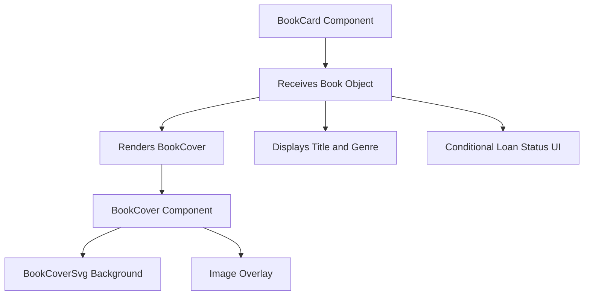
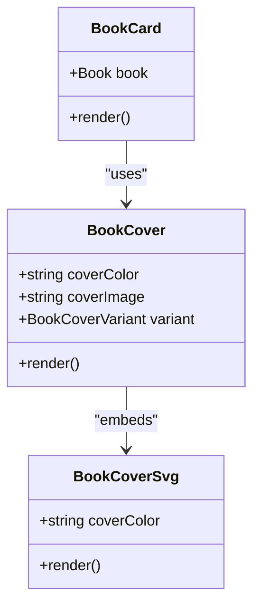
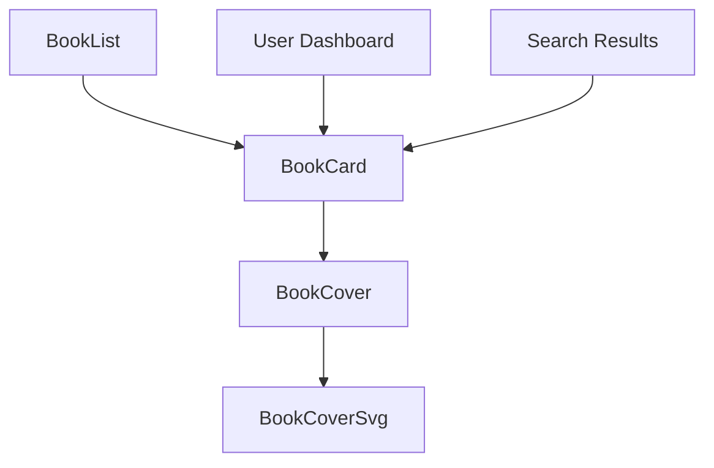

# Book Card Component

<cite>
**Referenced Files in This Document**   
- [BookCard.tsx](file://components/BookCard.tsx)
- [types.d.ts](file://types.d.ts)
- [BookCover.tsx](file://components/BookCover.tsx)
- [BookCoverSvg.tsx](file://components/BookCoverSvg.tsx)
- [BookList.tsx](file://components/BookList.tsx)
- [BookOverview.tsx](file://components/BookOverview.tsx)
</cite>

## Table of Contents
1. [Introduction](#introduction)
2. [Component Overview](#component-overview)
3. [Data Structure and Prop Interface](#data-structure-and-prop-interface)
4. [Composition and Visual Hierarchy](#composition-and-visual-hierarchy)
5. [Conditional Rendering and Availability Status](#conditional-rendering-and-availability-status)
6. [Styling and Responsive Design](#styling-and-responsive-design)
7. [Usage Contexts and Integration Patterns](#usage-contexts-and-integration-patterns)
8. [Customization and Extension Points](#customization-and-extension-points)
9. [Performance Considerations](#performance-considerations)

## Introduction
The BookCard component serves as the primary presentation unit for individual books within the university_lms application. It is designed to render a compact, visually engaging representation of a book's metadata and availability status, suitable for use in lists, grids, and overviews. This document provides a comprehensive analysis of its implementation, architecture, and integration patterns, enabling developers to effectively utilize and extend the component.

## Component Overview
The BookCard component is a functional React component that receives a Book object as a prop and renders a structured card containing key book information. It acts as a container for visual and textual elements, including the book cover, title, genre, and conditional loan status indicators. The component is designed to be reusable across different contexts, such as book listings and user loan dashboards.



**Diagram sources**
- [BookCard.tsx](file://components/BookCard.tsx#L7-L47)
- [BookCover.tsx](file://components/BookCover.tsx#L15-L51)

**Section sources**
- [BookCard.tsx](file://components/BookCard.tsx#L1-L48)

## Data Structure and Prop Interface
The BookCard component expects a Book object that conforms to the interface defined in `types.d.ts`. This interface includes essential metadata such as title, author, genre, rating, and availability information. The component destructures specific fields from the Book object, including `id`, `title`, `genre`, `color`, `cover`, and an optional `isLoanedBook` flag.

**Book Interface Structure:**
- `id`: number
- `title`: string
- `author`: string
- `genre`: string
- `rating`: number
- `total_copies`: number
- `available_copies`: number
- `description`: string
- `color`: string (used for cover background)
- `cover`: string (URL to cover image)
- `video`: string
- `summary`: string
- `createdAt`: Date | null (optional)

The component uses TypeScript's destructuring with default values to handle optional props, such as `isLoanedBook = false`.

**Section sources**
- [types.d.ts](file://types.d.ts#L1-L14)
- [BookCard.tsx](file://components/BookCard.tsx#L7-L47)

## Composition and Visual Hierarchy
The BookCard component follows a composition pattern, embedding other components to create a cohesive visual hierarchy. It primarily relies on the `BookCover` component to render the book's visual representation, which in turn uses `BookCoverSvg` for the background design.

### BookCover Component
The `BookCover` component accepts `coverColor` and `coverImage` props to customize the appearance of the book cover. It applies responsive styling through Tailwind CSS classes and supports different size variants via the `variant` prop.

### BookCoverSvg Component
The `BookCoverSvg` component renders an SVG element that provides a stylized book cover background with shadows, highlights, and decorative elements. The primary color of the SVG is dynamically set using the `coverColor` prop, allowing each book to have a unique visual identity.



**Diagram sources**
- [BookCard.tsx](file://components/BookCard.tsx#L7-L47)
- [BookCover.tsx](file://components/BookCover.tsx#L15-L51)
- [BookCoverSvg.tsx](file://components/BookCoverSvg.tsx#L1-L55)

**Section sources**
- [BookCover.tsx](file://components/BookCover.tsx#L1-L51)
- [BookCoverSvg.tsx](file://components/BookCoverSvg.tsx#L1-L55)

## Conditional Rendering and Availability Status
The BookCard component implements conditional rendering based on the `isLoanedBook` prop. When this flag is true, additional UI elements are displayed to indicate the book's loan status, including a calendar icon and a "Download receipt" button.

**Conditional Elements:**
- Calendar icon (SVG) indicating loan duration
- Text showing remaining return time ("11 days left to return")
- Action button for downloading the loan receipt

This pattern allows the same component to serve dual purposes: displaying available books in catalogs and showing currently loaned books in user profiles.

```tsx
{isLoanedBook && (
  <div className="mt-3 w-full">
    <div className="book-loaned">
      <Image src="/icons/calendar.svg" alt="calendar" width={18} height={18} />
      <p className="text-light-100">11 days left to return</p>
    </div>
    <Button className="book-btn">Download receipt</Button>
  </div>
)}
```

**Section sources**
- [BookCard.tsx](file://components/BookCard.tsx#L30-L45)

## Styling and Responsive Design
The BookCard component leverages Tailwind CSS for responsive styling and visual effects. It uses the `cn` utility function from `@/lib/utils` to conditionally apply classes based on props.

### Key Styling Features:
- **Responsive Width**: Adjusts width based on `isLoanedBook` status using `xs:w-52 w-full`
- **Flex Layout**: Uses flexbox for vertical alignment in loaned book mode
- **Spacing**: Applies consistent margins with `mt-4` and `mt-3`
- **Text Constraints**: Limits text width with `xs:max-w-40 max-w-28` for non-loaned books
- **Hover Effects**: Inherits transition effects from `transition-all duration-300` in BookCover

The component adapts its layout for different screen sizes, ensuring readability and visual consistency across devices.

**Section sources**
- [BookCard.tsx](file://components/BookCard.tsx#L7-L47)
- [lib/utils.ts](file://lib/utils.ts#L1-L5)

## Usage Contexts and Integration Patterns
The BookCard component is integrated into higher-level components such as `BookList` and `BookOverview`, demonstrating its reusability across different contexts.

### BookList Integration
The `BookList` component maps over an array of Book objects and renders a `BookCard` for each item. It uses the book's title as the React key and spreads all book properties onto the component.

```tsx
{books.map((book) => (
  <BookCard key={book.title} {...book} />
))}
```

### BookOverview Integration
While `BookOverview` does not directly use `BookCard`, it demonstrates similar composition patterns with `BookCover`, indicating a consistent design language across the application.



**Diagram sources**
- [BookList.tsx](file://components/BookList.tsx#L15-L20)
- [BookCard.tsx](file://components/BookCard.tsx#L7-L47)

**Section sources**
- [BookList.tsx](file://components/BookList.tsx#L1-L24)

## Customization and Extension Points
The BookCard component can be extended in several ways to accommodate new requirements:

### Adding Metadata Fields
To display additional book information (e.g., rating, author), modify the component to include new elements:
```tsx
<div className="mt-2">
  <p className="text-sm text-gray-500">by {author}</p>
  <div className="flex items-center gap-1">
    <StarIcon className="w-4 h-4 text-yellow-500" />
    <span>{rating}</span>
  </div>
</div>
```

### Modifying Visual Layout
Customize the layout by adjusting Tailwind classes or adding new variants to the `BookCover` component.

### Integrating Click Handlers
Enhance interactivity by adding event handlers:
```tsx
<Link href={`/books/${id}`} onClick={(e) => onBookClick?.(id)}>
```

### Supporting New States
Extend the component to handle additional states (e.g., reserved, overdue) by introducing new boolean props and conditional rendering blocks.

**Section sources**
- [BookCard.tsx](file://components/BookCard.tsx#L7-L47)
- [types.d.ts](file://types.d.ts#L1-L14)

## Performance Considerations
When rendering large lists of BookCard components, consider the following optimizations:

### Key Prop Strategy
Use a stable, unique identifier (preferably `id` rather than `title`) as the React key to optimize re-rendering:
```tsx
<BookCard key={book.id} {...book} />
```

### Virtualization
For large datasets, implement virtual scrolling using libraries like `react-window` or `virtuoso` to render only visible items.

### Image Optimization
Ensure cover images are properly optimized and served through an image CDN to reduce load times.

### Memoization
Consider wrapping the component with `React.memo` if it receives frequent prop updates without visual changes.

### Lazy Loading
Implement lazy loading for images and components that are not immediately visible in the viewport.

**Section sources**
- [BookList.tsx](file://components/BookList.tsx#L15-L20)
- [BookCard.tsx](file://components/BookCard.tsx#L7-L47)