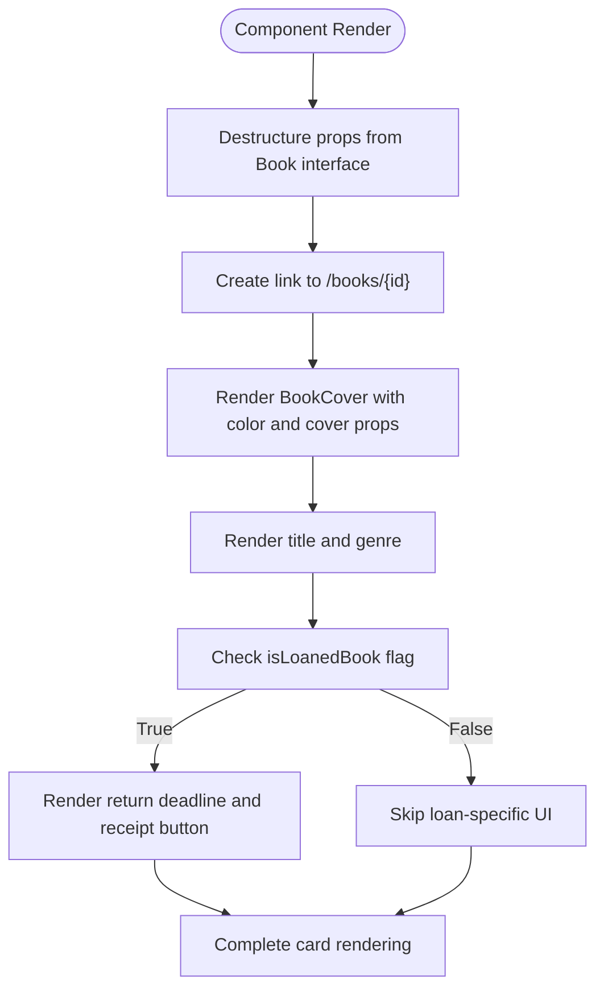
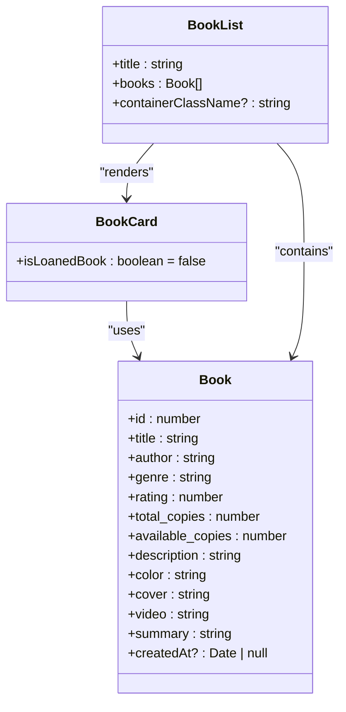
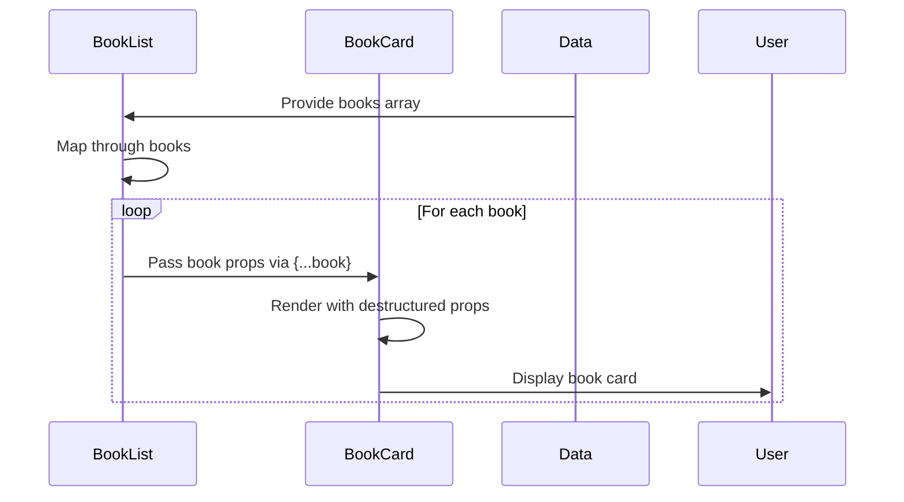

# Book Card Props Interface

<cite>
**Referenced Files in This Document**   
- [types.d.ts](file://types.d.ts#L0-L14)
- [BookCard.tsx](file://components/BookCard.tsx#L0-L47)
- [BookList.tsx](file://components/BookList.tsx#L0-L23)
- [BookOverview.tsx](file://components/BookOverview.tsx#L0-L49)
- [index.ts](file://constants/index.ts#L0-L193)
</cite>

## Table of Contents
1. [Introduction](#introduction)
2. [Book Interface Definition](#book-interface-definition)
3. [BookCard Props Analysis](#bookcard-props-analysis)
4. [Prop Usage and Implementation](#prop-usage-and-implementation)
5. [TypeScript Best Practices](#typescript-best-practices)
6. [Compile-Time Validation](#compile-time-validation)
7. [Runtime Error Prevention](#runtime-error-prevention)
8. [Component Usage Examples](#component-usage-examples)
9. [Conclusion](#conclusion)

## Introduction
This document provides a comprehensive analysis of the BookCard component's props interface in the university_lms application. It details the Book interface structure defined in types.d.ts and its implementation within BookCard.tsx. The documentation covers all prop types, their purposes, required/optional status, and practical usage patterns. Special attention is given to TypeScript type safety, prop validation mechanisms, and strategies for preventing runtime errors when rendering book data.

**Section sources**
- [types.d.ts](file://types.d.ts#L0-L14)
- [BookCard.tsx](file://components/BookCard.tsx#L0-L47)

## Book Interface Definition
The Book interface defines the complete data structure for book entities in the university_lms application. This interface is centrally defined in types.d.ts and imported across various components.

```typescript
interface Book {
  id: number;
  title: string;
  author: string;
  genre: string;
  rating: number;
  total_copies: number;
  available_copies: number;
  description: string;
  color: string;
  cover: string;
  video: string;
  summary: string;
  createdAt?: Date | null;
}
```

The interface includes essential book metadata such as title, author, and genre, along with library-specific information like copy availability and visual presentation properties (color, cover). The optional `createdAt` field supports temporal tracking of book records.

**Section sources**
- [types.d.ts](file://types.d.ts#L0-L14)

## BookCard Props Analysis
The BookCard component accepts props based on the Book interface, with additional component-specific properties for rendering variations.

### Prop Structure
The component destructures the following props from the Book interface:

- **id**: `number` - Unique identifier for the book (required)
- **title**: `string` - Book title displayed in the card (required)
- **genre**: `string` - Book category/genre label (required)
- **color**: `string` - Primary color theme for the book cover (required)
- **cover**: `string` - URL path to the book cover image (required)

### Component-Specific Prop
- **isLoanedBook**: `boolean` - Optional flag (default: false) that modifies the card's appearance and behavior when a book is currently loaned

### Prop Type Summary
| Prop Name | Type | Required | Default Value | Purpose |
|---------|------|----------|---------------|---------|
| id | number | Yes | - | Book identifier for routing |
| title | string | Yes | - | Display book title |
| genre | string | Yes | - | Display book category |
| color | string | Yes | - | Visual theme for cover |
| cover | string | Yes | - | Book cover image source |
| isLoanedBook | boolean | No | false | Toggle loaned book UI |

**Section sources**
- [BookCard.tsx](file://components/BookCard.tsx#L0-L47)

## Prop Usage and Implementation
The BookCard component implements a functional React component that renders book information in a card format, with conditional rendering based on the `isLoanedBook` prop.

### Rendering Logic
The component uses the destructured props to render the book card with the following structure:

1. **Link Wrapper**: Creates a clickable card that navigates to `/books/${id}`
2. **BookCover**: Renders the book cover using `color` and `cover` props
3. **Title and Genre**: Displays `title` and `genre` in designated text elements
4. **Conditional UI**: When `isLoanedBook` is true, displays return deadline and receipt download button

### Conditional Styling
The component uses conditional className application through the `cn` utility:
- When `isLoanedBook` is true: Applies wider width and flex column layout
- When `isLoanedBook` is false: Restricts maximum width of text content



**Diagram sources**
- [BookCard.tsx](file://components/BookCard.tsx#L0-L47)

**Section sources**
- [BookCard.tsx](file://components/BookCard.tsx#L0-L47)

## TypeScript Best Practices
The implementation follows several TypeScript best practices to ensure type safety and maintainability.

### Interface-Based Typing
The component leverages the centrally defined Book interface rather than creating ad-hoc types, ensuring consistency across the application.

### Destructuring with Type Annotation
The component uses destructuring with explicit type annotation:
```typescript
const BookCard = ({
  id,
  title,
  genre,
  color,
  cover,
  isLoanedBook = false,
}: Book) => (...)
```
This approach ensures that only properties defined in the Book interface can be destructured, providing compile-time validation.

### Optional Parameter with Default Value
The `isLoanedBook` prop demonstrates proper handling of optional parameters with a default value assignment, eliminating the need for runtime null checks.

**Section sources**
- [BookCard.tsx](file://components/BookCard.tsx#L0-L47)
- [types.d.ts](file://types.d.ts#L0-L14)

## Compile-Time Validation
The TypeScript implementation provides robust compile-time validation through several mechanisms.

### Interface Enforcement
By typing the destructured props as `: Book`, the compiler validates that:
- All required Book properties are accounted for in the destructuring
- No non-existent properties are referenced
- Property types match the interface definition

### Usage in Parent Components
The BookList component demonstrates proper prop passing:
```typescript
<BookCard key={book.title} {...book} />
```
The spread operator `{...book}` passes all Book interface properties, with TypeScript ensuring the object conforms to the Book interface.

### Type Inference
When importing sample data from constants:
```typescript
import { sampleBooks } from "@/constants";
<BookList books={sampleBooks} />
```
TypeScript infers that sampleBooks must conform to Book[] based on the BookList component's Props interface.



**Diagram sources**
- [types.d.ts](file://types.d.ts#L0-L14)
- [BookCard.tsx](file://components/BookCard.tsx#L0-L47)
- [BookList.tsx](file://components/BookList.tsx#L0-L23)

**Section sources**
- [BookCard.tsx](file://components/BookCard.tsx#L0-L47)
- [BookList.tsx](file://components/BookList.tsx#L0-L23)

## Runtime Error Prevention
The implementation includes several strategies to prevent runtime errors when rendering book data.

### Default Values
The `isLoanedBook` prop has a default value of `false`, ensuring the component renders correctly even if this prop is not provided.

### Conditional Rendering
The component uses safe conditional rendering patterns:
```typescript
{isLoanedBook && (
  <div className="mt-3 w-full">
    {/* loan-specific UI */}
  </div>
)}
```
This prevents rendering loan-specific elements when not applicable.

### Optional Chaining Consideration
While not explicitly implemented, the codebase could benefit from optional chaining for deeply nested properties. For example:
```typescript
<p className="book-title">{book?.title || 'Untitled'}</p>
```

### Data Validation
The sample data in constants/index.ts demonstrates properly formatted Book objects, ensuring that development and testing use valid data structures that match the interface definition.

**Section sources**
- [BookCard.tsx](file://components/BookCard.tsx#L0-L47)
- [index.ts](file://constants/index.ts#L0-L193)

## Component Usage Examples
The BookCard component is used in multiple contexts throughout the application.

### In BookList Component
The primary usage is within BookList, which renders multiple BookCard components:

```typescript
export const BookList = ({ title, books, containerClassName }: Props) => {
  return (
    <section className={containerClassName}>
      <h2>{title}</h2>
      <ul className="book-list">
        {books.map((book) => (
          <BookCard key={book.title} {...book} />
        ))}
      </ul>
    </section>
  );
};
```

### In Home Page
The Home component uses BookList with sample data:
```typescript
<BookList
  title="Latest Books"
  books={sampleBooks}
  containerClassName="mt-28"
/>
```

### Sample Data Structure
The sampleBooks constant provides properly typed book data:
```typescript
export const sampleBooks = [
  {
    id: 1,
    title: "The Midnight Library",
    author: "Matt Haig",
    genre: "Fantasy / Fiction",
    rating: 4.6,
    total_copies: 20,
    available_copies: 10,
    description: "A dazzling novel about all the choices...",
    color: "#1c1f40",
    cover: "https://m.media-amazon.com/images/I/81J6APjwxlL.jpg",
    video: "/sample-video.mp4?updatedAt=1722593504152",
    summary: "A dazzling novel about all the choices..."
  },
  // ... additional books
]
```



**Diagram sources**
- [BookList.tsx](file://components/BookList.tsx#L0-L23)
- [BookCard.tsx](file://components/BookCard.tsx#L0-L47)
- [index.ts](file://constants/index.ts#L0-L193)

**Section sources**
- [BookList.tsx](file://components/BookList.tsx#L0-L23)
- [index.ts](file://constants/index.ts#L0-L193)

## Conclusion
The BookCard component effectively implements a type-safe interface for displaying book information in the university_lms application. By leveraging the centrally defined Book interface, the component ensures data consistency and compile-time validation. The implementation demonstrates proper TypeScript practices including interface-based typing, destructuring with type annotations, and default values for optional parameters. The component's design supports both regular book display and special rendering for loaned books through the isLoanedBook flag. Integration with parent components like BookList shows a clean pattern of prop passing using the spread operator, maintaining type safety throughout the component hierarchy. The combination of TypeScript interfaces and React's component model creates a robust system for rendering book data with minimal risk of runtime errors.

**Section sources**
- [types.d.ts](file://types.d.ts#L0-L14)
- [BookCard.tsx](file://components/BookCard.tsx#L0-L47)
- [BookList.tsx](file://components/BookList.tsx#L0-L23)