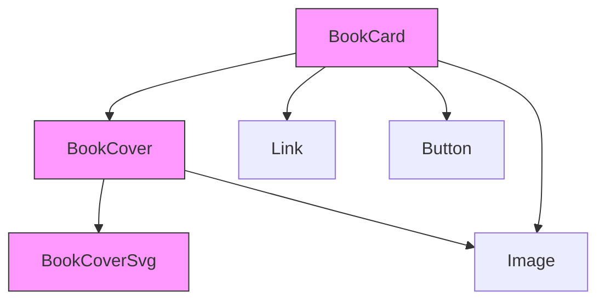
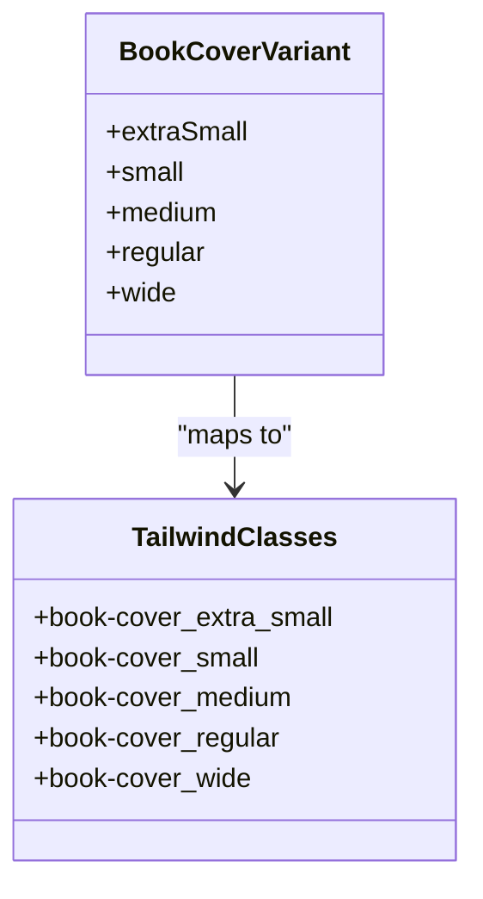
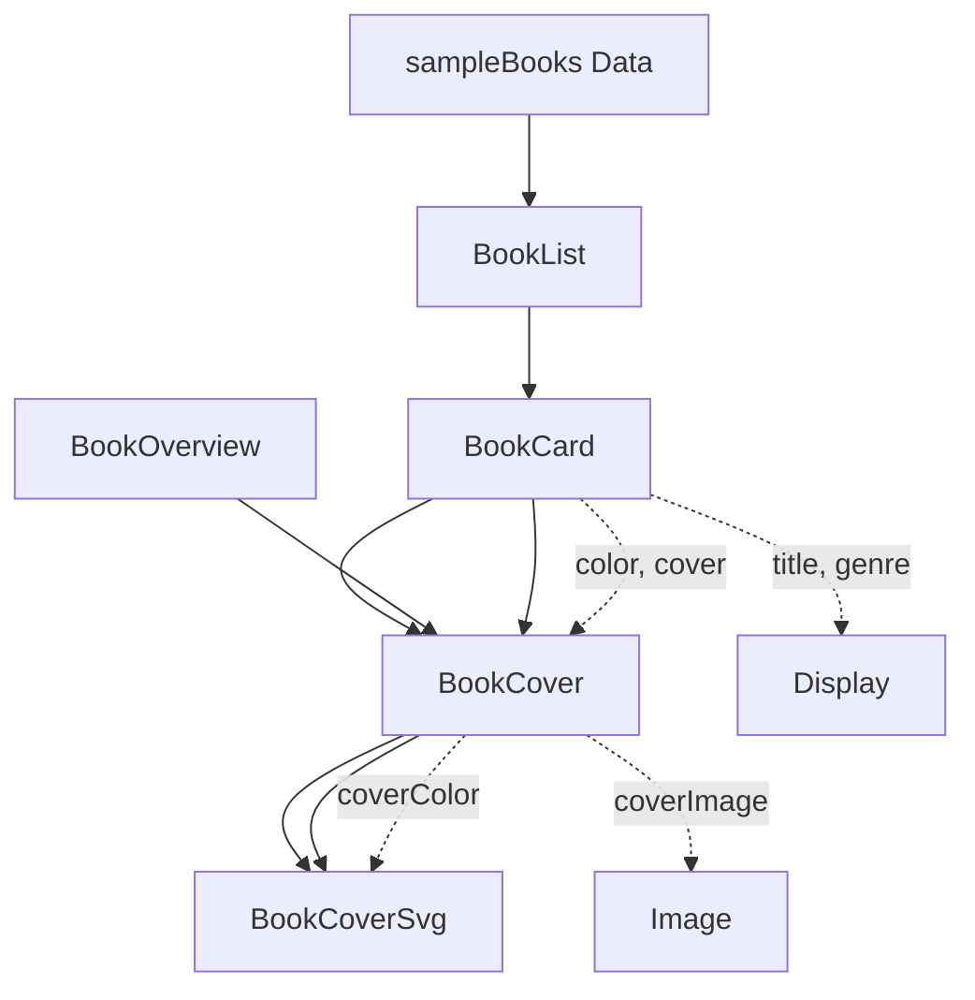

# Book Cover Visual Integration

<cite>
**Referenced Files in This Document**   
- [BookCard.tsx](file://components/BookCard.tsx)
- [BookCover.tsx](file://components/BookCover.tsx)
- [BookCoverSvg.tsx](file://components/BookCoverSvg.tsx)
- [utils.ts](file://lib/utils.ts)
- [globals.css](file://app/globals.css)
- [next.config.ts](file://next.config.ts)
- [types.d.ts](file://types.d.ts)
- [index.ts](file://constants/index.ts)
</cite>

## Table of Contents
1. [Introduction](#introduction)
2. [Component Architecture Overview](#component-architecture-overview)
3. [BookCard Component Analysis](#bookcard-component-analysis)
4. [BookCover Component Implementation](#bookcover-component-implementation)
5. [BookCoverSvg 3D Effect Generation](#bookcoversvg-3d-effect-generation)
6. [Styling and Responsive Design](#styling-and-responsive-design)
7. [Data Flow and Prop Management](#data-flow-and-prop-management)
8. [Accessibility and Image Optimization](#accessibility-and-image-optimization)
9. [Performance Considerations](#performance-considerations)
10. [Customization and Extension Options](#customization-and-extension-options)

## Introduction
This document provides a comprehensive analysis of the book cover visual integration system within the university LMS application. It details how the BookCard component composes BookCover and BookCoverSvg components to create a stylized, 3D-like book representation. The documentation covers the architectural relationships, styling coordination, data flow, and performance considerations for rendering book covers across the application.

## Component Architecture Overview



**Diagram sources**
- [BookCard.tsx](file://components/BookCard.tsx#L1-L47)
- [BookCover.tsx](file://components/BookCover.tsx#L1-L51)
- [BookCoverSvg.tsx](file://components/BookCoverSvg.tsx#L1-L55)

The book cover visualization system consists of three primary components working in concert: BookCard, BookCover, and BookCoverSvg. BookCard serves as the container component that integrates the visual elements with book metadata and interactive features. BookCover acts as the intermediate component that combines the SVG-based 3D effect with the actual book cover image. BookCoverSvg generates the stylized 3D book effect using SVG paths with dynamic color customization.

**Section sources**
- [BookCard.tsx](file://components/BookCard.tsx#L1-L47)
- [BookCover.tsx](file://components/BookCover.tsx#L1-L51)
- [BookCoverSvg.tsx](file://components/BookCoverSvg.tsx#L1-L55)

## BookCard Component Analysis

The BookCard component serves as the primary interface for displaying book information in list and grid layouts throughout the application. It integrates the BookCover component with metadata display and conditional UI elements based on the book's status.

```tsx
const BookCard = ({
  id,
  title,
  genre,
  color,
  cover,
  isLoanedBook = false,
}: Book) => (
  <li className={cn(isLoanedBook && "xs:w-52 w-full")}>
    <Link href={`/books/${id}`}>
      <BookCover coverColor={color} coverImage={cover} />
      <div className={cn("mt-4", !isLoanedBook && "xs:max-w-40 max-w-28")}>
        <p className="book-title">{title}</p>
        <p className="book-genre">{genre}</p>
      </div>
      {isLoanedBook && (
        <div className="mt-3 w-full">
          <div className="book-loaned">
            <Image src="/icons/calendar.svg" alt="calendar" width={18} height={18} />
            <p className="text-light-100">11 days left to return</p>
          </div>
          <Button className="book-btn">Download receipt</Button>
        </div>
      )}
    </Link>
  </li>
);
```

The component receives book data through props defined in the Book interface, including essential properties like id, title, genre, color, and cover image URL. The `isLoanedBook` prop controls conditional rendering of loan-specific information such as return deadlines and receipt download functionality. When a book is marked as loaned, additional UI elements appear below the cover and title/genre information.

BookCard is used in multiple contexts throughout the application, including the BookList component for displaying collections of books and the BookOverview component for featured books. The component uses the `cn` utility function from lib/utils.ts for conditional class name composition, allowing responsive styling based on the `isLoanedBook` state.

**Section sources**
- [BookCard.tsx](file://components/BookCard.tsx#L1-L47)
- [types.d.ts](file://types.d.ts#L1-L40)
- [BookList.tsx](file://components/BookList.tsx#L1-L23)
- [BookOverview.tsx](file://components/BookOverview.tsx#L1-L72)

## BookCover Component Implementation

The BookCover component serves as the bridge between the SVG-based 3D effect and the actual book cover image, combining both visual elements into a cohesive representation.

```tsx
const BookCover = ({
  className,
  variant = "regular",
  coverColor = "#012B48",
  coverImage = "https://placehold.co/400x600.png",
}: Props) => {
  return (
    <div
      className={cn(
        "relative transition-all duration-300",
        variantStyles[variant],
        className
      )}
    >
     <BookCoverSvg coverColor={coverColor} />
      <div
        className="absolute z-10"
        style={{ left: "12%", width: "87.5%", height: "88%" }}
      >
        <Image
          src={coverImage}
          alt="book cover"
          fill
          className="rounded-sm object-fill"
        />
      </div>
    </div>
  );
};
```

This component accepts four primary props:
- **className**: Additional CSS classes for customization
- **variant**: Size variant selection (extraSmall, small, medium, regular, wide)
- **coverColor**: Color for the book spine and edges
- **coverImage**: URL of the book cover image

The component uses a relative positioning container that houses both the BookCoverSvg and the actual cover image. The image is absolutely positioned with specific dimensions (87.5% width, 88% height) and offset (12% from the left) to create the illusion of depth, with the SVG elements appearing to frame the actual cover image. The transition-all and duration-300 classes enable smooth animations when the component state changes.

The variant prop allows for different size options, with corresponding CSS classes defined in the globals.css file. This enables responsive design where different cover sizes can be used based on the context (e.g., wide variant in BookOverview, regular variant in BookList).

**Section sources**
- [BookCover.tsx](file://components/BookCover.tsx#L1-L51)
- [globals.css](file://app/globals.css#L65-L81)

## BookCoverSvg 3D Effect Generation

The BookCoverSvg component creates the 3D book effect using SVG paths with carefully crafted shapes that simulate depth, shadows, and perspective.

```tsx
const BookCoverSvg = ({ coverColor }: { coverColor: string }) => {
    return (
        <svg
            preserveAspectRatio="none"
            fill="none"
            width="100%"
            height="100%"
            viewBox="0 0 143 199"
            xmlns="http://www.w3.org/2000/svg"
            className="absolute inset-0"
        >
            <path d="M141.851 196.481H140.652V174.61C141.39 173.885 141.851 172.876 141.851 171.763V4.26316C141.851 2.07107 140.068 0.277516 137.889 0.277516H16.7824C16.7824 0.277516 3.06348 -0.381156 0 11.5424V183.921C0 199.797 9.59001 198.993 9.59001 198.993H141.851C142.497 198.886 142.991 198.655 143 197.938C143.018 196.582 141.851 196.481 141.851 196.481Z"
                fill="#CAD7DB"
            />
            <path d="M141.851 196.481H140.652V194.036H4.79924C2.20563 190.492 2.50324 184.366 2.50324 184.366C2.76966 174.251 16.7824 175.749 16.7824 175.749H137.888C138.961 175.749 139.937 175.313 140.652 174.61C141.39 173.885 141.851 172.876 141.851 171.763V4.26316C141.851 2.07107 140.068 0.277516 137.888 0.277516H16.7824C16.7824 0.277516 3.06348 -0.381156 0 11.5424V183.921C0 199.797 9.59001 198.993 9.59001 198.993H141.851C142.497 198.886 142.991 198.655 143 197.938C143.018 196.582 141.851 196.481 141.851 196.481Z"
                fill={coverColor}
            />
            <!-- Additional paths for spine, pages, and shadows -->
        </svg>
    );
};
```

The SVG uses multiple paths to create the 3D effect:
- **Base layer**: A light gray path (#CAD7DB) that forms the shadow and depth effect
- **Main cover**: A path filled with the dynamic `coverColor` prop that represents the book's front cover
- **Spine**: A path that creates the book's spine with the same `coverColor`
- **Page details**: White paths that simulate the appearance of pages
- **Edge shadow**: A dark path (#03030B) that enhances the 3D effect
- **Side shadow**: A medium gray path (#AAB8BC) that adds depth to the side edge

The SVG is absolutely positioned to fill its container, allowing it to overlay perfectly with the actual book cover image. The preserveAspectRatio="none" attribute ensures the SVG stretches to fill the container without maintaining aspect ratio, which is essential for the 3D effect to work across different screen sizes and orientations.

**Section sources**
- [BookCoverSvg.tsx](file://components/BookCoverSvg.tsx#L1-L55)

## Styling and Responsive Design

The styling system for book covers is implemented through a combination of Tailwind CSS classes and custom CSS definitions in globals.css, enabling responsive design across different screen sizes.



**Diagram sources**
- [BookCover.tsx](file://components/BookCover.tsx#L1-L51)
- [globals.css](file://app/globals.css#L65-L81)

The BookCover component supports five size variants, each with corresponding CSS classes defined in globals.css:

- **extraSmall**: 28.95px width, 40px height
- **small**: 55px width, 76px height
- **medium**: 144px width, 199px height
- **regular**: 114px/174px width (responsive), 169px/239px height (responsive)
- **wide**: 256px/296px width (responsive), 354px/404px height (responsive)

The responsive design uses Tailwind's breakpoint system (xs prefix) to adjust dimensions on larger screens. This allows the book covers to scale appropriately based on the viewport size, ensuring optimal display on both mobile and desktop devices.

The styling system also incorporates transition effects with a 300ms duration, providing smooth animations when the component state changes. The z-index system ensures proper layering, with the actual cover image (z-10) appearing above the SVG elements.

In the BookOverview component, the wide variant is used to create a prominent display of the featured book, while the BookList component uses the regular variant for a more compact presentation. The BookCard component also applies conditional styling based on the isLoanedBook prop, adjusting the width and layout for loaned books.

**Section sources**
- [globals.css](file://app/globals.css#L65-L81)
- [BookCover.tsx](file://components/BookCover.tsx#L1-L51)
- [BookOverview.tsx](file://components/BookOverview.tsx#L1-L72)

## Data Flow and Prop Management

The data flow for book cover components follows a clear hierarchy from parent to child components, with proper type definitions ensuring type safety throughout the application.



**Diagram sources**
- [index.ts](file://constants/index.ts#L1-L193)
- [BookList.tsx](file://components/BookList.tsx#L1-L23)
- [BookCard.tsx](file://components/BookCard.tsx#L1-L47)
- [BookCover.tsx](file://components/BookCover.tsx#L1-L51)
- [BookCoverSvg.tsx](file://components/BookCoverSvg.tsx#L1-L55)

The data originates from the sampleBooks array in constants/index.ts, which contains book objects with properties including id, title, genre, rating, total_copies, available_copies, description, color, cover, video, and summary. The Book interface in types.d.ts defines the type structure for these objects.

When a BookList component is rendered, it maps over the books array and creates BookCard components for each book, passing all book properties as props using the spread operator ({...book}). The BookCard component destructures the relevant props (id, title, genre, color, cover, isLoanedBook) and passes the color and cover values to the BookCover component.

The BookCover component receives the coverColor and coverImage props and passes the coverColor to BookCoverSvg while using coverImage for the Next.js Image component. Default values are provided for both props to ensure the component renders correctly even when data is missing: #012B48 for coverColor and a placeholder image URL for coverImage.

This prop drilling pattern ensures that each component receives only the data it needs while maintaining a clear data flow from the data source to the final visual representation.

**Section sources**
- [types.d.ts](file://types.d.ts#L1-L40)
- [index.ts](file://constants/index.ts#L1-L193)
- [BookList.tsx](file://components/BookList.tsx#L1-L23)
- [BookCard.tsx](file://components/BookCard.tsx#L1-L47)
- [BookCover.tsx](file://components/BookCover.tsx#L1-L51)
- [BookCoverSvg.tsx](file://components/BookCoverSvg.tsx#L1-L55)

## Accessibility and Image Optimization

The book cover components incorporate accessibility features and image optimization techniques to ensure a high-quality user experience across different devices and network conditions.

The primary accessibility feature is the alt text on the cover image: `alt="book cover"`. This provides screen readers with a meaningful description of the image content. Additional icons in the BookCard component (calendar.svg) also include appropriate alt text ("calendar") to ensure all visual elements are accessible.

Image optimization is handled through Next.js Image component and configuration in next.config.ts:

```ts
const nextConfig: NextConfig = {
  images: {
    remotePatterns: [
      {
        protocol: "https",
        hostname: "placehold.co",
      },
      {
        protocol: "https",
        hostname: "m.media-amazon.com",
      },
    ],
  },
};
```

This configuration allows the application to optimize images from two external domains:
- placehold.co: Used for placeholder images when actual cover images are not available
- m.media-amazon.com: Source of actual book cover images in the sample data

The Next.js Image component with the fill prop enables responsive image loading with automatic optimization, including:
- Automatic image compression
- Responsive image sizing
- Lazy loading by default
- WebP format delivery when supported
- Blur-up placeholder effects

The package.json and package-lock.json files reveal the presence of the sharp image processing library, which is used by Next.js for server-side image optimization. This ensures that images are resized and compressed on the server before being delivered to the client, reducing bandwidth usage and improving load times.

The object-fill class on the image ensures the cover image fills its container while maintaining its aspect ratio, preventing visual distortion. The rounded-sm class adds subtle rounding to the image corners, matching the overall design aesthetic.

**Section sources**
- [BookCover.tsx](file://components/BookCover.tsx#L1-L51)
- [next.config.ts](file://next.config.ts#L1-L18)
- [package-lock.json](file://package-lock.json#L5483-L5554)

## Performance Considerations

The book cover rendering system incorporates several performance optimizations to ensure smooth rendering, especially when displaying multiple covers in list views.

When rendering multiple BookCard components in a BookList, the following performance considerations apply:

1. **Image Optimization**: The Next.js Image component automatically implements lazy loading, ensuring that only images in or near the viewport are loaded. This prevents unnecessary network requests when scrolling through long lists of books.

2. **Component Memoization**: While not explicitly implemented with React.memo, the functional component design with pure rendering properties allows React to optimize re-renders when props remain unchanged.

3. **Efficient SVG Rendering**: The BookCoverSvg component uses static SVG markup with dynamic fill colors, which is more efficient than generating complex canvas-based 3D effects. SVGs are lightweight and scale perfectly to any size without quality loss.

4. **Conditional Rendering**: The BookCard component uses conditional rendering for loan-specific UI elements, preventing unnecessary DOM elements from being created when not needed.

5. **CSS Optimization**: The use of Tailwind CSS with tree-shaking ensures only the used utility classes are included in the final build, minimizing CSS bundle size.

6. **Placeholder Strategy**: The fallback cover image (https://placehold.co/400x600.png) provides a consistent visual experience even when actual cover images fail to load or are not available.

For applications with very large book collections, additional optimizations could include:
- Implementing virtual scrolling to render only visible items
- Adding explicit React.memo to BookCard to prevent unnecessary re-renders
- Using Intersection Observer for more granular control over image loading
- Implementing a caching strategy for frequently accessed cover images

The current implementation strikes a balance between visual richness and performance, providing an engaging user experience without compromising on load times or responsiveness.

**Section sources**
- [BookCard.tsx](file://components/BookCard.tsx#L1-L47)
- [BookCover.tsx](file://components/BookCover.tsx#L1-L51)
- [next.config.ts](file://next.config.ts#L1-L18)
- [package-lock.json](file://package-lock.json#L5483-L5554)

## Customization and Extension Options

The book cover component system provides several customization and extension options that allow for adaptation to different use cases and design requirements.

### Aspect Ratio Modification
The aspect ratio of book covers can be modified by updating the CSS classes in globals.css or by passing custom styles through the className prop. For example, to create a square cover variant:

```css
.book-cover_square {
  @apply w-40 h-40;
}
```

### Animation Enhancement
Additional animations can be added by extending the transition classes or adding CSS animations. For example, to add a hover effect:

```css
.book-cover:hover {
  @apply scale-105 shadow-lg;
  transition: all 0.2s ease-in-out;
}
```

### New Image Formats
The system can support new image formats by updating the next.config.ts remotePatterns configuration to include additional hostnames or protocols. For example, to support WebP images from a new source:

```ts
remotePatterns: [
  {
    protocol: "https",
    hostname: "images.example.com",
    pathname: "/**",
  },
]
```

### Additional Cover Variants
New size variants can be added by extending the BookCoverVariant type and adding corresponding CSS classes:

```ts
type BookCoverVariant = "extraSmall" | "small" | "medium" | "regular" | "wide" | "thumbnail";

const variantStyles: Record<BookCoverVariant, string> = {
  // existing variants
  thumbnail: "book-cover_thumbnail",
};
```

### Accessibility Improvements
The accessibility features can be enhanced by adding ARIA labels and roles:

```tsx
<div role="img" aria-label={`Book cover for ${title}`} className="relative">
```

### Dark Mode Support
The component system can be extended to support dark mode by using CSS variables or conditional styling based on user preferences.

These customization options demonstrate the flexibility of the current implementation, allowing developers to adapt the book cover components to meet evolving design requirements while maintaining the core functionality and performance characteristics.

**Section sources**
- [BookCover.tsx](file://components/BookCover.tsx#L1-L51)
- [globals.css](file://app/globals.css#L65-L81)
- [next.config.ts](file://next.config.ts#L1-L18)
- [types.d.ts](file://types.d.ts#L1-L40)