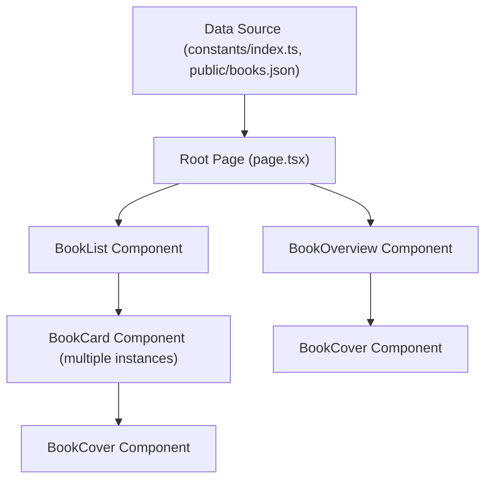
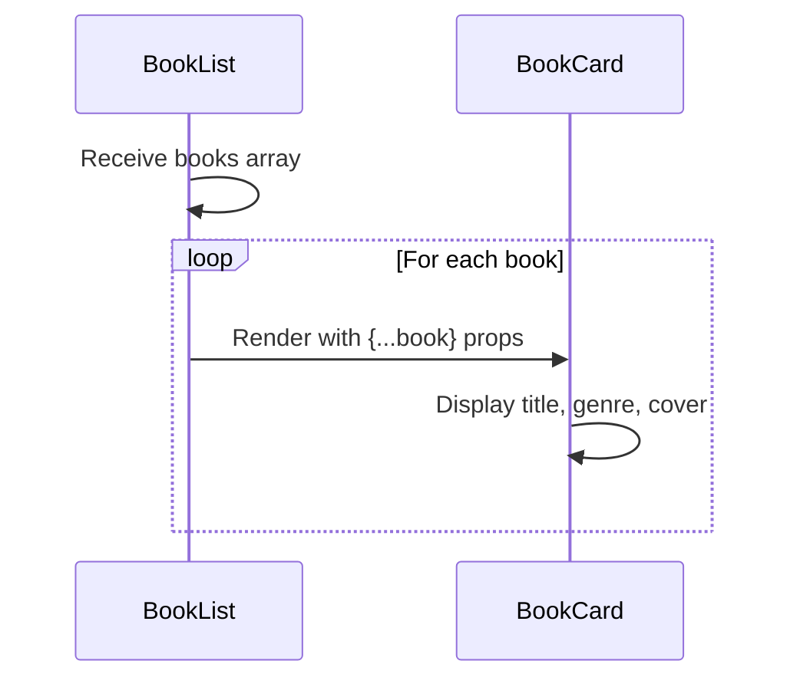
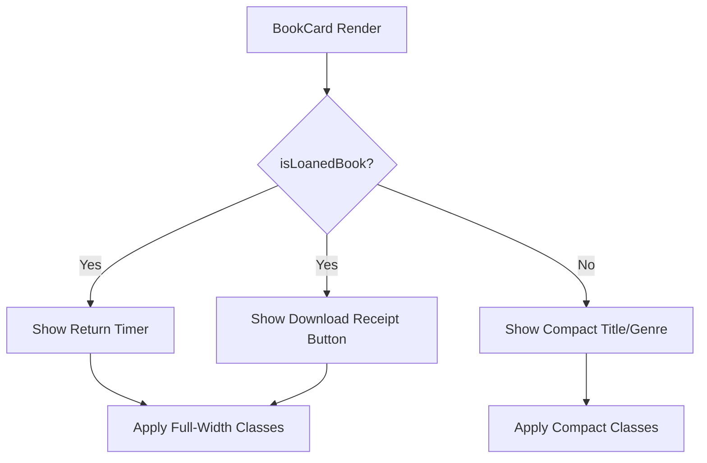

# Usage Patterns and Composition

<cite>
**Referenced Files in This Document**   
- [BookCard.tsx](file://components/BookCard.tsx)
- [BookList.tsx](file://components/BookList.tsx)
- [BookOverview.tsx](file://components/BookOverview.tsx)
- [index.ts](file://constants/index.ts)
- [types.d.ts](file://types.d.ts)
- [books.json](file://public/books.json)
- [page.tsx](file://app/(root)/page.tsx)
</cite>

## Table of Contents
1. [Introduction](#introduction)
2. [Data Flow and Source Integration](#data-flow-and-source-integration)
3. [BookCard in BookList: Rendering Collections](#bookcard-in-booklist-rendering-collections)
4. [BookCard in BookOverview: Featured Displays](#bookcard-in-bookoverview-featured-displays)
5. [Conditional Rendering and State Handling](#conditional-rendering-and-state-handling)
6. [Performance Considerations and Best Practices](#performance-considerations-and-best-practices)
7. [Extensibility and Future Enhancements](#extensibility-and-future-enhancements)

## Introduction
The **BookCard** component in the university_lms application serves as a reusable UI building block for displaying book information across multiple contexts. It is designed to be flexible, supporting different display modes such as standard listings and loaned book status. This document explores how **BookCard** is composed within **BookList** for rendering collections and within **BookOverview** for featured displays. It details the data flow from static sources like `constants/index.ts` and `public/books.json`, examines conditional rendering logic based on book state, and provides guidance on performance optimization and future extensibility.

## Data Flow and Source Integration
The book data used throughout the application originates from two primary sources: a static array `sampleBooks` defined in `constants/index.ts` and a JSON file `public/books.json`. Both contain structured book objects that conform to the `Book` interface defined in `types.d.ts`.

The `Book` interface includes essential properties such as `id`, `title`, `author`, `genre`, `rating`, `total_copies`, `available_copies`, `description`, `color`, `cover`, and `video`. These properties are passed down through props from parent components to **BookCard** and **BookOverview**.

In the root page (`app/(root)/page.tsx`), the `sampleBooks` array is imported and used directly to populate both **BookOverview** and **BookList** components. This demonstrates a static data injection pattern where mock or seeded data drives the UI during development or for demonstration purposes.



**Diagram sources**
- [index.ts](file://constants/index.ts#L150-L193)
- [types.d.ts](file://types.d.ts#L1-L14)
- [page.tsx](file://app/(root)/page.tsx#L1-L15)
- [BookOverview.tsx](file://components/BookOverview.tsx#L1-L73)
- [BookList.tsx](file://components/BookList.tsx#L1-L24)

**Section sources**
- [index.ts](file://constants/index.ts#L150-L193)
- [types.d.ts](file://types.d.ts#L1-L14)
- [page.tsx](file://app/(root)/page.tsx#L1-L15)

## BookCard in BookList: Rendering Collections
The **BookList** component is responsible for rendering a collection of books using the **BookCard** component. It accepts a `books` array as a prop and maps over it to generate a list of **BookCard** instances.

Each **BookCard** is given a `key` based on the book's `title`. While functional, this approach could lead to issues if multiple books share the same title. A more robust key would be the `id` field, which is guaranteed to be unique.

```tsx
{books.map((book) => (
  <BookCard key={book.title} {...book} />
))}
```

The **BookList** component wraps the **BookCard** elements in an unordered list (`<ul>`) with the class `book-list`, ensuring proper semantic HTML structure. The parent also passes a `title` prop to render a heading above the list, providing context for the displayed books.

This composition pattern enables reusable, consistent rendering of book items across different sections of the application, such as "Latest Books" or "Recommended Titles".



**Diagram sources**
- [BookList.tsx](file://components/BookList.tsx#L1-L24)
- [BookCard.tsx](file://components/BookCard.tsx#L1-L48)

**Section sources**
- [BookList.tsx](file://components/BookList.tsx#L1-L24)

## BookCard in BookOverview: Featured Displays
While **BookCard** is not directly used in **BookOverview**, both components share common subcomponents like **BookCover**, indicating a design system approach where visual elements are abstracted for reuse.

The **BookOverview** component displays a single book in detail, showing additional information such as author, rating, total and available copies, and a full description. It uses the same `Book` interface to receive data, ensuring consistency with **BookCard**.

Unlike **BookCard**, **BookOverview** includes interactive elements like a "Borrow" button, suggesting that user authentication state may influence available actions. However, this logic is not implemented in the current codebase, indicating a potential area for future development.

The component also features a visually rich book cover display with a layered effect using two **BookCover** instances, one slightly rotated and offset, enhancing the visual appeal of the featured book.

**Section sources**
- [BookOverview.tsx](file://components/BookOverview.tsx#L1-L73)

## Conditional Rendering and State Handling
The **BookCard** component implements conditional rendering based on the `isLoanedBook` prop. When `true`, the card displays additional information relevant to a borrowed book:

- A calendar icon with a message indicating "11 days left to return"
- A "Download receipt" button

This is achieved using a simple logical AND operator in JSX:

```tsx
{isLoanedBook && (
  <div className="mt-3 w-full">
    <div className="book-loaned">
      <Image src="/icons/calendar.svg" alt="calendar" width={18} height={18} />
      <p className="text-light-100">11 days left to return</p>
    </div>
    <Button className="book-btn">Download receipt</Button>
  </div>
)}
```

Additionally, the component uses conditional class names via the `cn` utility to adjust layout based on the `isLoanedBook` state, modifying width and alignment for better presentation in different contexts.

This pattern allows the same **BookCard** to serve dual purposes: as a general book listing and as a representation of a user's currently borrowed book.



**Diagram sources**
- [BookCard.tsx](file://components/BookCard.tsx#L1-L48)

**Section sources**
- [BookCard.tsx](file://components/BookCard.tsx#L1-L48)

## Performance Considerations and Best Practices
Currently, the **BookCard** component is implemented as a basic functional component without memoization. For large lists, this could lead to unnecessary re-renders when parent state changes.

**Recommended Improvements:**
1. **Use `React.memo`**: Wrap **BookCard** with `React.memo` to prevent re-renders when props haven't changed.
2. **Optimize Keys**: Change the key in **BookList** from `book.title` to `book.id` to ensure uniqueness and stability.
3. **Virtualization**: For large collections, implement virtual scrolling using libraries like `react-window` or `virtuoso` to render only visible items.
4. **Lazy Loading**: Implement lazy loading for book cover images to improve initial load performance.

Example of optimized **BookCard**:
```tsx
export default React.memo(BookCard);
```

And in **BookList**:
```tsx
<BookCard key={book.id} {...book} />
```

These optimizations would significantly improve performance when rendering hundreds of books, ensuring smooth scrolling and responsive interactions.

**Section sources**
- [BookCard.tsx](file://components/BookCard.tsx#L1-L48)
- [BookList.tsx](file://components/BookList.tsx#L1-L24)

## Extensibility and Future Enhancements
The **BookCard** component can be extended to support additional use cases:

1. **Action Buttons**: Add conditional buttons based on user role or book availability (e.g., "Borrow", "Renew", "Reserve").
2. **API Integration**: Replace static data with API calls to fetch real-time book availability and user borrowing status.
3. **Authentication State**: Introduce context or prop to conditionally render actions based on whether the user is logged in.
4. **Accessibility**: Enhance keyboard navigation and screen reader support.
5. **Hover Effects**: Add interactive states for desktop users.

Example extension for action buttons:
```tsx
{available_copies > 0 && !isLoanedBook && (
  <Button onClick={() => onBorrow(book.id)}>Borrow</Button>
)}
```

These enhancements would make **BookCard** a more dynamic and interactive component while maintaining its reusability across different application contexts.

**Section sources**
- [BookCard.tsx](file://components/BookCard.tsx#L1-L48)
- [types.d.ts](file://types.d.ts#L1-L14)