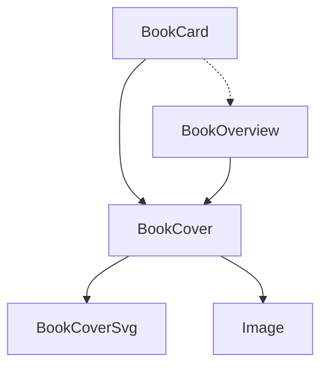

# Book Cover Components

<cite>
**Referenced Files in This Document**   
- [BookCover.tsx](file://components/BookCover.tsx)
- [BookCoverSvg.tsx](file://components/BookCoverSvg.tsx)
- [BookCard.tsx](file://components/BookCard.tsx)
- [globals.css](file://app/globals.css)
- [BookOverview.tsx](file://components/BookOverview.tsx)
</cite>

## Table of Contents
1. [Introduction](#introduction)
2. [Component Architecture](#component-architecture)
3. [BookCover Component](#bookcover-component)
4. [BookCoverSvg Component](#bookcoversvg-component)
5. [Responsive Behavior and Aspect Ratio](#responsive-behavior-and-aspect-ratio)
6. [Usage in BookCard](#usage-in-bookcard)
7. [Customization Options](#customization-options)
8. [Best Practices](#best-practices)

## Introduction
The BookCover and BookCoverSvg components work together to create a visually engaging 3D-like book cover representation within the university_lms application. These components are used in BookCard to display book covers with dynamic colors and images. The design combines SVG artwork with image overlays to create depth and visual interest, while maintaining responsiveness across different screen sizes.

## Component Architecture



**Diagram sources**
- [BookCard.tsx](file://components/BookCard.tsx#L2)
- [BookCover.tsx](file://components/BookCover.tsx#L3)
- [BookCoverSvg.tsx](file://components/BookCoverSvg.tsx#L1)

## BookCover Component

The BookCover component acts as a wrapper that applies perspective and shadow effects using Tailwind CSS. It manages the overall structure and layout of the book cover, combining the SVG artwork with the actual book image.

### Structure and Props
The component accepts the following props:
- **className**: Additional CSS classes for customization
- **variant**: Size variant (extraSmall, small, medium, regular, wide)
- **coverColor**: Dynamic color for the SVG artwork
- **coverImage**: URL of the book cover image

### Implementation Details
The BookCover component uses Tailwind CSS classes to create a responsive container with transition effects:

```tsx
const BookCover = ({
  className,
  variant = "regular",
  coverColor = "#012B48",
  coverImage = "https://placehold.co/400x600.png",
}: Props) => {
  return (
    <div
      className={cn(
        "relative transition-all duration-300",
        variantStyles[variant],
        className
      )}
    >
     <BookCoverSvg coverColor={coverColor} />
      <div
        className="absolute z-10"
        style={{ left: "12%", width: "87.5%", height: "88%" }}
      >
        <Image
          src={coverImage}
          alt="book cover"
          fill
          className="rounded-sm object-fill"
        />
      </div>
    </div>
  );
};
```

The component uses a relative container with absolute positioning to layer the SVG artwork and the book image. The transition-all and duration-300 classes provide smooth animations when the component state changes.

### Size Variants
The component supports five size variants through the variant prop:
- **extraSmall**: 28.95px × 40px
- **small**: 55px × 76px
- **medium**: 144px × 199px
- **regular**: 114px × 169px (xs: 174px × 239px)
- **wide**: 256px × 354px (xs: 296px × 404px)

These variants are defined in the variantStyles object and correspond to CSS classes in globals.css.

**Section sources**
- [BookCover.tsx](file://components/BookCover.tsx#L7-L51)
- [globals.css](file://app/globals.css#L100-L105)

## BookCoverSvg Component

The BookCoverSvg component renders the actual book artwork as an SVG with dynamic color and text. It creates the 3D-like appearance with shadows and perspective effects.

### SVG Structure
The component renders an SVG with multiple paths that create the book cover artwork:

```tsx
const BookCoverSvg = ({ coverColor }: { coverColor: string }) => {
    return (
        <svg
            preserveAspectRatio="none"
            fill="none"
            width="100%"
            height="100%"
            viewBox="0 0 143 199"
            xmlns="http://www.w3.org/2000/svg"
            className="absolute inset-0"
        >
            {/* Multiple path elements */}
        </svg>
    );
};
```

### Design Elements
The SVG contains several key visual elements:

1. **Base Layer**: A light gray background (#CAD7DB) that forms the base of the book cover
2. **Main Cover**: The primary book cover area filled with the dynamic coverColor
3. **Spine**: A vertical section on the left side of the book
4. **Title Areas**: Two rectangular areas for book titles
5. **Text Elements**: White text elements for book details
6. **Shadow Effects**: Darker paths (#03030B and #AAB8BC) that create depth and perspective

### Color Implementation
The component uses dynamic coloring through props:
- **coverColor**: Applied to the main cover, spine, and title areas
- **Static colors**: #CAD7DB (base), #03030B (shadow), #AAB8BC (additional shadow), and white (text)

The preserveAspectRatio="none" attribute allows the SVG to stretch to fill its container, maintaining the visual effect across different sizes.

**Section sources**
- [BookCoverSvg.tsx](file://components/BookCoverSvg.tsx#L1-L55)

## Responsive Behavior and Aspect Ratio

### ViewBox and Scaling
The BookCoverSvg component uses a viewBox of "0 0 143 199", which establishes a 143:199 aspect ratio (approximately 1:1.39). This ratio is maintained across different screen sizes through the combination of the viewBox attribute and responsive CSS classes.

### preserveAspectRatio="none"
The preserveAspectRatio="none" attribute is crucial to the responsive behavior. It allows the SVG to stretch to fill its container without maintaining the aspect ratio, which creates a perspective effect where the book appears to be viewed at an angle.

### CSS Media Queries
The component uses Tailwind's responsive prefixes (xs:) to adjust sizes at different breakpoints:

```css
.book-cover_regular {
    @apply xs:w-[174px] w-[114px] xs:h-[239px] h-[169px];
}
```

This ensures that on extra-small screens and larger, the component uses larger dimensions, while on smaller screens, it uses more compact dimensions.

### Image Positioning
The book image is positioned absolutely within the cover with specific percentages:
- **left**: 12% from the left edge
- **width**: 87.5% of the container
- **height**: 88% of the container

This creates a consistent border around the image while allowing it to scale with the container.

**Section sources**
- [BookCoverSvg.tsx](file://components/BookCoverSvg.tsx#L4)
- [globals.css](file://app/globals.css#L100-L105)

## Usage in BookCard

### Component Composition
The BookCard component uses BookCover to display book information in a card format:

```tsx
const BookCard = ({
  id,
  title,
  genre,
  color,
  cover,
  isLoanedBook = false,
}: Book) => (
  <li className={cn(isLoanedBook && "xs:w-52 w-full")}>
    <Link
      href={`/books/${id}`}
      className={cn(isLoanedBook && "w-full flex flex-col items-center")}
    >
      <BookCover coverColor={color} coverImage={cover} />

      <div className={cn("mt-4", !isLoanedBook && "xs:max-w-40 max-w-28")}>
        <p className="book-title">{title}</p>
        <p className="book-genre">{genre}</p>
      </div>
    </Link>
  </li>
);
```

### Prop Passing
BookCard passes the following props to BookCover:
- **coverColor**: From the book's color property
- **coverImage**: From the book's cover property

The component receives book data through its props interface, which includes id, title, genre, color, and cover properties.

### Advanced Usage in BookOverview
The BookOverview component demonstrates more advanced usage with multiple BookCover instances:

```tsx
<BookCover
  variant="wide"
  className="z-10"
  coverColor={color}
  coverImage={cover}
/>

<div className="absolute left-16 top-10 rotate-12 opacity-40 max-sm:hidden">
  <BookCover variant="wide" coverColor={color} coverImage={cover} />
</div>
```

This creates a layered effect with a rotated, semi-transparent duplicate cover in the background, enhancing the 3D appearance.

**Section sources**
- [BookCard.tsx](file://components/BookCard.tsx#L1-L48)
- [BookOverview.tsx](file://components/BookOverview.tsx#L64-L72)

## Customization Options

### Modifying the SVG Design
To modify the SVG design, edit the path elements in BookCoverSvg.tsx. Each path represents a different visual element:
- Change d attributes to modify shapes
- Adjust fill colors for different visual effects
- Add new paths for additional design elements

### Changing the Perspective Effect
The perspective effect can be adjusted by:
1. Modifying the preserveAspectRatio attribute
2. Adjusting the viewBox dimensions
3. Changing the path coordinates to alter the 3D appearance

### Supporting Image-Based Covers
To support image-based covers instead of SVG:
1. Create a new component variant
2. Replace BookCoverSvg with an Image component
3. Apply similar shadow and perspective effects using CSS

Example:
```tsx
<div className="relative">
  <Image 
    src={coverImage} 
    alt="book cover" 
    fill
    className="rounded-sm shadow-lg"
  />
  <div className="absolute inset-0 bg-gradient-to-r from-black/20 to-transparent"></div>
</div>
```

### Adding New Size Variants
To add new size variants:
1. Add a new entry to the BookCoverVariant type
2. Add a corresponding entry to variantStyles
3. Define the CSS class in globals.css

Example:
```tsx
type BookCoverVariant = "extraSmall" | "small" | "medium" | "regular" | "wide" | "large";

const variantStyles: Record<BookCoverVariant, string> = {
  // existing variants
  large: "book-cover_large",
};
```

With corresponding CSS:
```css
.book-cover_large {
    @apply xs:w-[350px] w-[300px] xs:h-[480px] h-[410px];
}
```

## Best Practices

### Visual Consistency
- Use consistent color schemes across all book covers
- Maintain the same aspect ratio for all cover variants
- Ensure text elements are readable at all sizes
- Test color combinations for accessibility

### Performance Optimization
- **Image Optimization**: Use optimized cover images with appropriate dimensions
- **Lazy Loading**: Implement lazy loading for BookCover components when rendering multiple covers
- **Memoization**: Consider using React.memo for BookCover to prevent unnecessary re-renders

```tsx
const MemoizedBookCover = React.memo(BookCover);
```

- **CSS Optimization**: Combine frequently used classes to reduce bundle size

### Responsive Design
- Test across multiple screen sizes
- Ensure touch targets are appropriately sized on mobile devices
- Verify that text remains readable at all breakpoints
- Check that the perspective effect works well on different aspect ratios

### Accessibility
- Ensure sufficient color contrast between text and background
- Provide appropriate alt text for images
- Support keyboard navigation within BookCard
- Test with screen readers to ensure content is properly announced

### Maintenance
- Document any customizations to the SVG paths
- Keep a style guide for book cover designs
- Regularly review performance when adding new books to the system
- Monitor for any layout shifts when the component loads