# Book Display Components

<cite>
**Referenced Files in This Document**   
- [types.d.ts](file://types.d.ts#L0-L14)
- [constants/index.ts](file://constants/index.ts#L145-L193)
- [components/BookCard.tsx](file://components/BookCard.tsx#L0-L48)
- [components/BookCover.tsx](file://components/BookCover.tsx#L0-L52)
- [components/BookCoverSvg.tsx](file://components/BookCoverSvg.tsx#L0-L55)
- [components/BookList.tsx](file://components/BookList.tsx#L0-L24)
- [components/BookOverview.tsx](file://components/BookOverview.tsx#L0-L73)
- [public/books.json](file://public/books.json#L0-L239)
</cite>

## Table of Contents
1. [Introduction](#introduction)
2. [Core Component Hierarchy](#core-component-hierarchy)
3. [Data Structure: Book Interface](#data-structure-book-interface)
4. [Component Composition and Props Flow](#component-composition-and-props-flow)
5. [Visual Representation: Book Cover System](#visual-representation-book-cover-system)
6. [Container Components: BookList and BookOverview](#container-components-booklist-and-bookoverview)
7. [Sample Data and Component Tree](#sample-data-and-component-tree)
8. [Responsive Layout Strategies](#responsive-layout-strategies)
9. [Customization and Extension Points](#customization-and-extension-points)
10. [Best Practices for Reuse](#best-practices-for-reuse)

## Introduction
This document provides a comprehensive analysis of the book display component system in the university_lms application. It details the hierarchical structure, data flow, visual composition, and responsive design patterns used to present book information throughout the application. The system is built around a modular component architecture that enables consistent presentation of book data across different views.

## Core Component Hierarchy
The book display system follows a hierarchical composition pattern where container components orchestrate the presentation of specialized child components. This architecture promotes reusability and maintainability across the application.

```mermaid
graph TD
BookOverview["BookOverview<br/>Container for detailed book view"] --> BookCover["BookCover<br/>Visual representation component"]
BookList["BookList<br/>Container for multiple books"] --> BookCard["BookCard<br/>Individual book presentation"]
BookCard --> BookCover
BookCover --> BookCoverSvg["BookCoverSvg<br/>SVG-based cover decoration"]
style BookOverview fill:#f9f,stroke:#333
style BookList fill:#f9f,stroke:#333
style BookCard fill:#bbf,stroke:#333
style BookCover fill:#bbf,stroke:#333
style BookCoverSvg fill:#bbf,stroke:#333
```



**Diagram sources**
- [components/BookOverview.tsx](file://components/BookOverview.tsx#L0-L73)
- [components/BookList.tsx](file://components/BookList.tsx#L0-L24)
- [components/BookCard.tsx](file://components/BookCard.tsx#L0-L48)
- [components/BookCover.tsx](file://components/BookCover.tsx#L0-L52)
- [components/BookCoverSvg.tsx](file://components/BookCoverSvg.tsx#L0-L55)

**Section sources**
- [components/BookOverview.tsx](file://components/BookOverview.tsx#L0-L73)
- [components/BookList.tsx](file://components/BookList.tsx#L0-L24)

## Data Structure: Book Interface
The Book interface defines the data structure used throughout the book display components. This consistent type ensures type safety and predictable data flow across the component tree.

```typescript
interface Book {
  id: number;
  title: string;
  author: string;
  genre: string;
  rating: number;
  total_copies: number;
  available_copies: number;
  description: string;
  color: string;
  cover: string;
  video: string;
  summary: string;
  createdAt?: Date | null;
}
```

The interface includes essential book metadata, visual properties (color, cover), and availability information. The optional createdAt field supports flexible data handling from different sources.

**Section sources**
- [types.d.ts](file://types.d.ts#L0-L14)

## Component Composition and Props Flow
The book display components follow a clear composition pattern where data flows from container components to presentation components through props. This unidirectional data flow ensures predictable rendering and easy debugging.


**Diagram sources**
- [constants/index.ts](file://constants/index.ts#L145-L193)
- [components/BookList.tsx](file://components/BookList.tsx#L0-L24)
- [components/BookCard.tsx](file://components/BookCard.tsx#L0-L48)
- [components/BookCover.tsx](file://components/BookCover.tsx#L0-L52)

**Section sources**
- [components/BookList.tsx](file://components/BookList.tsx#L0-L24)
- [components/BookCard.tsx](file://components/BookCard.tsx#L0-L48)

## Visual Representation: Book Cover System
The book cover visualization system uses a layered approach combining SVG graphics with image overlays to create a realistic book cover effect. This system is implemented across multiple components working in concert.

### BookCover Component
The BookCover component serves as the primary interface for book cover visualization, accepting props to customize appearance:

```typescript
interface Props {
  className?: string;
  variant?: BookCoverVariant;
  coverColor: string;
  coverImage: string;
}
```

It supports different size variants (extraSmall, small, medium, regular, wide) through CSS classes defined in the variantStyles object.

### BookCoverSvg Component
The BookCoverSvg component renders an SVG element that provides the book cover's decorative elements:

```tsx
const BookCoverSvg = ({ coverColor }: { coverColor: string }) => {
    return (
        <svg preserveAspectRatio="none" fill="none" width="100%" height="100%" viewBox="0 0 143 199" xmlns="http://www.w3.org/2000/svg" className="absolute inset-0">
            {/* Multiple path elements creating book spine, edges, and design elements */}
            <path d="M141.851 196.481H140.652V174.61..." fill="#CAD7DB" />
            <path d="M141.851 196.481H140.652V194.036..." fill={coverColor} />
            {/* Additional decorative paths */}
        </svg>
    );
};
```

The SVG uses the coverColor prop to style key elements, creating a cohesive look with the actual book cover image.

### Layered Composition
The visual effect is achieved through CSS positioning, with the SVG forming the base layer and the actual book cover image positioned absolutely on top:

```tsx
<div className="relative transition-all duration-300">
  <BookCoverSvg coverColor={coverColor} />
  <div className="absolute z-10" style={{ left: "12%", width: "87.5%", height: "88%" }}>
    <Image src={coverImage} alt="book cover" fill className="rounded-sm object-fill" />
  </div>
</div>
```

This layered approach creates depth and realism in the book representation.

**Section sources**
- [components/BookCover.tsx](file://components/BookCover.tsx#L0-L52)
- [components/BookCoverSvg.tsx](file://components/BookCoverSvg.tsx#L0-L55)

## Container Components: BookList and BookOverview
The BookList and BookOverview components serve as container components that orchestrate the presentation of book information in different contexts.

### BookList Component
The BookList component displays a collection of books in a list format:

```tsx
export const BookList = ({ title, books, containerClassName }: Props) => {
  return (
    <section className={containerClassName}>
      <h2 className="font-bebas-neue text-4xl text-light-100">{title}</h2>
      <ul className="book-list">
        {books.map((book) => (
          <BookCard key={book.title} {...book} />
        ))}
      </ul>
    </section>
  );
};
```

It accepts a title for the section, an array of Book objects, and an optional containerClassName for custom styling. The component maps over the books array, creating a BookCard for each book and spreading all book properties as props.

### BookOverview Component
The BookOverview component provides a detailed view of a single book:

```tsx
const BookOverview = ({
  title,
  author,
  genre,
  rating,
  total_copies,
  available_copies,
  description,
  color,
  cover,
  id,
}: Book) => {
  return (
    <section className="book-overview">
      <div className="flex flex-1 flex-col gap-5">
        <h1>{title}</h1>
        <div className="book-info">
          <p>By <span className="font-semibold text-light-200">{author}</span></p>
          <p>Category <span className="font-semibold text-light-200">{genre}</span></p>
          <div className="flex flex-row gap-1">
            <Image src="/icons/star.svg" alt="star" width={22} height={22} />
            <p>{rating}</p>
          </div>
        </div>
        <div className="book-copies">
          <p>Total Books <span>{total_copies}</span></p>
          <p>Available Books <span>{available_copies}</span></p>
        </div>
        <p className="book-description">{description}</p>
        <Button className="book-overview_btn">
          <Image src="/icons/book.svg" alt="book" width={20} height={20} />
          <p className="font-bebas-neue text-xl text-dark-100">Borrow</p>
        </Button>
      </div>
      <div className="relative flex flex-1 justify-center">
        <div className="relative">
          <BookCover variant="wide" className="z-10" coverColor={color} coverImage={cover} />
          <div className="absolute left-16 top-10 rotate-12 opacity-40 max-sm:hidden">
            <BookCover variant="wide" coverColor={color} coverImage={cover} />
          </div>
        </div>
      </div>
    </section>
  );
};
```

The component displays comprehensive book information including title, author, genre, rating, availability, and description. It also features a prominent BookCover with a secondary, rotated cover in the background for visual interest on larger screens.

**Section sources**
- [components/BookList.tsx](file://components/BookList.tsx#L0-L24)
- [components/BookOverview.tsx](file://components/BookOverview.tsx#L0-L73)

## Sample Data and Component Tree
The application uses sample book data defined in constants/index.ts to demonstrate the book display components. This data is passed through the component tree to render book information.

### Sample Book Data
```typescript
export const sampleBooks = [
  {
    id: 1,
    title: "The Midnight Library",
    author: "Matt Haig",
    genre: "Fantasy / Fiction",
    rating: 4.6,
    total_copies: 20,
    available_copies: 10,
    description: "A dazzling novel about all the choices that go into a life well lived...",
    color: "#1c1f40",
    cover: "https://m.media-amazon.com/images/I/81J6APjwxlL.jpg",
    video: "/sample-video.mp4?updatedAt=1722593504152",
    summary: "A dazzling novel about all the choices that go into a life well lived..."
  },
  // Additional book objects
];
```

### Component Tree with Sample Data
When the BookList component is used with sample data:

```tsx
<BookList 
  title="Featured Books" 
  books={sampleBooks} 
  containerClassName="featured-books-section"
/>
```

The data flows through the component hierarchy:
1. BookList receives the sampleBooks array
2. BookList maps over each book, creating BookCard instances
3. Each BookCard receives book properties as props
4. BookCard passes coverColor and coverImage to BookCover
5. BookCover passes coverColor to BookCoverSvg and displays coverImage

This pattern ensures consistent data presentation across all book displays.

**Section sources**
- [constants/index.ts](file://constants/index.ts#L145-L193)
- [components/BookList.tsx](file://components/BookList.tsx#L0-L24)
- [components/BookCard.tsx](file://components/BookCard.tsx#L0-L48)

## Responsive Layout Strategies
The book display components implement responsive design strategies to ensure optimal presentation across different screen sizes.

### BookList Responsive Design
The BookList component uses CSS classes to control layout:

```tsx
<ul className="book-list">
  {books.map((book) => (
    <BookCard key={book.title} {...book} />
  ))}
</ul>
```

The "book-list" class likely contains CSS grid or flexbox rules that adapt to screen size, potentially using media queries to adjust the number of columns or item spacing.

### BookCard Responsive Behavior
The BookCard component includes responsive logic:

```tsx
<li className={cn(isLoanedBook && "xs:w-52 w-full")}>
  <Link href={`/books/${id}`} className={cn(isLoanedBook && "w-full flex flex-col items-center")}>
```

This shows conditional class application based on the isLoanedBook prop, with different width behaviors for xs screens and larger screens. The use of Tailwind's responsive prefixes (xs:) indicates a mobile-first approach.

### BookOverview Responsive Layout
The BookOverview component uses flexbox with responsive utilities:

```tsx
<div className="absolute left-16 top-10 rotate-12 opacity-40 max-sm:hidden">
```

The max-sm:hidden class hides the secondary book cover on small screens, maintaining a clean layout on mobile devices. The flex layout (flex flex-1 flex-col gap-5) adapts to available space, stacking content vertically on smaller screens.

### CSS Customization
Additional responsive behavior is likely defined in the application's CSS files, particularly for:
- Adjusting font sizes at different breakpoints
- Modifying spacing and padding for mobile views
- Controlling the visibility of decorative elements
- Adapting the grid or list layout for different screen widths

These strategies ensure the book display system remains usable and visually appealing across devices.

**Section sources**
- [components/BookList.tsx](file://components/BookList.tsx#L0-L24)
- [components/BookCard.tsx](file://components/BookCard.tsx#L0-L48)
- [components/BookOverview.tsx](file://components/BookOverview.tsx#L0-L73)

## Customization and Extension Points
The book display components provide several customization points for adapting to new requirements and views.

### Styling Customization
Components can be customized through:
- **className props**: Both BookList and BookCover accept className props for custom styling
- **CSS variables**: The color property in the Book interface allows for theme adaptation
- **Tailwind classes**: Utility-first CSS enables easy visual modifications

### Functional Extensions
The components can be extended to support new features:
- **Additional metadata**: The Book interface can be extended to include new fields like publisher, ISBN, or publication date
- **Interactive elements**: BookCard could be enhanced with hover effects or quick action buttons
- **Filtering and sorting**: BookList could accept additional props for sorting criteria or filtering options

### New Component Variants
New display patterns can be created by:
- Creating specialized BookCard variants for different contexts (e.g., compact, detailed, grid)
- Extending BookOverview with additional sections like reviews or related books
- Building new container components that combine BookList and BookOverview patterns

### Data Source Integration
The components are designed to work with various data sources:
- The sampleBooks array in constants/index.ts
- The books.json file in the public directory
- Potential API endpoints returning Book objects
- Database queries returning book records

This flexibility allows the same components to be used with different data sources throughout the application.

**Section sources**
- [components/BookCard.tsx](file://components/BookCard.tsx#L0-L48)
- [components/BookList.tsx](file://components/BookList.tsx#L0-L24)
- [components/BookOverview.tsx](file://components/BookOverview.tsx#L0-L73)
- [types.d.ts](file://types.d.ts#L0-L14)

## Best Practices for Reuse
To effectively reuse and extend the book display components, follow these best practices:

### Component Reuse Guidelines
1. **Consistent Data Structure**: Always ensure data passed to components matches the Book interface
2. **Prop Spreading**: Use the spread operator ({...book}) when passing book data to maintain consistency
3. **Key Management**: Always provide unique keys when mapping over book arrays (e.g., key={book.id})

### Extension Recommendations
1. **Preserve Core Functionality**: When extending components, maintain the existing API and behavior
2. **Use Composition**: Create new components by composing existing ones rather than modifying core components
3. **Type Safety**: Extend the Book interface carefully, considering backward compatibility

### Performance Optimization
1. **Memoization**: Consider using React.memo for BookCard to prevent unnecessary re-renders
2. **Lazy Loading**: Implement lazy loading for book images in large lists
3. **Virtualization**: For long book lists, consider using virtualized rendering

### Testing Strategies
1. **Component Isolation**: Test BookCard, BookCover, and BookCoverSvg independently
2. **Integration Testing**: Verify the complete component tree with sample data
3. **Responsive Testing**: Test component behavior at different screen sizes

By following these practices, developers can effectively reuse and extend the book display components for new views and features while maintaining code quality and consistency.

**Section sources**
- [components/BookCard.tsx](file://components/BookCard.tsx#L0-L48)
- [components/BookList.tsx](file://components/BookList.tsx#L0-L24)
- [components/BookOverview.tsx](file://components/BookOverview.tsx#L0-L73)
- [types.d.ts](file://types.d.ts#L0-L14)
- [constants/index.ts](file://constants/index.ts#L145-L193)