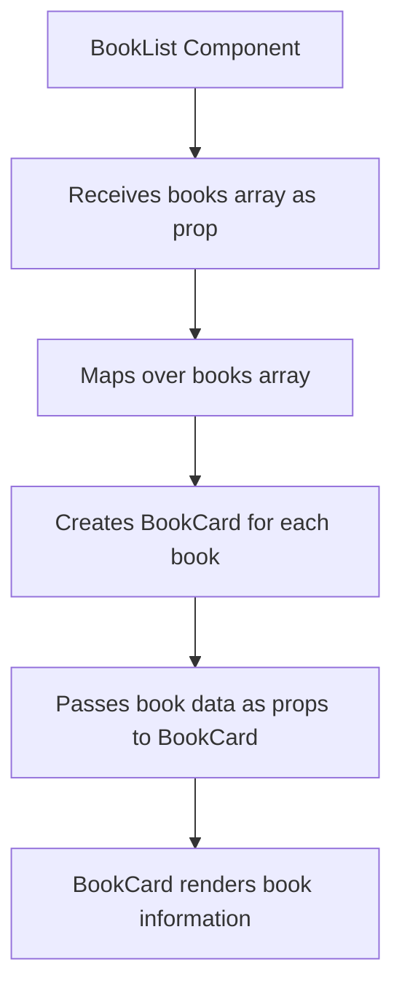
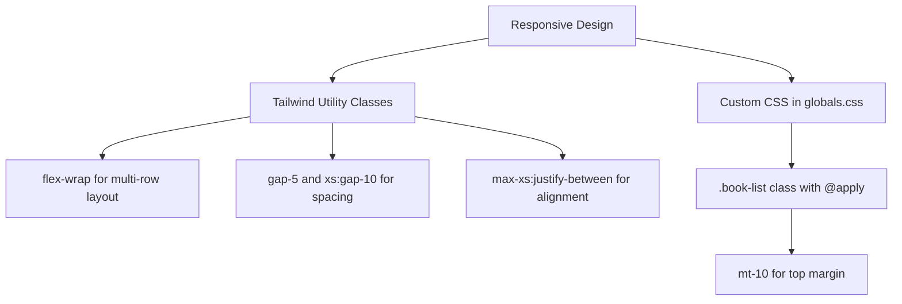
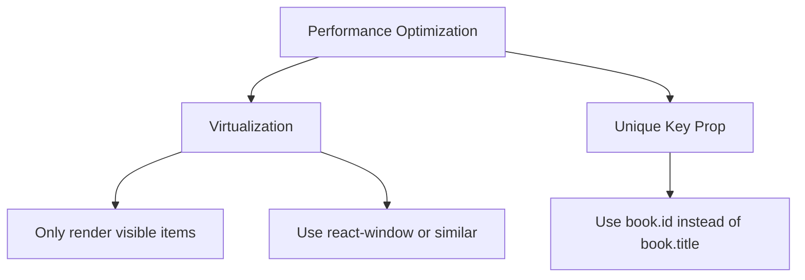

# Book List Component

<cite>
**Referenced Files in This Document**   
- [BookList.tsx](file://components/BookList.tsx)
- [BookCard.tsx](file://components/BookCard.tsx)
- [index.ts](file://constants/index.ts)
- [types.d.ts](file://types.d.ts)
- [globals.css](file://app/globals.css)
- [page.tsx](file://app/(root)/page.tsx)
</cite>

## Table of Contents
1. [Introduction](#introduction)
2. [Component Structure and Purpose](#component-structure-and-purpose)
3. [Data Flow and Prop Types](#data-flow-and-prop-types)
4. [Styling and Responsive Layout](#styling-and-responsive-layout)
5. [Usage Examples and Integration](#usage-examples-and-integration)
6. [Common Usage Patterns](#common-usage-patterns)
7. [Customization and Extension](#customization-and-extension)
8. [Performance Considerations](#performance-considerations)
9. [Conclusion](#conclusion)

## Introduction
The BookList component in the university_lms application serves as a container for displaying a collection of books in a visually organized grid layout. It is designed to render multiple BookCard components, each representing a book from a provided dataset. This document provides a comprehensive analysis of the BookList component, including its structure, data flow, styling, and integration patterns. The goal is to offer clear guidance for developers on how to use, customize, and extend the component effectively.

## Component Structure and Purpose

The BookList component is implemented as a React functional component that accepts three props: `title`, `books`, and `containerClassName`. Its primary purpose is to render a section with a heading and a responsive grid of book cards. Each book in the `books` array is mapped to a BookCard component, which displays the book's title, genre, cover, and other metadata.

The component uses a semantic `<section>` element as its container, allowing for proper HTML structure and accessibility. The title is rendered as an `<h2>` element with custom typography using the "font-bebas-neue" class. The list of books is rendered within an unordered list (`<ul>`) with the class "book-list", which applies responsive grid styling via Tailwind CSS.

```tsx
export const BookList = ({ title, books, containerClassName }: Props) => {
  return (
    <section className={containerClassName}>
      <h2 className="font-bebas-neue text-4xl text-light-100">{title}</h2>
      <ul className="book-list">
        {books.map((book) => (
          <BookCard key={book.title} {...book} />
        ))}
      </ul>
    </section>
  );
};
```

**Section sources**
- [BookList.tsx](file://components/BookList.tsx#L1-L24)

## Data Flow and Prop Types

The BookList component receives data through its props, which are defined in the `Props` interface. The `books` prop is an array of `Book` objects, where the `Book` interface is defined in the `types.d.ts` file. This interface includes properties such as `id`, `title`, `author`, `genre`, `rating`, `total_copies`, `available_copies`, `description`, `color`, `cover`, `video`, `summary`, and an optional `createdAt` field.

The BookCard component, which is used within BookList, destructures the `Book` object to extract specific properties like `id`, `title`, `genre`, `color`, and `cover`. It also accepts an optional `isLoanedBook` boolean prop, which modifies the card's layout and displays additional information such as return deadlines and a download receipt button.

The data for the books is sourced from the `sampleBooks` array in the `constants/index.ts` file. This array contains a collection of book objects with realistic metadata, including titles like "The Midnight Library", "Atomic Habits", and "Clean Code". The BookList component is typically used in conjunction with this sample data, as seen in the root page of the application.



**Diagram sources**
- [BookList.tsx](file://components/BookList.tsx#L1-L24)
- [BookCard.tsx](file://components/BookCard.tsx#L1-L48)
- [types.d.ts](file://types.d.ts#L1-L42)

**Section sources**
- [BookList.tsx](file://components/BookList.tsx#L1-L24)
- [BookCard.tsx](file://components/BookCard.tsx#L1-L48)
- [types.d.ts](file://types.d.ts#L1-L42)

## Styling and Responsive Layout

The BookList component relies on Tailwind CSS for styling, with additional custom styles defined in the `app/globals.css` file. The responsive behavior is achieved through a combination of Tailwind's utility classes and custom CSS.

The `.book-list` class applies a flexbox layout with wrapping enabled (`flex-wrap`), allowing the book cards to flow into multiple rows on smaller screens. The gap between cards is controlled by the `gap-5` and `xs:gap-10` classes, which set different spacing values for extra-small and larger screens. The `max-xs:justify-between` class ensures that cards are spaced evenly across the container on very small screens.

```css
.book-list {
  @apply mt-10 flex flex-wrap gap-5 max-xs:justify-between xs:gap-10;
}
```

The BookCard component also uses conditional styling via the `cn` utility function from `lib/utils.ts`. For example, when the `isLoanedBook` prop is true, the card's width is set to `xs:w-52 w-full`, making it full-width on small screens and 208px wide on extra-small screens and above. The title and genre text are also constrained with `xs:max-w-40 max-w-28` to prevent overflow.



**Diagram sources**
- [globals.css](file://app/globals.css#L86-L90)
- [BookCard.tsx](file://components/BookCard.tsx#L1-L48)

**Section sources**
- [globals.css](file://app/globals.css#L86-L90)
- [BookCard.tsx](file://components/BookCard.tsx#L1-L48)

## Usage Examples and Integration

The BookList component is used in the main page of the application, located at `app/(root)/page.tsx`. In this context, it is imported along with the `sampleBooks` array from the constants module. The component is rendered with a title of "Latest Books", the full sampleBooks array, and a custom container class name for margin.

```tsx
import BookOverview from "@/components/BookOverview";
import BookList from "@/components/BookList";
import { sampleBooks } from "@/constants";

const Home = () => (
  <>
    <BookOverview {...sampleBooks[0]} />
    <BookList
      title="Latest Books"
      books={sampleBooks}
      containerClassName="mt-28"
    />
  </>
);
```

This usage pattern demonstrates how the BookList component can be integrated into a page to display a curated list of books. The `BookOverview` component is used to highlight a featured book at the top of the page, while the BookList displays the remaining books in a grid format.

**Section sources**
- [page.tsx](file://app/(root)/page.tsx#L1-L14)

## Common Usage Patterns

Although the current implementation of the BookList component does not include built-in filtering, sorting, or pagination, these features can be implemented at the parent component level. For example, a search input could be added above the BookList, and its value could be used to filter the `books` array before passing it to the component.

Sorting could be achieved by providing a sorted version of the `books` array based on criteria such as title, author, or rating. Pagination would require splitting the `books` array into chunks and rendering one chunk at a time, with navigation controls to switch between pages.

These patterns are not currently implemented in the codebase, but they represent common extensions that could be added to enhance the functionality of the BookList component.

**Section sources**
- [BookList.tsx](file://components/BookList.tsx#L1-L24)
- [page.tsx](file://app/(root)/page.tsx#L1-L14)

## Customization and Extension

The BookList component can be customized in several ways. The `containerClassName` prop allows for additional styling to be applied to the container element, such as margins, padding, or background colors. The `title` prop can be changed to reflect different categories or sections of books.

To extend the component for search integration, a search input could be added as a sibling element, and its value could be used to filter the `books` array. This would require lifting the state to a parent component and passing the filtered array to BookList.

For more advanced customization, the BookList component could be modified to accept additional props, such as a `onBookClick` callback function or a `variant` prop to change the layout style. However, such changes would require modifications to the component's implementation.

**Section sources**
- [BookList.tsx](file://components/BookList.tsx#L1-L24)

## Performance Considerations

The current implementation of the BookList component uses a simple `map` function to render all books in the array. For large collections, this could lead to performance issues, as all BookCard components are rendered at once. To optimize rendering performance, techniques such as virtualization could be implemented.

Virtualization would involve only rendering the BookCard components that are currently visible in the viewport, reducing the number of DOM nodes and improving scroll performance. Libraries like `react-window` or `react-virtualized` could be used to achieve this.

Additionally, the `key` prop in the `map` function is currently set to `book.title`, which may not be unique if two books have the same title. Using the `id` field as the key would be more reliable and prevent potential rendering issues.



**Diagram sources**
- [BookList.tsx](file://components/BookList.tsx#L1-L24)

**Section sources**
- [BookList.tsx](file://components/BookList.tsx#L1-L24)

## Conclusion
The BookList component is a fundamental part of the university_lms application, providing a clean and responsive way to display a collection of books. It leverages React's component model and Tailwind CSS to create a flexible and maintainable UI element. By understanding its structure, data flow, and styling, developers can effectively use and extend the component to meet various requirements. Future enhancements could include built-in support for filtering, sorting, pagination, and performance optimizations for large datasets.