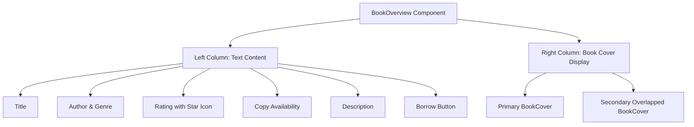
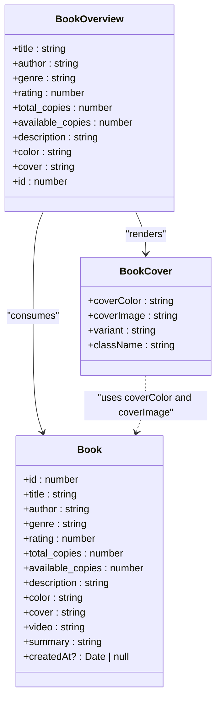

# Book Overview Component

<cite>
**Referenced Files in This Document**  
- [BookOverview.tsx](file://components/BookOverview.tsx#L1-L73)
- [types.d.ts](file://types.d.ts#L1-L14)
- [index.ts](file://constants/index.ts#L150-L193)
- [page.tsx](file://app/(root)/page.tsx#L1-L15)
- [BookCover.tsx](file://components/BookCover.tsx#L1-L52)
</cite>

## Table of Contents
1. [Introduction](#introduction)
2. [Component Overview](#component-overview)
3. [Props and Data Structure](#props-and-data-structure)
4. [Integration with Sample Data](#integration-with-sample-data)
5. [Visual Design and Layout](#visual-design-and-layout)
6. [Responsive Design Implementation](#responsive-design-implementation)
7. [Customization and Extensibility](#customization-and-extensibility)
8. [Best Practices for Integration](#best-practices-for-integration)
9. [Performance Considerations](#performance-considerations)

## Introduction
The **BookOverview** component serves as a featured book showcase on the homepage of the university_lms application. It highlights a single prominent book with enhanced visual treatment, providing users with immediate access to key information and borrowing functionality. This document details its implementation, integration, and design principles to support maintainability and scalability.

## Component Overview
The BookOverview component is a React functional component designed to display a highlighted book at the top level of the homepage. It renders detailed metadata including title, author, genre, rating, availability, and description, along with a prominent visual representation of the book cover.

It is structured as a two-column layout using Flexbox via Tailwind CSS, with textual content on the left and a visually layered book cover display on the right. The component uses the `BookCover` subcomponent to render the book's visual identity and includes a "Borrow" action button for user interaction.



**Diagram sources**  
- [BookOverview.tsx](file://components/BookOverview.tsx#L1-L73)

**Section sources**  
- [BookOverview.tsx](file://components/BookOverview.tsx#L1-L73)

## Props and Data Structure
The component accepts props that conform to the `Book` interface defined in `types.d.ts`. These props are destructured directly from a single `Book` object passed as a spread.

### Book Interface Definition
```typescript
interface Book {
  id: number;
  title: string;
  author: string;
  genre: string;
  rating: number;
  total_copies: number;
  available_copies: number;
  description: string;
  color: string;
  cover: string;
  video: string;
  summary: string;
  createdAt?: Date | null;
}
```

### Prop Usage in BookOverview
The following table outlines how each prop is used within the component:

| Prop | Usage | Element |
|------|-------|--------|
| `title` | Displayed as main heading | `<h1>` |
| `author` | Shown in author info line | `<span className="font-semibold text-light-200">` |
| `genre` | Displayed as category label | `<span className="font-semibold text-light-200">` |
| `rating` | Rendered with star icon | `<p>` next to SVG star image |
| `total_copies` | Listed under "Total Books" | `<span>` inside paragraph |
| `available_copies` | Listed under "Available Books" | `<span>` inside paragraph |
| `description` | Full book summary text | `<p className="book-description">` |
| `color` | Passed to BookCover as background | `coverColor` prop |
| `cover` | Image URL for book cover | `coverImage` prop |
| `id` | Not directly rendered but available | Component scope |

**Section sources**  
- [types.d.ts](file://types.d.ts#L1-L14)
- [BookOverview.tsx](file://components/BookOverview.tsx#L5-L73)

## Integration with Sample Data
The BookOverview component is integrated into the homepage (`page.tsx`) and receives its data from the `sampleBooks` array in `constants/index.ts`. The first book in the array (`sampleBooks[0]`) is passed as props using the spread operator.

### Sample Data Source
```typescript
export const sampleBooks = [
  {
    id: 1,
    title: "The Midnight Library",
    author: "Matt Haig",
    genre: "Fantasy / Fiction",
    rating: 4.6,
    total_copies: 20,
    available_copies: 10,
    description: "A dazzling novel about all the choices that go into a life well lived...",
    color: "#1c1f40",
    cover: "https://m.media-amazon.com/images/I/81J6APjwxlL.jpg",
    // ... other fields
  },
  // ... more books
];
```

### Homepage Integration
```tsx
import BookOverview from "@/components/BookOverview";
import { sampleBooks } from "@/constants";

const Home = () => (
  <>
    <BookOverview {...sampleBooks[0]} />
  </>
);
```

This pattern ensures that the most prominent book is always displayed first. The selection logic is currently hardcoded but can be modified to support dynamic selection based on criteria like popularity, new arrivals, or editorial choice.

**Section sources**  
- [index.ts](file://constants/index.ts#L150-L193)
- [page.tsx](file://app/(root)/page.tsx#L1-L15)

## Visual Design and Layout
The component uses a responsive flex layout to arrange content in two primary sections:

### Left Column (Text Content)
- **Title**: Rendered as an `<h1>` element
- **Info Row**: Displays author, genre, and rating with appropriate icons
- **Copy Availability**: Shows total and available copies
- **Description**: Full book summary
- **Action Button**: "Borrow" button with icon

### Right Column (Visual Display)
- **Primary BookCover**: Rendered with `variant="wide"` and `z-10` for layering
- **Secondary Overlapped Cover**: Positioned behind with rotation and reduced opacity for depth effect
- **Responsive Behavior**: Hidden on small screens using `max-sm:hidden`

The `BookCover` component uses an SVG background colored with the `color` prop and overlays the actual book image from the `cover` URL using Next.js `Image` component with `fill`.



**Diagram sources**  
- [BookOverview.tsx](file://components/BookOverview.tsx#L1-L73)
- [BookCover.tsx](file://components/BookCover.tsx#L1-L52)
- [types.d.ts](file://types.d.ts#L1-L14)

**Section sources**  
- [BookOverview.tsx](file://components/BookOverview.tsx#L1-L73)
- [BookCover.tsx](file://components/BookCover.tsx#L1-L52)

## Responsive Design Implementation
The BookOverview component implements responsive design using Tailwind CSS utility classes:

### Key Responsive Classes
- `flex flex-1 flex-col gap-5`: Creates vertical stack on smaller screens
- `max-sm:hidden`: Hides the secondary book cover on small devices
- `flex-1`: Ensures both columns grow equally across screen sizes
- `justify-center`: Centers the visual column content

### Breakpoint Behavior
| Screen Size | Layout Behavior |
|------------|-----------------|
| Large (≥480px) | Two-column layout with overlapped book covers |
| Small (<480px) | Single column with primary cover only; secondary cover hidden |

The `xs: "480px"` breakpoint is defined in `tailwind.config.ts`, enabling responsive behavior at this threshold.

**Section sources**  
- [BookOverview.tsx](file://components/BookOverview.tsx#L1-L73)
- [tailwind.config.ts](file://tailwind.config.ts#L84-L114)

## Customization and Extensibility
The component supports several customization options:

### Selection Logic
To change the featured book selection:
```tsx
// Instead of sampleBooks[0], use logic like:
const featuredBook = sampleBooks.find(book => book.rating > 4.8) || sampleBooks[0];
<BookOverview {...featuredBook} />
```

### Styling Modifications
- Update `book-overview_btn` class for different button styles
- Modify `book-description` class for typography changes
- Adjust `gap-5` and padding for spacing

### Feature Enhancements
- Add hover effects to the borrow button
- Include a "Read Summary" link
- Add rating count display
- Support video preview via the `video` field

## Best Practices for Integration
When integrating BookOverview into other layouts:

1. **Ensure Data Consistency**: Always pass a complete `Book` object
2. **Maintain Visual Hierarchy**: Use only one BookOverview per page to preserve prominence
3. **Handle Missing Data**: Provide fallback values for optional fields
4. **Accessibility**: Ensure screen reader compatibility with ARIA labels if enhanced
5. **Performance**: Avoid unnecessary re-renders with React.memo if used dynamically

Example integration:
```tsx
<Section className="featured-book">
  <BookOverview {...featuredBook} />
</Section>
```

**Section sources**  
- [BookOverview.tsx](file://components/BookOverview.tsx#L1-L73)
- [page.tsx](file://app/(root)/page.tsx#L1-L15)

## Performance Considerations
When scaling to dynamic data sources:

1. **Data Fetching**: Replace static `sampleBooks` with API calls using `useEffect` or Next.js `getServerSideProps`
2. **Image Optimization**: Ensure `cover` URLs are optimized; consider using Next.js Image with `next/image`
3. **Caching**: Cache the featured book response to reduce server load
4. **Lazy Loading**: Defer loading if below the fold (not applicable for homepage hero)
5. **Bundle Size**: The component has minimal dependencies (React, Next/Image, Button) and is lightweight

For production use, consider:
- Adding loading states during data fetch
- Implementing error boundaries
- Using TypeScript generics for flexible data sources
- Monitoring Largest Contentful Paint (LCP) for the featured book image

**Section sources**  
- [BookOverview.tsx](file://components/BookOverview.tsx#L1-L73)
- [index.ts](file://constants/index.ts#L150-L193)
- [page.tsx](file://app/(root)/page.tsx#L1-L15)