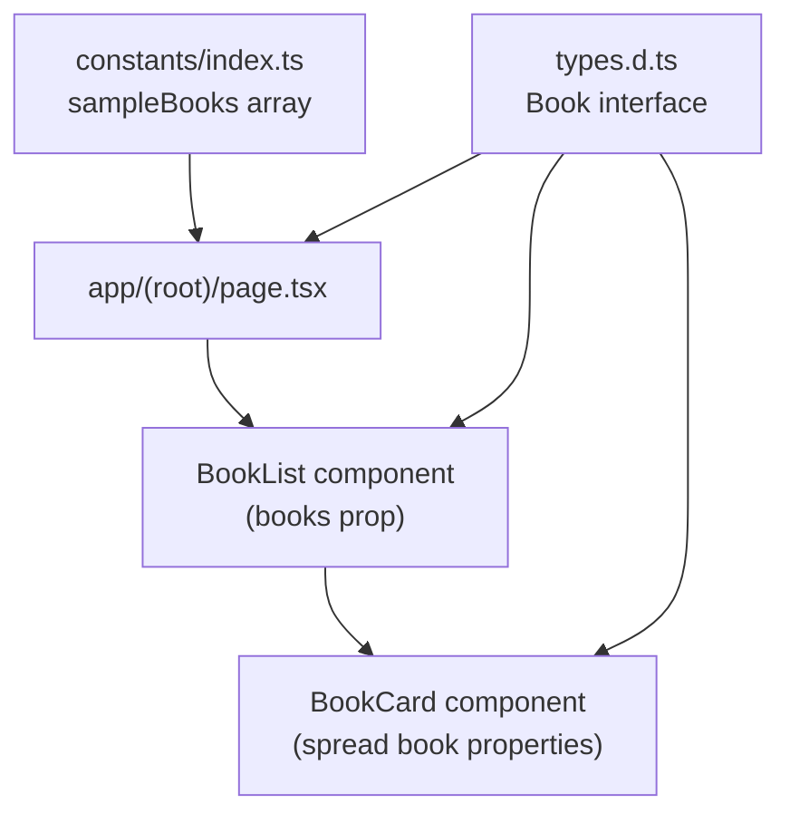
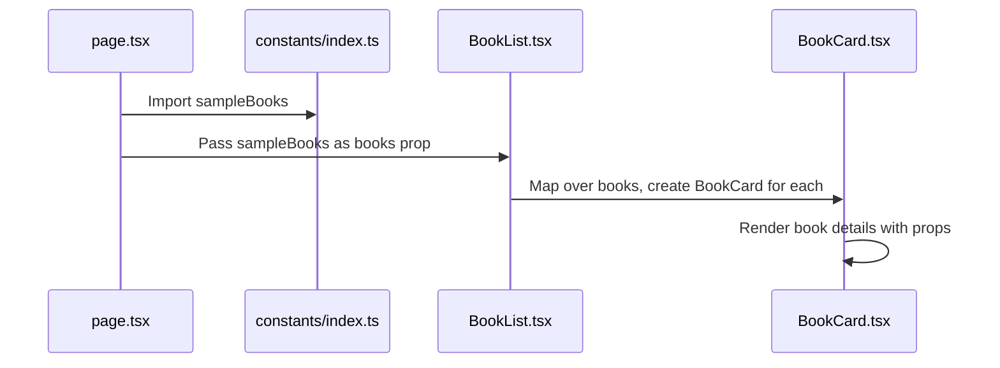
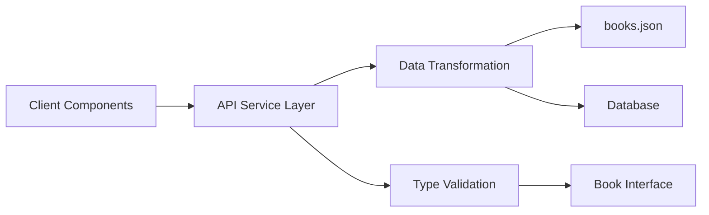

# Data Management

<cite>
**Referenced Files in This Document**   
- [constants/index.ts](file://constants/index.ts)
- [public/books.json](file://public/books.json)
- [types.d.ts](file://types.d.ts)
- [components/BookList.tsx](file://components/BookList.tsx)
- [components/BookCard.tsx](file://components/BookCard.tsx)
- [components/BookOverview.tsx](file://components/BookOverview.tsx)
- [app/(root)/page.tsx](file://app/(root)/page.tsx)
</cite>

## Table of Contents
1. [Data Sources Overview](#data-sources-overview)
2. [Data Structure and Type Safety](#data-structure-and-type-safety)
3. [Data Flow and Component Integration](#data-flow-and-component-integration)
4. [Practical Data Usage Examples](#practical-data-usage-examples)
5. [Limitations of Static Data Approach](#limitations-of-static-data-approach)
6. [Future API Integration Pathways](#future-api-integration-pathways)
7. [Data Consistency and Validation](#data-consistency-and-validation)
8. [Performance Considerations](#performance-considerations)

## Data Sources Overview

The university_lms application currently employs a dual static data source strategy for managing book information. The primary source is a TypeScript file located at `constants/index.ts`, which exports a `sampleBooks` array containing structured book data used throughout the application. This file serves as the main repository for sample book entries, providing immediate access to predefined book objects with consistent formatting.

A secondary data source exists in the form of `public/books.json`, a JSON file stored in the public directory that contains additional book records with slightly different property naming conventions. This file appears to be designed for potential future integration, possibly as a mock API response or static asset for client-side fetching.

The separation of data into these two sources allows for different use cases: the TypeScript file provides type-safe, compile-time available data, while the JSON file offers a more flexible, easily modifiable format that could simulate external API responses.

**Section sources**
- [constants/index.ts](file://constants/index.ts#L150-L193)
- [public/books.json](file://public/books.json#L0-L239)

## Data Structure and Type Safety

The application enforces type safety through a well-defined `Book` interface in the root-level `types.d.ts` file. This interface establishes the contract for all book-related data across the application, ensuring consistency and preventing runtime errors due to incorrect property access.

```typescript
interface Book {
  id: number;
  title: string;
  author: string;
  genre: string;
  rating: number;
  total_copies: number;
  available_copies: number;
  description: string;
  color: string;
  cover: string;
  video: string;
  summary: string;
  createdAt?: Date | null;
}
```

The `Book` interface defines twelve required properties and one optional property (`createdAt`). Notably, the interface uses snake_case for multi-word properties (e.g., `total_copies`), which aligns with the data structure in `constants/index.ts` but differs from the camelCase convention used in `public/books.json` (e.g., `totalCopies`).

This type definition is imported and utilized across multiple components, providing compile-time validation and IDE support for property access. The interface serves as a single source of truth for book data structure, enabling refactoring safety and reducing bugs related to incorrect property names or types.

An additional `BookParams` interface exists in the same file with camelCase properties, suggesting a potential mapping layer may be needed when integrating the JSON data with the existing component structure.

**Section sources**
- [types.d.ts](file://types.d.ts#L0-L12)

## Data Flow and Component Integration

The data flow in the university_lms application follows a clear pattern from data source to UI components. The primary entry point for book data is the `sampleBooks` array imported from `constants/index.ts`, which is then passed down to presentation components through props.

The main data consumer is the `BookList` component, which accepts a `books` prop of type `Book[]` and renders each book using the `BookCard` component. The data flow can be visualized as follows:



**Diagram sources**
- [constants/index.ts](file://constants/index.ts#L150-L193)
- [types.d.ts](file://types.d.ts#L0-L12)
- [components/BookList.tsx](file://components/BookList.tsx#L0-L24)
- [components/BookCard.tsx](file://components/BookCard.tsx#L0-L48)
- [app/(root)/page.tsx](file://app/(root)/page.tsx#L1-L14)

The `BookOverview` component follows a similar pattern, receiving individual book properties as props and rendering detailed information. Both components leverage the `Book` interface for type checking, ensuring that only valid properties are accessed.

The `BookCard` component destructures specific properties from the book object (`id`, `title`, `genre`, `color`, `cover`) and uses them to render a clickable card that links to the book's detail page. The use of the spread operator (`{...book}`) in the `BookList` component ensures all book properties are passed to `BookCard`.

**Section sources**
- [components/BookList.tsx](file://components/BookList.tsx#L0-L24)
- [components/BookCard.tsx](file://components/BookCard.tsx#L0-L48)
- [components/BookOverview.tsx](file://components/BookOverview.tsx#L0-L73)

## Practical Data Usage Examples

The implementation of static data in the university_lms application can be clearly demonstrated through practical examples from the codebase. The home page (`app/(root)/page.tsx`) serves as the primary example of how sample book data is imported and rendered:



**Diagram sources**
- [app/(root)/page.tsx](file://app/(root)/page.tsx#L1-L14)
- [constants/index.ts](file://constants/index.ts#L150-L193)
- [components/BookList.tsx](file://components/BookList.tsx#L0-L24)
- [components/BookCard.tsx](file://components/BookCard.tsx#L0-L48)

In the home page component, the `sampleBooks` array is imported and used in two ways:
1. The first book (`sampleBooks[0]`) is passed as props to `BookOverview` for featured display
2. The entire array is passed to `BookList` to render a collection of books

The `BookList` component receives these props and maps over the books array, creating a `BookCard` for each entry. The component structure demonstrates proper React patterns:
- Using the book's title as the React key (though ID would be more reliable)
- Spreading all book properties to the child component
- Maintaining a clean separation of concerns between list rendering and individual card presentation

This approach allows for easy modification of the displayed books by simply updating the `sampleBooks` array, with changes automatically propagating through the component tree.

**Section sources**
- [app/(root)/page.tsx](file://app/(root)/page.tsx#L1-L14)
- [components/BookList.tsx](file://components/BookList.tsx#L0-L24)

## Limitations of Static Data Approach

While the current static data approach provides simplicity and immediate development velocity, it presents several significant limitations that impact the application's scalability and maintainability.

First, the data is hardcoded in the application bundle, meaning any updates to book information require a full redeployment of the application. This creates operational overhead and prevents real-time updates to the library catalog. The separation between `constants/index.ts` and `public/books.json` also introduces inconsistency, with different property naming conventions (snake_case vs. camelCase) and data structures that would require transformation before integration.

Second, the static approach does not support dynamic filtering, sorting, or searching operations efficiently. With all data loaded upfront, implementing features like pagination or category-based filtering would require client-side processing of the entire dataset, leading to performance issues as the collection grows.

Third, the current implementation lacks proper data validation for the JSON file. Since `public/books.json` is not type-checked at compile time, errors in the data structure would only be discovered at runtime, potentially causing component rendering failures.

Finally, the static approach does not support user-specific data or state persistence. Features like tracking borrowed books, reading lists, or user reviews cannot be implemented without a backend data store.

**Section sources**
- [constants/index.ts](file://constants/index.ts#L150-L193)
- [public/books.json](file://public/books.json#L0-L239)
- [types.d.ts](file://types.d.ts#L0-L12)

## Future API Integration Pathways

To overcome the limitations of the static data approach, the university_lms application can evolve toward a dynamic API-based architecture. Several integration pathways exist, leveraging the existing type system and component structure.

A recommended approach would involve creating an API route that serves the book data, potentially consolidating both the `sampleBooks` and `books.json` sources into a unified response. The existing `Book` interface can serve as the response type, ensuring type safety throughout the application.



**Diagram sources**
- [types.d.ts](file://types.d.ts#L0-L12)
- [public/books.json](file://public/books.json#L0-L239)

The integration could follow these steps:
1. Create an API endpoint (e.g., `/api/books`) that reads from `public/books.json` or a database
2. Transform the data to match the `Book` interface structure, converting camelCase to snake_case properties
3. Implement server-side rendering or static site generation using Next.js's data fetching methods
4. Update components to accept data from the API rather than direct imports

The existing `BookParams` interface suggests the application may already be designed with API integration in mind, as it matches the camelCase convention of the JSON file. This interface could serve as the input type for API requests or data transformation functions.

For backward compatibility, a hybrid approach could be implemented where the application first attempts to fetch data from the API, falling back to the static `sampleBooks` array during development or if the API is unavailable.

**Section sources**
- [types.d.ts](file://types.d.ts#L14-L25)
- [public/books.json](file://public/books.json#L0-L239)
- [constants/index.ts](file://constants/index.ts#L150-L193)

## Data Consistency and Validation

Maintaining data consistency across the university_lms application presents challenges due to the dual data source architecture and differing property naming conventions. The application currently relies on TypeScript interfaces for compile-time validation, but runtime data validation is not implemented.

The `Book` interface enforces structure for data used in components, but the `public/books.json` file contains properties that don't directly map to this interface:
- `coverUrl` vs. `cover`
- `totalCopies` vs. `total_copies`
- `availableCopies` vs. `available_copies`
- `videoUrl` vs. `video`

This discrepancy would require a transformation layer when integrating the JSON data, potentially using a mapping function:

```typescript
const transformBookData = (book: BookParams): Book => ({
  id: typeof book.id === 'string' ? parseInt(book.id.split('-')[0]) || 0 : book.id,
  title: book.title,
  author: book.author,
  genre: book.genre,
  rating: book.rating,
  total_copies: book.totalCopies,
  available_copies: book.availableCopies,
  description: book.description,
  color: book.coverColor,
  cover: book.coverUrl,
  video: book.videoUrl,
  summary: book.summary
});
```

Without proper validation, inconsistencies in data types could cause runtime errors. For example, the `id` field in `books.json` is a string with UUID format, while the `Book` interface expects a number. This mismatch could lead to rendering issues or broken navigation links.

Implementing a validation layer using libraries like Zod or Joi would enhance data reliability, ensuring that all book data conforms to the expected structure regardless of source.

**Section sources**
- [types.d.ts](file://types.d.ts#L0-L25)
- [public/books.json](file://public/books.json#L0-L239)
- [constants/index.ts](file://constants/index.ts#L150-L193)

## Performance Considerations

The current static data approach has both advantages and disadvantages from a performance perspective. On the positive side, all book data is immediately available upon component mounting, eliminating loading states and API request latency. This results in fast initial rendering, especially for the `BookList` component which can synchronously map over the `sampleBooks` array.

However, this approach introduces several performance concerns:

1. **Bundle Size Impact**: The book data is included in the main application bundle, increasing the initial download size. As the collection grows, this could significantly impact page load times, particularly on mobile networks.

2. **Memory Usage**: All book data is loaded into memory at once, regardless of whether all books are visible to the user. This could become problematic with large collections.

3. **Rendering Performance**: The `BookList` component renders all books in a single list without pagination or virtualization. As the number of books increases, this could lead to long rendering times and UI jank.

4. **Update Efficiency**: Any change to book data requires a full rebuild and redeployment of the application, preventing incremental updates.

A performance optimization strategy could include:
- Implementing pagination or infinite scrolling for large collections
- Using dynamic imports to split data by category or genre
- Adding client-side caching mechanisms for API responses
- Implementing skeleton loaders for better perceived performance during data fetching

The current use of the book title as the React key in `BookList` could also cause unnecessary re-renders if titles change, as React would treat this as a completely different element rather than an update to an existing one. Using the `id` property as the key would provide more stable rendering.

**Section sources**
- [components/BookList.tsx](file://components/BookList.tsx#L0-L24)
- [constants/index.ts](file://constants/index.ts#L150-L193)
- [public/books.json](file://public/books.json#L0-L239)