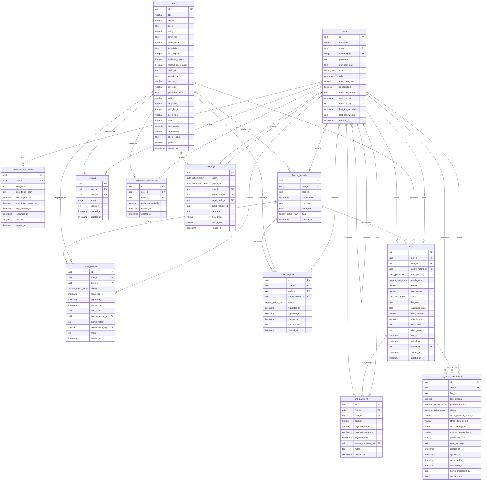

# Database Schema Documentation

## Overview

The University Library Management System (LMS) uses PostgreSQL as its primary database with Drizzle ORM for type-safe database operations. The schema is designed to support comprehensive library operations including user management, book catalog, borrowing workflows, fine management, and payment processing.

## Entity Relationship Diagram

## Database Tables

### Core User Management

#### users

Primary user table storing all user information including authentication details and restriction status.

| Column                | Type          | Constraints         | Description                   |
| --------------------- | ------------- | ------------------- | ----------------------------- |
| id                    | uuid          | PRIMARY KEY, UNIQUE | Unique user identifier        |
| full_name             | varchar(255)  | NOT NULL            | User's full name              |
| email                 | text          | NOT NULL, UNIQUE    | User's email address          |
| university_id         | integer       | NOT NULL, UNIQUE    | University ID number          |
| password              | text          | NOT NULL            | Hashed password               |
| university_card       | text          | NOT NULL            | University card details       |
| status                | status_enum   | DEFAULT 'PENDING'   | Account approval status       |
| role                  | role_enum     | DEFAULT 'USER'      | User role (USER/ADMIN)        |
| total_fines_owed      | numeric(10,2) | DEFAULT 0.00        | Total outstanding fines       |
| is_restricted         | boolean       | DEFAULT false       | Restriction status            |
| restriction_reason    | text          | NULL                | Reason for restriction        |
| restricted_at         | timestamp     | NULL                | When restriction was applied  |
| restricted_by         | uuid          | FK to users.id      | Admin who applied restriction |
| last_fine_calculation | timestamp     | NULL                | Last fine calculation date    |
| last_activity_date    | date          | DEFAULT NOW()       | Last user activity            |
| created_at            | timestamp     | DEFAULT NOW()       | Account creation date         |

#### password_reset_tokens

Manages password reset functionality with secure token handling.

| Column                 | Type      | Constraints              | Description              |
| ---------------------- | --------- | ------------------------ | ------------------------ |
| id                     | uuid      | PRIMARY KEY              | Token identifier         |
| user_id                | uuid      | FK to users.id, NOT NULL | Associated user          |
| code_hash              | text      | NOT NULL                 | Hashed verification code |
| reset_token_hash       | text      | NULL                     | Hashed reset token       |
| code_expires_at        | timestamp | NOT NULL                 | Code expiration time     |
| reset_token_expires_at | timestamp | NULL                     | Token expiration time    |
| code_verified_at       | timestamp | NULL                     | Code verification time   |
| consumed_at            | timestamp | NULL                     | Token consumption time   |
| attempts               | integer   | DEFAULT 0                | Verification attempts    |
| created_at             | timestamp | DEFAULT NOW()            | Token creation time      |

### Book Catalog Management

#### books

Central book catalog with comprehensive book information.

| Column             | Type          | Constraints   | Description                      |
| ------------------ | ------------- | ------------- | -------------------------------- |
| id                 | uuid          | PRIMARY KEY   | Book identifier                  |
| title              | varchar(255)  | NOT NULL      | Book title                       |
| author             | varchar(255)  | NOT NULL      | Book author                      |
| genre              | text          | NOT NULL      | Book genre                       |
| rating             | numeric(3,1)  | NOT NULL      | Book rating (0.0-5.0)            |
| cover_url          | text          | NOT NULL      | Book cover image URL             |
| cover_color        | varchar(7)    | NOT NULL      | Hex color for cover              |
| description        | text          | NOT NULL      | Book description                 |
| total_copies       | integer       | DEFAULT 1     | Total copies available           |
| available_copies   | integer       | DEFAULT 0     | Currently available copies       |
| reserve_on_request | boolean       | DEFAULT true  | Allow reservations               |
| video_url          | text          | NULL          | Book video URL                   |
| youtube_url        | text          | NULL          | YouTube video URL                |
| summary            | varchar       | NOT NULL      | Book summary                     |
| publisher          | varchar(255)  | NULL          | Publisher name                   |
| publication_date   | date          | NULL          | Publication date                 |
| edition            | varchar(100)  | NULL          | Book edition                     |
| language           | varchar(50)   | NULL          | Book language                    |
| print_length       | integer       | NULL          | Number of pages                  |
| book_type          | varchar(20)   | NULL          | paperback/hardcover              |
| isbn               | varchar(20)   | NULL          | ISBN number                      |
| item_weight        | numeric(5,2)  | NULL          | Weight in pounds                 |
| dimensions         | varchar(50)   | NULL          | Dimensions in inches             |
| about_author       | text          | NULL          | Author biography                 |
| price              | numeric(10,2) | NULL          | Book price for fine calculations |
| created_at         | timestamp     | DEFAULT NOW() | Record creation time             |

### Borrowing System

#### borrow_records

Tracks actual book borrowing transactions.

| Column      | Type               | Constraints              | Description          |
| ----------- | ------------------ | ------------------------ | -------------------- |
| id          | uuid               | PRIMARY KEY              | Record identifier    |
| user_id     | uuid               | FK to users.id, NOT NULL | Borrowing user       |
| book_id     | uuid               | FK to books.id, NOT NULL | Borrowed book        |
| borrow_date | timestamp          | DEFAULT NOW()            | Borrowing date       |
| due_date    | date               | NOT NULL                 | Return due date      |
| return_date | date               | NULL                     | Actual return date   |
| status      | borrow_status_enum | DEFAULT 'BORROWED'       | Borrowing status     |
| created_at  | timestamp          | DEFAULT NOW()            | Record creation time |

#### borrow_requests

Manages borrow request workflow with admin approval.

| Column           | Type                | Constraints              | Description              |
| ---------------- | ------------------- | ------------------------ | ------------------------ |
| id               | uuid                | PRIMARY KEY              | Request identifier       |
| user_id          | uuid                | FK to users.id, NOT NULL | Requesting user          |
| book_id          | uuid                | FK to books.id, NOT NULL | Requested book           |
| status           | request_status_enum | DEFAULT 'PENDING'        | Request status           |
| requested_at     | timestamp           | DEFAULT NOW()            | Request creation time    |
| approved_at      | timestamp           | NULL                     | Approval time            |
| rejected_at      | timestamp           | NULL                     | Rejection time           |
| due_date         | date                | NULL                     | Due date when approved   |
| borrow_record_id | uuid                | FK to borrow_records.id  | Associated borrow record |
| admin_notes      | text                | NULL                     | Admin notes              |
| idempotency_key  | varchar(255)        | UNIQUE                   | Deduplication key        |
| meta             | text                | NULL                     | JSON metadata            |
| created_at       | timestamp           | DEFAULT NOW()            | Record creation time     |

#### return_requests

Manages book return request workflow.

| Column           | Type                | Constraints                       | Description              |
| ---------------- | ------------------- | --------------------------------- | ------------------------ |
| id               | uuid                | PRIMARY KEY                       | Request identifier       |
| user_id          | uuid                | FK to users.id, NOT NULL          | Returning user           |
| book_id          | uuid                | FK to books.id, NOT NULL          | Book to return           |
| borrow_record_id | uuid                | FK to borrow_records.id, NOT NULL | Associated borrow record |
| status           | request_status_enum | DEFAULT 'PENDING'                 | Request status           |
| requested_at     | timestamp           | DEFAULT NOW()                     | Request creation time    |
| approved_at      | timestamp           | NULL                              | Approval time            |
| rejected_at      | timestamp           | NULL                              | Rejection time           |
| admin_notes      | text                | NULL                              | Admin notes              |
| created_at       | timestamp           | DEFAULT NOW()                     | Record creation time     |

### Fine and Payment Management

#### fines

Comprehensive fine tracking with multiple penalty types.

| Column           | Type              | Constraints                       | Description                |
| ---------------- | ----------------- | --------------------------------- | -------------------------- |
| id               | uuid              | PRIMARY KEY                       | Fine identifier            |
| user_id          | uuid              | FK to users.id, NOT NULL          | User with fine             |
| book_id          | uuid              | FK to books.id, NOT NULL          | Associated book            |
| borrow_record_id | uuid              | FK to borrow_records.id, NOT NULL | Associated borrow record   |
| fine_type        | fine_type_enum    | NOT NULL                          | Type of fine               |
| penalty_type     | penalty_type_enum | NOT NULL                          | Penalty calculation method |
| amount           | numeric(10,2)     | NOT NULL                          | Fine amount                |
| paid_amount      | numeric(10,2)     | DEFAULT 0.00                      | Amount paid                |
| status           | fine_status_enum  | DEFAULT 'PENDING'                 | Payment status             |
| due_date         | date              | NOT NULL                          | Original due date          |
| calculation_date | date              | NOT NULL                          | When fine was calculated   |
| days_overdue     | numeric(5,2)      | NOT NULL                          | Days overdue               |
| is_book_lost     | boolean           | DEFAULT false                     | Book loss indicator        |
| description      | text              | NOT NULL                          | Fine description           |
| admin_notes      | text              | NULL                              | Admin notes                |
| paid_at          | timestamp         | NULL                              | Payment time               |
| waived_at        | timestamp         | NULL                              | Waiver time                |
| waived_by        | uuid              | FK to users.id                    | Admin who waived           |
| created_at       | timestamp         | DEFAULT NOW()                     | Record creation time       |
| updated_at       | timestamp         | DEFAULT NOW()                     | Last update time           |

#### fine_payments

Tracks individual fine payments including partial payments.

| Column             | Type          | Constraints              | Description           |
| ------------------ | ------------- | ------------------------ | --------------------- |
| id                 | uuid          | PRIMARY KEY              | Payment identifier    |
| fine_id            | uuid          | FK to fines.id, NOT NULL | Associated fine       |
| user_id            | uuid          | FK to users.id, NOT NULL | Paying user           |
| amount             | numeric(10,2) | NOT NULL                 | Payment amount        |
| payment_method     | varchar(50)   | NULL                     | Payment method        |
| payment_reference  | varchar(255)  | NULL                     | Transaction reference |
| payment_date       | timestamp     | DEFAULT NOW()            | Payment date          |
| admin_processed_by | uuid          | FK to users.id           | Processing admin      |
| notes              | text          | NULL                     | Payment notes         |
| created_at         | timestamp     | DEFAULT NOW()            | Record creation time  |

#### payment_transactions

Manages Stripe and other payment gateway transactions.

| Column                   | Type                | Constraints              | Description                    |
| ------------------------ | ------------------- | ------------------------ | ------------------------------ |
| id                       | uuid                | PRIMARY KEY              | Transaction identifier         |
| user_id                  | uuid                | FK to users.id, NOT NULL | Paying user                    |
| fine_ids                 | text                | NOT NULL                 | JSON array of fine IDs         |
| total_amount             | numeric(10,2)       | NOT NULL                 | Total transaction amount       |
| payment_method           | payment_method_enum | NOT NULL                 | Payment method                 |
| status                   | payment_status_enum | DEFAULT 'PENDING'        | Transaction status             |
| stripe_payment_intent_id | varchar(255)        | NULL                     | Stripe Payment Intent ID       |
| stripe_client_secret     | varchar(500)        | NULL                     | Stripe client secret           |
| stripe_charge_id         | varchar(255)        | NULL                     | Stripe charge ID               |
| external_transaction_id  | varchar(255)        | NULL                     | External transaction reference |
| processing_data          | text                | NULL                     | JSON processing data           |
| error_message            | text                | NULL                     | Error details                  |
| created_at               | timestamp           | DEFAULT NOW()            | Transaction creation time      |
| updated_at               | timestamp           | DEFAULT NOW()            | Last update time               |
| processed_at             | timestamp           | NULL                     | Processing time                |
| completed_at             | timestamp           | NULL                     | Completion time                |
| admin_processed_by       | uuid                | FK to users.id           | Processing admin               |
| admin_notes              | text                | NULL                     | Admin notes                    |

### Additional Features

#### reviews

Book review and rating system.

| Column     | Type      | Constraints              | Description          |
| ---------- | --------- | ------------------------ | -------------------- |
| id         | uuid      | PRIMARY KEY              | Review identifier    |
| user_id    | uuid      | FK to users.id, NOT NULL | Reviewing user       |
| book_id    | uuid      | FK to books.id, NOT NULL | Reviewed book        |
| rating     | integer   | NOT NULL                 | Rating (1-5 stars)   |
| comment    | text      | NOT NULL                 | Review comment       |
| created_at | timestamp | DEFAULT NOW()            | Review creation time |
| updated_at | timestamp | DEFAULT NOW()            | Last update time     |

#### notification_preferences

User notification preferences for book availability.

| Column              | Type      | Constraints              | Description              |
| ------------------- | --------- | ------------------------ | ------------------------ |
| id                  | uuid      | PRIMARY KEY              | Preference identifier    |
| user_id             | uuid      | FK to users.id, NOT NULL | User                     |
| book_id             | uuid      | FK to books.id, NOT NULL | Book                     |
| notify_on_available | boolean   | DEFAULT true             | Notification preference  |
| notified_at         | timestamp | NULL                     | Last notification time   |
| created_at          | timestamp | DEFAULT NOW()            | Preference creation time |

#### audit_logs

Comprehensive audit trail for all system actions.

| Column            | Type                  | Constraints    | Description                  |
| ----------------- | --------------------- | -------------- | ---------------------------- |
| id                | uuid                  | PRIMARY KEY    | Log identifier               |
| action            | audit_action_enum     | NOT NULL       | Action performed             |
| actor_type        | audit_actor_type_enum | NOT NULL       | Type of actor                |
| actor_id          | uuid                  | FK to users.id | Actor user (null for SYSTEM) |
| target_user_id    | uuid                  | FK to users.id | Target user                  |
| target_book_id    | uuid                  | FK to books.id | Target book                  |
| target_request_id | uuid                  | NULL           | Generic request ID           |
| metadata          | text                  | NULL           | JSON metadata                |
| ip_address        | varchar(45)           | NULL           | Client IP address            |
| user_agent        | varchar(500)          | NULL           | Client user agent            |
| created_at        | timestamp             | DEFAULT NOW()  | Log creation time            |

## Enums

### status_enum

User account approval status:

- `PENDING` - Awaiting admin approval
- `APPROVED` - Account approved and active
- `REJECTED` - Account rejected

### role_enum

User roles:

- `USER` - Regular library user
- `ADMIN` - Administrative user

### borrow_status_enum

Borrow record status:

- `BORROWED` - Currently borrowed
- `RETURNED` - Returned

### request_status_enum

Request workflow status:

- `PENDING` - Awaiting admin action
- `APPROVED` - Request approved
- `REJECTED` - Request rejected
- `CANCELLED` - Request cancelled
- `RETURN_PENDING` - Return request pending
- `RETURNED` - Item returned

### fine_status_enum

Fine payment status:

- `PENDING` - Unpaid fine
- `PAID` - Fully paid
- `WAIVED` - Administrative waiver
- `PARTIAL_PAID` - Partially paid

### fine_type_enum

Types of fines:

- `LATE_RETURN` - Late return penalty
- `LOST_BOOK` - Lost book fee
- `DAMAGE_FEE` - Book damage fee
- `PROCESSING_FEE` - Administrative processing fee

### penalty_type_enum

Penalty calculation methods:

- `FLAT_FEE` - Fixed amount (e.g., $10 on first late day)
- `DAILY_FEE` - Daily accumulating fee (e.g., $0.5/day)
- `LOST_BOOK_FEE` - Book price plus penalty percentage

### payment_status_enum

Payment transaction status:

- `PENDING` - Payment initiated
- `PROCESSING` - Payment being processed
- `COMPLETED` - Payment successful
- `FAILED` - Payment failed
- `CANCELLED` - Payment cancelled
- `REFUNDED` - Payment refunded

### payment_method_enum

Payment methods:

- `STRIPE_CARD` - Stripe card payment
- `STRIPE_BANK_TRANSFER` - Stripe bank transfer
- `CASH` - Cash payment
- `ADMIN_WAIVER` - Administrative waiver
- `STUB` - Stub payment for testing

### audit_action_enum

Auditable actions:

- `BORROW_REQUEST_CREATED` - Borrow request created
- `BORROW_REQUEST_APPROVED` - Borrow request approved
- `BORROW_REQUEST_REJECTED` - Borrow request rejected
- `RETURN_REQUEST_CREATED` - Return request created
- `RETURN_REQUEST_APPROVED` - Return request approved
- `RETURN_REQUEST_REJECTED` - Return request rejected
- `BOOK_BORROWED` - Book borrowed
- `BOOK_RETURNED` - Book returned
- `INVENTORY_UPDATED` - Inventory updated
- `USER_LOGIN` - User logged in
- `USER_LOGOUT` - User logged out
- `ADMIN_ACTION` - Administrative action
- `FINE_CALCULATED` - Fine calculated
- `FINE_PAID` - Fine paid
- `FINE_WAIVED` - Fine waived
- `USER_RESTRICTED` - User restricted
- `USER_UNRESTRICTED` - User restriction removed

### audit_actor_type_enum

Types of actors:

- `USER` - Regular user action
- `ADMIN` - Administrative action
- `SYSTEM` - Automated system action

## Key Relationships

### User-Centric Relationships

- Users can have multiple borrow records, requests, fines, and payments
- Users can be restricted by admin users (self-referential relationship)
- Admins can process payments and waive fines

### Book-Centric Relationships

- Books can have multiple borrow records, requests, reviews, and fines
- Books track total and available copies for inventory management

### Borrowing Workflow

- Borrow requests can create borrow records when approved
- Borrow records can generate return requests and fines
- Return requests reference specific borrow records

### Fine and Payment System

- Fines are tied to specific borrow records and books
- Fine payments track individual payments against fines
- Payment transactions can cover multiple fines in a single payment

### Audit and Compliance

- All significant actions are logged in audit_logs
- Audit logs track actors, targets, and metadata for compliance

## Indexes and Performance Considerations

The schema includes several performance optimizations:

### Primary Indexes

- All tables use UUID primary keys for distributed scalability
- Unique constraints on user email, university_id, and borrow request idempotency_key

### Foreign Key Indexes

- All foreign key relationships have implicit indexes for join performance
- Self-referential relationships (restricted_by, waived_by) for user management

### Query Optimization

- Status-based queries are optimized with enum indexes
- Timestamp fields support date range queries
- JSON metadata fields allow flexible data storage without schema changes

## Data Integrity and Constraints

### Referential Integrity

- Cascade deletes on password reset tokens when users are deleted
- Preserve historical data through foreign key references
- Audit logs maintain references even if source records are modified

### Business Logic Constraints

- Available copies cannot exceed total copies
- Fine amounts and payments use decimal precision for accuracy
- Timestamp ordering ensures logical workflow progression

### Security Considerations

- Password hashing handles sensitive authentication data
- Audit logs track IP addresses and user agents for security analysis
- Idempotency keys prevent duplicate request processing

This schema provides a robust foundation for a comprehensive library management system with built-in audit trails, fine management, and payment processing capabilities.
