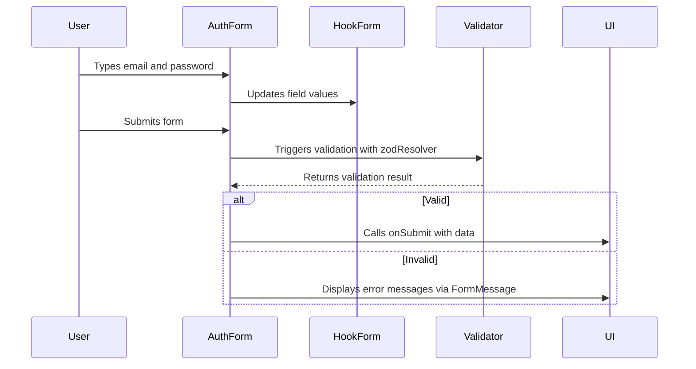

# State Management

<cite>
**Referenced Files in This Document**   
- [AuthForm.tsx](file://components/AuthForm.tsx#L0-L95)
- [Header.tsx](file://components/Header.tsx#L0-L50)
- [utils.ts](file://lib/utils.ts#L0-L7)
- [validations.ts](file://lib/validations.ts#L0-L15)
- [page.tsx](file://app/(auth)/sign-in/page.tsx#L0-L21)
- [page.tsx](file://app/(auth)/sign-up/page.tsx#L0-L23)
</cite>

## Table of Contents
1. [Introduction](#introduction)
2. [Form State Management with React Hook Form](#form-state-management-with-react-hook-form)
3. [Navigation State with usePathname](#navigation-state-with-usepathname)
4. [Derived State and Conditional Class Composition](#derived-state-and-conditional-class-composition)
5. [State Flow Example: User Authentication](#state-flow-example-user-authentication)
6. [Absence of Global State Management](#absence-of-global-state-management)
7. [Scalability Considerations](#scalability-considerations)

## Introduction
This document provides a comprehensive analysis of state management patterns in the university_lms application. It explores how React's local state, combined with external libraries like React Hook Form and Zod, is used to manage form inputs, navigation state, and UI appearance. The application currently relies on component-local state and utility functions rather than global state management solutions, which aligns with its current scope and complexity.

**Section sources**
- [AuthForm.tsx](file://components/AuthForm.tsx#L0-L95)
- [Header.tsx](file://components/Header.tsx#L0-L50)

## Form State Management with React Hook Form

The `AuthForm` component demonstrates a robust pattern for managing form state using **React Hook Form** in combination with **Zod** for validation. Instead of manually tracking each input’s value with `useState`, the form leverages the `useForm` hook to centralize form state, validation, and submission logic.

Key features include:
- **Centralized form state**: The `useForm<T>()` hook manages all input values, errors, and submission status.
- **Validation via Zod**: The `zodResolver` integrates schema validation rules defined in `lib/validations.ts`.
- **Type safety**: Generic types ensure consistency between form data structure and component props.

```tsx
const form: UseFormReturn<T> = useForm({
  resolver: zodResolver(schema),
  defaultValues: defaultValues as DefaultValues<T>,
});
```

The form dynamically renders fields using `FormField`, `FormItem`, and `FormControl` components, which are wrappers around React Hook Form’s controller system. This abstraction simplifies rendering and ensures consistent styling and error handling.

**Section sources**
- [AuthForm.tsx](file://components/AuthForm.tsx#L0-L95)
- [validations.ts](file://lib/validations.ts#L0-L15)

### Validation Schema Implementation

Validation rules are defined in `lib/validations.ts` using Zod, enabling declarative and type-safe schema definitions:

```ts
export const signInSchema = z.object({
  email: z.string().email(),
  password: z.string().min(8),
});
```

These schemas are passed into `AuthForm` as props and used by `zodResolver` to validate input before submission. This separation of concerns keeps validation logic reusable and testable.

**Section sources**
- [validations.ts](file://lib/validations.ts#L0-L15)

## Navigation State with usePathname

The `Header` component manages navigation state by determining the active route using Next.js’s `usePathname()` hook. This allows the UI to reflect the current page by conditionally applying styles to navigation links.

```tsx
const pathname = usePathname();

<Link
  href="/library"
  className={cn(
    "text-base cursor-pointer capitalize",
    pathname === "/library" ? "text-light-200" : "text-light-100"
  )}
>
  Library
</Link>
```

Here, the `pathname` value directly influences the `className` of each link, creating a visual indicator of the active section. This approach avoids the need for global state or context to track navigation, relying instead on React’s reactivity model.

**Section sources**
- [Header.tsx](file://components/Header.tsx#L0-L50)

## Derived State and Conditional Class Composition

Derived state—state computed from other state values—is handled efficiently using the `cn()` utility function from `lib/utils.ts`. This function combines Tailwind CSS classes conditionally, enabling dynamic styling based on props or state.

```ts
export function cn(...inputs: ClassValue[]) {
  return twMerge(clsx(inputs));
}
```

The `cn()` function uses `clsx` for conditional class evaluation and `tailwind-merge` to safely combine conflicting Tailwind classes (e.g., ensuring `text-red-500` overrides `text-blue-500`). This pattern is used throughout the app, particularly in the `Header` component, to derive UI state from route information.

**Section sources**
- [utils.ts](file://lib/utils.ts#L0-L7)
- [Header.tsx](file://components/Header.tsx#L0-L50)

## State Flow Example: User Authentication

The following sequence illustrates how state flows from user interaction to UI update during sign-in:

1. **User Input**: Typing in the email field updates the internal form state via React Hook Form.
2. **Validation**: On blur or submit, Zod validates the input against `signInSchema`.
3. **Error Handling**: If invalid, `FormMessage` displays the error using `formState.errors`.
4. **Submission**: On valid submit, `onSubmit` is called with form data.
5. **UI Feedback**: The parent page (e.g., `/sign-in/page.tsx`) handles authentication logic and updates UI accordingly.

```tsx
<AuthForm
  type="SIGN_IN"
  schema={signInSchema}
  defaultValues={{ email: "", password: "" }}
  onSubmit={signInWithCredentials}
/>
```

This flow encapsulates state within the form, minimizing side effects and keeping the component reusable across sign-in and sign-up flows.



**Diagram sources**
- [AuthForm.tsx](file://components/AuthForm.tsx#L0-L95)
- [validations.ts](file://lib/validations.ts#L0-L15)

**Section sources**
- [AuthForm.tsx](file://components/AuthForm.tsx#L0-L95)
- [page.tsx](file://app/(auth)/sign-in/page.tsx#L0-L21)

## Absence of Global State Management

The university_lms application does not use global state management libraries such as Redux, Zustand, or Context API for shared state. Instead, it relies on:
- **Local component state** for UI interactions
- **React Hook Form** for form state
- **URL/route state** for navigation
- **Utility functions** for derived UI state

This design choice is appropriate given the app’s current scope, where most state is either transient (form inputs) or derivable (active route). Avoiding global state reduces complexity, improves performance, and simplifies debugging.

However, this approach assumes that data sharing between distant components is minimal. Currently, authentication state appears to be managed externally (possibly via NextAuth), as no session state is passed into `Header` or `AuthForm`.

**Section sources**
- [AuthForm.tsx](file://components/AuthForm.tsx#L0-L95)
- [Header.tsx](file://components/Header.tsx#L0-L50)

## Scalability Considerations

As the application grows, the current state management strategy may require enhancement. Potential scalability challenges include:

| Scenario | Current Limitation | Recommended Solution |
|--------|-------------------|------------------------|
| Shared user session data | No global state for user profile, preferences, or fines | Introduce Context API or Zustand for session state |
| Real-time fine updates | Fine badge in Header is static | Use SWR or React Query for data fetching and caching |
| Complex form wizards | AuthForm handles single-step forms only | Extend React Hook Form with multi-step logic or use a state machine |
| Cross-component theme or UI preferences | No shared UI state | Implement a settings context for dark mode, font size, etc. |

Despite these potential needs, the current architecture remains clean and maintainable. The use of well-defined utilities (`cn`, `zodResolver`) and composable components (`AuthForm`) ensures that scaling state management will be incremental rather than disruptive.

**Section sources**
- [AuthForm.tsx](file://components/AuthForm.tsx#L0-L95)
- [Header.tsx](file://components/Header.tsx#L0-L50)
- [utils.ts](file://lib/utils.ts#L0-L7)