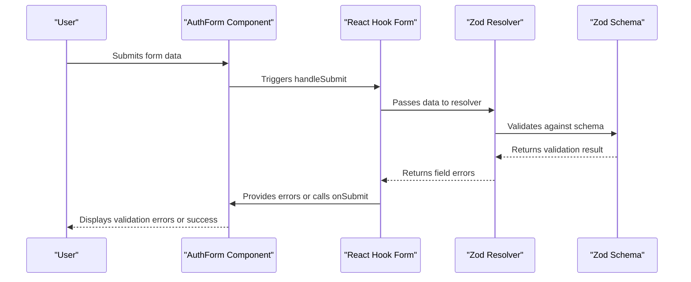
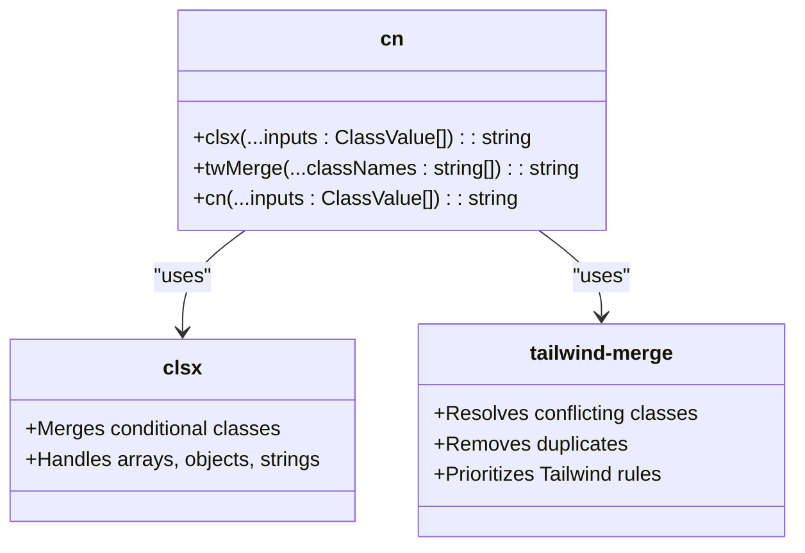

# Technology Stack & Dependencies

<cite>
**Referenced Files in This Document**   
- [package.json](file://package.json)
- [next.config.ts](file://next.config.ts)
- [tailwind.config.ts](file://tailwind.config.ts)
- [tsconfig.json](file://tsconfig.json)
- [lib/utils.ts](file://lib/utils.ts)
- [lib/validations.ts](file://lib/validations.ts)
- [components/ui/form.tsx](file://components/ui/form.tsx)
- [components/AuthForm.tsx](file://components/AuthForm.tsx)
- [app/(auth)/sign-in/page.tsx](file://app/(auth)/sign-in/page.tsx)
- [app/(auth)/sign-up/page.tsx](file://app/(auth)/sign-up/page.tsx)
- [components.json](file://components.json)
- [app/globals.css](file://app/globals.css)
- [eslint.config.mjs](file://eslint.config.mjs)
- [postcss.config.mjs](file://postcss.config.mjs)
</cite>

## Table of Contents
1. [Core Frameworks](#core-frameworks)
2. [Form Validation System](#form-validation-system)
3. [Styling & UI Components](#styling--ui-components)
4. [Configuration Files](#configuration-files)
5. [Development Tooling](#development-tooling)
6. [Integration Examples](#integration-examples)
7. [Setup Considerations](#setup-considerations)
8. [Performance Implications](#performance-implications)

## Core Frameworks

The university_lms application is built on a modern React-based stack with Next.js as the foundational framework. The core technologies provide routing, rendering, component architecture, and type safety.

### Next.js 15.5.2
Next.js serves as the full-stack framework for the application, handling routing, server-side rendering, and API routes. The project leverages the App Router pattern with React Server Components, as evidenced by the directory structure containing `(auth)` and `(root)` route groups.

Key features enabled:
- File-based routing system
- Server and client component hybrid rendering
- Built-in API routes
- Image optimization through remote pattern whitelisting

The application uses Turbopack for development, as indicated by the `--turbopack` flag in the dev and build scripts in package.json.

### React 19.1.0
React provides the component architecture for the application. Version 19 introduces several performance improvements and new features that enhance the user experience:

- Automatic batching of state updates
- New useActionState and useOptimistic hooks (though not explicitly used in current code)
- Improved server components support
- Enhanced error boundaries

The application follows the client component pattern for interactive elements, as shown by the `"use client"` directive in components like AuthForm.tsx and form.tsx.

### TypeScript
TypeScript provides static type checking and enhances code quality through type safety. The configuration in tsconfig.json shows:

- Targeting ES2017 for broad browser compatibility
- ES module resolution via `moduleResolution: "bundler"`
- Strict type checking enabled
- JSON module resolution
- Path mapping with `@/*` alias pointing to the root directory

The types.d.ts file defines key interfaces for the application's data model, including Book, AuthCredentials, and various parameter interfaces.

**Section sources**
- [package.json](file://package.json#L15-L18)
- [tsconfig.json](file://tsconfig.json#L2-L27)

## Form Validation System

The application implements a robust form validation system using React Hook Form and Zod, providing both client-side validation and type safety.

### React Hook Form
React Hook Form is used for efficient form state management with minimal re-renders. The implementation follows the controlled component pattern with the Controller component from react-hook-form.

Key features:
- Uncontrolled component approach for better performance
- Built-in validation and error handling
- Support for asynchronous validation
- Integration with UI component libraries

The form.tsx component creates a comprehensive form system using React Hook Form's context and controller patterns, providing accessible form components with proper labeling and error messaging.

### Zod for Schema Validation
Zod provides schema-based validation with TypeScript integration. The validation schemas are defined in lib/validations.ts and include:

- **signUpSchema**: Validates user registration with fields for fullName, email, universityId, universityCard, and password
- **signInSchema**: Validates user login with email and password fields

The schemas enforce:
- Minimum 3 characters for fullName
- Valid email format
- Minimum 8 characters for password
- Required universityCard field
- Type coercion for universityId (string to number)

### Integration Pattern
The integration between React Hook Form and Zod is achieved through @hookform/resolvers, which provides the zodResolver function. This allows the Zod schema to be used directly with React Hook Form's resolver option.

The AuthForm component demonstrates this integration, accepting a generic schema prop and using zodResolver(schema) in the useForm hook configuration.



**Diagram sources**
- [lib/validations.ts](file://lib/validations.ts#L3-L14)
- [components/AuthForm.tsx](file://components/AuthForm.tsx#L20-L45)
- [app/(auth)/sign-in/page.tsx](file://app/(auth)/sign-in/page.tsx#L8-L15)

**Section sources**
- [lib/validations.ts](file://lib/validations.ts#L1-L14)
- [components/ui/form.tsx](file://components/ui/form.tsx#L1-L167)
- [components/AuthForm.tsx](file://components/AuthForm.tsx#L1-L94)

## Styling & UI Components

The application uses a utility-first approach to styling with Tailwind CSS, enhanced by shadcn/ui components and Radix UI primitives.

### Tailwind CSS with Custom Configuration
Tailwind CSS provides the utility classes for styling, with extensive customization in tailwind.config.ts:

- **Theme Extension**: Custom colors including primary (#E7C9A5), green, red, blue, light, and dark variants
- **Font Configuration**: IBM Plex Sans as default font and Bebas Neue as a custom variable font
- **Breakpoints**: Custom xs breakpoint at 480px
- **Border Radius**: Custom radius values using CSS variables
- **Background Images**: Pattern background from /images/pattern.webp

The configuration also includes the tailwindcss-animate plugin for pre-built animations.

### shadcn/ui Component Library
The components.json file indicates the use of shadcn/ui with the "new-york" style. This component library provides:

- Accessible UI components built on Radix UI
- Pre-styled components with sensible defaults
- Easy customization through CSS variables
- Lucide icons integration

The component aliases in components.json show the import paths:
- `@/components` for custom components
- `@/lib/utils` for utility functions
- `@/components/ui` for shadcn/ui components
- `@/lib` for shared utilities

### Utility-First Styling with cn
The application uses a utility function `cn` from lib/utils.ts to merge Tailwind classes with conditional logic. This function combines clsx for conditional class evaluation and tailwind-merge for deduplication and conflict resolution.

The cn function is essential for:
- Combining static and dynamic classes
- Resolving Tailwind class conflicts (e.g., conflicting margin values)
- Conditionally applying classes based on props or state
- Maintaining clean component code



**Diagram sources**
- [lib/utils.ts](file://lib/utils.ts#L1-L6)
- [tailwind.config.ts](file://tailwind.config.ts#L1-L115)

**Section sources**
- [lib/utils.ts](file://lib/utils.ts#L1-L6)
- [tailwind.config.ts](file://tailwind.config.ts#L1-L115)
- [components.json](file://components.json#L1-L21)
- [app/globals.css](file://app/globals.css#L1-L340)

## Configuration Files

The application's behavior is configured through several key configuration files that define framework settings, build options, and development environment.

### next.config.ts
The Next.js configuration enables image optimization by defining remote patterns for trusted image hosts:

- placehold.co - Placeholder image service
- m.media-amazon.com - Amazon book cover images

This configuration ensures that only images from these domains can be optimized by Next.js's Image component, enhancing security and performance.

### tailwind.config.ts
The Tailwind configuration extends the default theme with custom values:

- **Dark Mode**: Enabled with class strategy
- **Content Paths**: Scans app, components, and pages directories for class usage
- **Theme Extension**: Custom fonts, colors, breakpoints, and border radii
- **Plugins**: Includes tailwindcss-animate for animations

The configuration uses CSS variables for theming, allowing dynamic theme switching through CSS class toggling.

### tsconfig.json
The TypeScript configuration includes:

- **Module Resolution**: Set to "bundler" for compatibility with modern bundlers
- **Target**: ES2017 for broad browser support
- **Strict Mode**: Enabled for better type safety
- **Path Mapping**: `@/*` alias for easier imports
- **JSX Preservation**: Allows JSX in TypeScript files

### ESLint and PostCSS Configuration
The development environment is enhanced with:

- **ESLint**: Configured with next/core-web-vitals, tailwindcss/recommended, and prettier plugins
- **PostCSS**: Configured with Tailwind CSS and Autoprefixer for vendor prefixing

These tools ensure code quality, consistent styling, and cross-browser compatibility.

**Section sources**
- [next.config.ts](file://next.config.ts#L1-L18)
- [tailwind.config.ts](file://tailwind.config.ts#L1-L115)
- [tsconfig.json](file://tsconfig.json#L1-L27)
- [eslint.config.mjs](file://eslint.config.mjs#L1-L30)
- [postcss.config.mjs](file://postcss.config.mjs#L1-L8)

## Development Tooling

The application is supported by a comprehensive set of development tools that ensure code quality, consistency, and maintainability.

### ESLint Configuration
The ESLint configuration (eslint.config.mjs) extends multiple presets:
- next/core-web-vitals: Next.js best practices
- next/typescript: TypeScript rules for Next.js
- standard: JavaScript style guide
- tailwindcss/recommended: Tailwind CSS linting
- prettier: Code formatting

The configuration ignores build directories and temporary files, focusing on source code quality.

### TypeScript Versioning
The project uses TypeScript ^5, which provides:
- Improved type inference
- Better performance
- Enhanced editor support
- New language features

### Build Scripts
The package.json defines the following scripts:
- **dev**: Starts development server with Turbopack
- **build**: Builds the application with Turbopack
- **start**: Starts the production server
- **lint**: Runs ESLint for code quality checking

Turbopack, the successor to Webpack, provides faster development builds and improved module bundling.

**Section sources**
- [package.json](file://package.json#L5-L12)
- [eslint.config.mjs](file://eslint.config.mjs#L1-L30)
- [postcss.config.mjs](file://postcss.config.mjs#L1-L8)

## Integration Examples

The application demonstrates effective integration of its technology stack through several key patterns.

### Form Component Integration
The form.tsx component showcases the integration of multiple technologies:

```tsx
const FormField = <TFieldValues extends FieldValues, TName extends FieldPath<TFieldValues>>({
  ...props
}: ControllerProps<TFieldValues, TName>) => {
  return (
    <FormFieldContext.Provider value={{ name: props.name }}>
      <Controller {...props} />
    </FormFieldContext.Provider>
  )
}
```

This component integrates:
- React Hook Form's Controller for form state management
- TypeScript generics for type safety
- React context for component communication
- Tailwind CSS via the cn utility for styling

### Authentication Flow
The authentication system demonstrates the complete stack integration:

1. **Routing**: Next.js App Router handles /sign-in and /sign-up routes
2. **Component**: AuthForm provides the UI with shadcn/ui components
3. **Validation**: Zod schemas validate input data
4. **State Management**: React Hook Form manages form state
5. **Styling**: Tailwind CSS and custom themes style the components

The sign-in page implementation shows this integration:

```tsx
const Page = () => (
  <AuthForm
    type="SIGN_IN"
    schema={signInSchema}
    defaultValues={{
      email: "",
      password: "",
    }}
    onSubmit={() => {}}
  />
);
```

**Section sources**
- [components/ui/form.tsx](file://components/ui/form.tsx#L1-L167)
- [components/AuthForm.tsx](file://components/AuthForm.tsx#L1-L94)
- [app/(auth)/sign-in/page.tsx](file://app/(auth)/sign-in/page.tsx#L1-L20)
- [app/(auth)/sign-up/page.tsx](file://app/(auth)/sign-up/page.tsx#L1-L20)

## Setup Considerations

When setting up or extending this technology stack, several considerations should be taken into account.

### Version Compatibility
The current version combination is carefully selected for compatibility:
- Next.js 15.5.2 is compatible with React 19.1.0
- React Hook Form ^7.62.0 supports React 19
- TypeScript ^5 works with the Next.js plugin
- Tailwind CSS ^3.4.17 is compatible with the included plugins

### Component Library Integration
The shadcn/ui integration requires:
- Proper component.json configuration
- Correct alias setup in tsconfig.json
- Inclusion of required dependencies (Radix UI, Lucide)
- Global CSS with Tailwind directives

### Environment Configuration
Key configuration files must be properly set up:
- next.config.ts for image optimization and other Next.js features
- tailwind.config.ts for theme customization
- tsconfig.json for path aliases and module resolution
- eslint.config.mjs for code quality enforcement

### Development Workflow
The development environment should include:
- VS Code extensions for Tailwind CSS IntelliSense
- ESLint and Prettier for code formatting
- TypeScript support for type checking
- Next.js debugging configuration

**Section sources**
- [package.json](file://package.json#L1-L38)
- [components.json](file://components.json#L1-L21)
- [tsconfig.json](file://tsconfig.json#L1-L27)
- [README.md](file://README.md#L37-L46)

## Performance Implications

The chosen technology stack has several performance implications that affect both development and runtime performance.

### Development Performance
The use of Turbopack provides significant development performance benefits:
- Faster cold and hot builds compared to Webpack
- Incremental compilation
- Better TypeScript and JSX handling
- Improved module resolution

### Runtime Performance
The stack optimizations contribute to runtime performance:

- **Next.js**: Automatic code splitting, image optimization, and server-side rendering reduce initial load time
- **React 19**: Improved rendering performance and automatic batching reduce re-renders
- **Tailwind CSS**: PurgeCSS removes unused classes, resulting in smaller CSS bundles
- **React Hook Form**: Uncontrolled components minimize re-renders during user input

### Bundle Size Considerations
The dependency tree includes several size-optimized libraries:
- clsx and tailwind-merge are lightweight utilities
- Zod has a small bundle footprint
- Radix UI components are tree-shakable
- Lucide icons are optimized for size

The configuration in tailwind.config.ts limits content scanning to specific directories, improving build performance by reducing the files that need to be analyzed for class usage.

### Image Optimization
The next.config.ts configuration enables Next.js's built-in image optimization for trusted domains:
- Automatic format optimization (WebP, AVIF)
- Size optimization based on device viewport
- Lazy loading by default
- Reduced bandwidth usage

These optimizations improve Core Web Vitals metrics such as Largest Contentful Paint (LCP) and Cumulative Layout Shift (CLS).

**Section sources**
- [next.config.ts](file://next.config.ts#L1-L18)
- [tailwind.config.ts](file://tailwind.config.ts#L1-L115)
- [package.json](file://package.json#L1-L38)
- [app/globals.css](file://app/globals.css#L1-L340)