# Use Case Diagram - University Library Management System

## Overview

The University Library Management System (Shelfwise) supports multiple actors with distinct roles and responsibilities. This document provides a comprehensive use case diagram showing all interactions between actors and the system, organized by functional areas.

## System Actors

### Primary Actors

- **Student/User** - Registered university students who can borrow books and manage their library account
- **Admin/Librarian** - Administrative staff who manage the library system, approve requests, and handle fines
- **System** - Automated system processes for background tasks and notifications

### External Systems

- **Stripe Payment Gateway** - Handles online payment processing for fines
- **Email Service (Resend)** - Sends automated notifications and communications
- **University Database** - Validates university credentials and student information

## Complete Use Case Diagram

```mermaid
graph TB
    %% Actors
    Student["👤 Student/User"]
    Admin["👨‍💼 Admin/Librarian"]
    System["🤖 System"]
    Stripe["💳 Stripe Payment"]
    Email["📧 Email Service"]
    University["🏫 University DB"]

    %% Authentication Use Cases
    subgraph "Authentication System"
        UC1["Sign Up"]
        UC2["Sign In"]
        UC3["Sign Out"]
        UC4["Forgot Password"]
        UC5["Reset Password"]
        UC6["Verify Email"]
        UC7["Approve User Account"]
        UC8["Reject User Account"]
    end

    %% Book Management Use Cases
    subgraph "Book Catalog Management"
        UC9["Browse Book Catalog"]
        UC10["Search Books"]
        UC11["View Book Details"]
        UC12["Filter Books by Genre/Author"]
        UC13["View Book Reviews"]
        UC14["Write Book Review"]
        UC15["Rate Books"]
        UC16["Add New Book"]
        UC17["Edit Book Information"]
        UC18["Delete Book"]
        UC19["Manage Book Inventory"]
        UC20["Upload Book Cover"]
        UC21["Set Book Price"]
    end

    %% Borrowing System Use Cases
    subgraph "Book Borrowing System"
        UC22["Request to Borrow Book"]
        UC23["View Borrowing History"]
        UC24["View Current Borrowed Books"]
        UC25["Check Book Availability"]
        UC26["Set Notification Preferences"]
        UC27["Approve Borrow Request"]
        UC28["Reject Borrow Request"]
        UC29["View All Borrow Requests"]
        UC30["Create Borrow Record"]
        UC31["Check User Eligibility"]
        UC32["Send Borrow Confirmation"]
    end

    %% Return System Use Cases
    subgraph "Book Return System"
        UC33["Request to Return Book"]
        UC34["View Return History"]
        UC35["Approve Return Request"]
        UC36["Reject Return Request"]
        UC37["View All Return Requests"]
        UC38["Update Book Availability"]
        UC39["Process Book Return"]
        UC40["Send Return Confirmation"]
    end

    %% Fine Management Use Cases
    subgraph "Fine Management System"
        UC41["View Personal Fines"]
        UC42["Pay Fines Online"]
        UC43["View Payment History"]
        UC44["Calculate Overdue Fines"]
        UC45["Waive User Fines"]
        UC46["View All User Fines"]
        UC47["Process Fine Payments"]
        UC48["Generate Fine Reports"]
        UC49["Send Overdue Notifications"]
        UC50["Mark Book as Lost"]
    end

    %% User Management Use Cases
    subgraph "User Management System"
        UC51["View Profile"]
        UC52["Update Profile"]
        UC53["View User Dashboard"]
        UC54["Restrict User Account"]
        UC55["Unrestrict User Account"]
        UC56["View All Users"]
        UC57["Search Users"]
        UC58["View User Details"]
        UC59["Manage User Roles"]
        UC60["Export User Data"]
    end

    %% Payment System Use Cases
    subgraph "Payment Processing System"
        UC61["Create Payment Session"]
        UC62["Process Card Payment"]
        UC63["Handle Payment Webhook"]
        UC64["Refund Payment"]
        UC65["Track Payment Status"]
        UC66["Generate Payment Receipt"]
        UC67["Handle Payment Failures"]
    end

    %% Notification System Use Cases
    subgraph "Notification System"
        UC68["Send Welcome Email"]
        UC69["Send Due Date Reminders"]
        UC70["Send Overdue Notifications"]
        UC71["Send Account Status Email"]
        UC72["Send Book Availability Notice"]
        UC73["Send Payment Confirmations"]
        UC74["Send Admin Notifications"]
    end

    %% Admin Management Use Cases
    subgraph "System Administration"
        UC75["View System Dashboard"]
        UC76["Generate Reports"]
        UC77["Monitor System Health"]
        UC78["Manage System Settings"]
        UC79["View Audit Logs"]
        UC80["Export System Data"]
        UC81["Backup Database"]
        UC82["Manage Feature Flags"]
    end

    %% Background Processing Use Cases
    subgraph "Background Processing"
        UC83["Calculate Daily Fines"]
        UC84["Process Overdue Books"]
        UC85["Send Automated Reminders"]
        UC86["Update Book Availability"]
        UC87["Generate Analytics"]
        UC88["Cleanup Old Data"]
        UC89["Process Workflows"]
    end

    %% Student/User Relationships
    Student --> UC1
    Student --> UC2
    Student --> UC3
    Student --> UC4
    Student --> UC5
    Student --> UC9
    Student --> UC10
    Student --> UC11
    Student --> UC12
    Student --> UC13
    Student --> UC14
    Student --> UC15
    Student --> UC22
    Student --> UC23
    Student --> UC24
    Student --> UC25
    Student --> UC26
    Student --> UC33
    Student --> UC34
    Student --> UC41
    Student --> UC42
    Student --> UC43
    Student --> UC51
    Student --> UC52
    Student --> UC53

    %% Admin/Librarian Relationships
    Admin --> UC2
    Admin --> UC3
    Admin --> UC7
    Admin --> UC8
    Admin --> UC9
    Admin --> UC10
    Admin --> UC11
    Admin --> UC16
    Admin --> UC17
    Admin --> UC18
    Admin --> UC19
    Admin --> UC20
    Admin --> UC21
    Admin --> UC27
    Admin --> UC28
    Admin --> UC29
    Admin --> UC35
    Admin --> UC36
    Admin --> UC37
    Admin --> UC45
    Admin --> UC46
    Admin --> UC47
    Admin --> UC48
    Admin --> UC54
    Admin --> UC55
    Admin --> UC56
    Admin --> UC57
    Admin --> UC58
    Admin --> UC59
    Admin --> UC60
    Admin --> UC75
    Admin --> UC76
    Admin --> UC77
    Admin --> UC78
    Admin --> UC79
    Admin --> UC80
    Admin --> UC81
    Admin --> UC82

    %% System Relationships
    System --> UC6
    System --> UC30
    System --> UC31
    System --> UC32
    System --> UC38
    System --> UC39
    System --> UC40
    System --> UC44
    System --> UC49
    System --> UC50
    System --> UC61
    System --> UC65
    System --> UC66
    System --> UC68
    System --> UC69
    System --> UC70
    System --> UC71
    System --> UC72
    System --> UC73
    System --> UC74
    System --> UC83
    System --> UC84
    System --> UC85
    System --> UC86
    System --> UC87
    System --> UC88
    System --> UC89

    %% External System Relationships
    Stripe --> UC62
    Stripe --> UC63
    Stripe --> UC64
    Stripe --> UC67
    Email --> UC68
    Email --> UC69
    Email --> UC70
    Email --> UC71
    Email --> UC72
    Email --> UC73
    Email --> UC74
    University --> UC1
    University --> UC6

    %% Include Relationships
    UC22 -.->|includes| UC31
    UC27 -.->|includes| UC30
    UC27 -.->|includes| UC32
    UC35 -.->|includes| UC38
    UC35 -.->|includes| UC39
    UC35 -.->|includes| UC40
    UC42 -.->|includes| UC61
    UC42 -.->|includes| UC62
    UC44 -.->|includes| UC49
    UC83 -.->|includes| UC44
    UC84 -.->|includes| UC50
    UC1 -.->|includes| UC68
    UC7 -.->|includes| UC71
    UC8 -.->|includes| UC71

    %% Extend Relationships
    UC50 -.->|extends| UC44
    UC67 -.->|extends| UC62
    UC71 -.->|extends| UC68
    UC74 -.->|extends| UC73
```

## Detailed Use Case Descriptions

### 1. Authentication System

#### UC1: Sign Up

- **Actor**: Student/User
- **Description**: New users register with university credentials
- **Preconditions**: Valid university ID and email
- **Flow**:
  1. User provides full name, email, university ID, password, and university card
  2. System validates university credentials with external database
  3. System creates pending user account
  4. System sends verification email
  5. Admin reviews and approves/rejects account

#### UC2: Sign In

- **Actor**: Student/User, Admin
- **Description**: Authenticated access to the system
- **Preconditions**: Approved user account
- **Flow**:
  1. User enters email and password
  2. System validates credentials
  3. System creates authenticated session
  4. User redirected to appropriate dashboard

#### UC4: Forgot Password

- **Actor**: Student/User
- **Description**: Password recovery process
- **Flow**:
  1. User requests password reset with email
  2. System generates secure reset code
  3. System sends reset code via email
  4. User verifies code and sets new password

### 2. Book Catalog Management

#### UC9: Browse Book Catalog

- **Actor**: Student/User, Admin
- **Description**: View available books in the library
- **Flow**:
  1. User accesses book catalog
  2. System displays books with covers, ratings, and availability
  3. User can filter by genre, author, availability
  4. User can sort by rating, title, or date added

#### UC16: Add New Book

- **Actor**: Admin
- **Description**: Add new books to the library catalog
- **Preconditions**: Admin authentication
- **Flow**:
  1. Admin provides book details (title, author, genre, etc.)
  2. Admin uploads book cover or selects color
  3. Admin sets inventory count and pricing
  4. System validates and saves book information
  5. Book becomes available for borrowing

#### UC21: Set Book Price

- **Actor**: Admin
- **Description**: Set book pricing for fine calculations
- **Purpose**: Used for calculating lost book penalties (book price + 30%)
- **Flow**:
  1. Admin enters book price during creation/editing
  2. System validates price format (minimum $0.01)
  3. Price stored for penalty calculations

### 3. Book Borrowing System

#### UC22: Request to Borrow Book

- **Actor**: Student/User
- **Description**: Submit request to borrow a book
- **Preconditions**:
  - Approved user account
  - No outstanding fines
  - User not restricted
- **Flow**:
  1. User selects book to borrow
  2. User confirms request with validation text
  3. System checks user eligibility
  4. System creates borrow request
  5. System notifies admin of new request

#### UC27: Approve Borrow Request

- **Actor**: Admin
- **Description**: Approve pending borrow requests
- **Flow**:
  1. Admin reviews borrow request details
  2. Admin sets due date (typically 14 days)
  3. Admin approves request with optional notes
  4. System creates borrow record
  5. System updates book availability
  6. System sends confirmation to user
  7. System logs audit trail

#### UC31: Check User Eligibility

- **Actor**: System
- **Description**: Automated validation of borrowing eligibility
- **Validation Rules**:
  - User account status must be "APPROVED"
  - User must not be restricted
  - User must have no outstanding fines
  - Book must be available

### 4. Book Return System

#### UC33: Request to Return Book

- **Actor**: Student/User
- **Description**: Submit request to return borrowed book
- **Flow**:
  1. User views currently borrowed books
  2. User selects book to return
  3. User submits return request
  4. System creates return request record
  5. System notifies admin

#### UC35: Approve Return Request

- **Actor**: Admin
- **Description**: Process book returns
- **Flow**:
  1. Admin reviews return request
  2. Admin inspects physical book condition
  3. Admin approves return
  4. System updates borrow record status
  5. System increments available book count
  6. System sends confirmation to user
  7. System triggers fine calculation if overdue

### 5. Fine Management System

#### UC44: Calculate Overdue Fines

- **Actor**: System
- **Description**: Automated fine calculation for overdue books
- **Fine Rules**:
  - Days 1-7: Free borrowing period
  - Day 8: $10 flat penalty (first late day)
  - Days 9-14: Additional $0.50/day
  - Day 15+: Book considered lost = Book Price + 30% penalty
- **Flow**:
  1. System identifies overdue books daily
  2. System calculates penalty based on days overdue
  3. System creates or updates fine records
  4. System updates user's total fines owed
  5. System restricts user if fines exceed threshold

#### UC42: Pay Fines Online

- **Actor**: Student/User
- **Description**: Online payment of outstanding fines
- **Flow**:
  1. User views outstanding fines
  2. User selects fines to pay
  3. System creates Stripe payment session
  4. User completes payment via Stripe
  5. System processes payment webhook
  6. System updates fine status and user account
  7. System sends payment confirmation

#### UC45: Waive User Fines

- **Actor**: Admin
- **Description**: Administrative waiver of user fines
- **Flow**:
  1. Admin selects user fines to waive
  2. Admin provides waiver reason
  3. System updates fine status to "WAIVED"
  4. System updates user's total fines owed
  5. System removes user restrictions if applicable
  6. System logs administrative action

### 6. User Management System

#### UC54: Restrict User Account

- **Actor**: Admin
- **Description**: Restrict user access due to violations or unpaid fines
- **Flow**:
  1. Admin selects user to restrict
  2. Admin provides restriction reason
  3. System updates user restriction status
  4. System prevents new borrow requests
  5. System logs restriction action
  6. System sends notification to user

#### UC58: View User Details

- **Actor**: Admin
- **Description**: Comprehensive view of user account information
- **Information Displayed**:
  - Personal details and contact information
  - Current borrowing status and history
  - Outstanding fines and payment history
  - Account restrictions and audit logs
  - Borrowing statistics and patterns

### 7. Payment Processing System

#### UC61: Create Payment Session

- **Actor**: System
- **Description**: Initialize Stripe payment session for fine payments
- **Flow**:
  1. System calculates total fine amount
  2. System creates Stripe Payment Intent
  3. System generates secure client secret
  4. System stores payment transaction record
  5. User redirected to Stripe payment form

#### UC63: Handle Payment Webhook

- **Actor**: System
- **Description**: Process Stripe webhook notifications
- **Flow**:
  1. Stripe sends payment status webhook
  2. System validates webhook signature
  3. System updates payment transaction status
  4. System updates fine payment records
  5. System recalculates user's total fines
  6. System removes restrictions if fines cleared
  7. System sends payment confirmation email

### 8. Notification System

#### UC69: Send Due Date Reminders

- **Actor**: System
- **Description**: Automated reminders for upcoming due dates
- **Schedule**: 3 days before due date
- **Flow**:
  1. System identifies books due within 3 days
  2. System generates reminder emails
  3. System sends personalized reminders to users
  4. System logs notification activity

#### UC70: Send Overdue Notifications

- **Actor**: System
- **Description**: Notifications for overdue books and fines
- **Schedule**: Daily for books 1+ days overdue
- **Flow**:
  1. System identifies overdue books
  2. System calculates current fine amounts
  3. System generates overdue notifications
  4. System sends emails with fine details
  5. System escalates to restriction warnings

### 9. System Administration

#### UC75: View System Dashboard

- **Actor**: Admin
- **Description**: Comprehensive system overview and metrics
- **Dashboard Elements**:
  - Active borrowing statistics
  - Pending requests counts
  - Revenue from fine payments
  - User activity metrics
  - System health indicators

#### UC79: View Audit Logs

- **Actor**: Admin
- **Description**: Review system activity and compliance logs
- **Log Types**:
  - User authentication events
  - Book borrowing and return actions
  - Fine calculations and payments
  - Administrative actions
  - System-generated events

### 10. Background Processing

#### UC83: Calculate Daily Fines

- **Actor**: System
- **Description**: Automated daily processing of overdue fines
- **Schedule**: Daily at midnight
- **Flow**:
  1. System queries all active borrow records
  2. System identifies overdue books
  3. System calculates progressive penalties
  4. System creates/updates fine records
  5. System updates user restriction status
  6. System triggers overdue notifications

#### UC89: Process Workflows

- **Actor**: System
- **Description**: Execute background workflows and jobs
- **Workflows Include**:
  - User onboarding email sequences
  - Automated book availability notifications
  - Fine escalation processes
  - Data cleanup and maintenance tasks

## System Integration Points

### External System Dependencies

1. **Stripe Payment Gateway**

   - Payment processing for fine payments
   - Webhook handling for payment status updates
   - Refund processing for administrative corrections

2. **Resend Email Service**

   - Transactional emails for all user communications
   - Automated workflow email sequences
   - Administrative notifications

3. **University Database Integration**
   - Student credential validation during registration
   - University ID verification
   - Academic standing verification (potential future feature)

### Security Considerations

- **Authentication**: Secure password hashing and session management
- **Authorization**: Role-based access control (USER vs ADMIN)
- **Audit Logging**: Comprehensive tracking of all system actions
- **Payment Security**: PCI-compliant payment processing via Stripe
- **Data Protection**: Encrypted sensitive data storage

### Performance and Scalability

- **Background Processing**: Async job processing for heavy operations
- **Caching**: Redis caching for frequently accessed data
- **Database Optimization**: Indexed queries and optimized schema design
- **Rate Limiting**: Protection against abuse and excessive requests

## Future Enhancement Use Cases

### Potential Future Features

1. **Mobile Application Support**

   - Native mobile app for iOS/Android
   - Push notifications for due dates and availability
   - QR code scanning for quick book identification

2. **Advanced Analytics**

   - Detailed borrowing pattern analysis
   - Predictive analytics for book demand
   - Revenue and fine trend reporting

3. \*\*Automated Book
