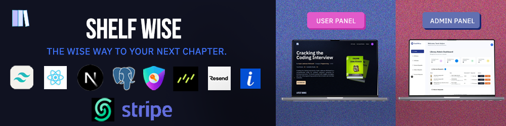

<!-- markdownlint-disable MD033 MD041 -->
<p align="center">
  
</p>

<p align="center">
  <a href="https://github.com/TanvirAnjumApurbo/shelfwise/blob/main/LICENSE"></a>
  <a href="https://github.com/TanvirAnjumApurbo/shelfwise/actions/workflows/ci.yml"></a>
  <a href="https://github.com/TanvirAnjumApurbo/shelfwise/stargazers"></a>
  <a href="https://github.com/TanvirAnjumApurbo/shelfwise/network/members"></a>
</p>


# 📚 Shelfwise

Shelfwise is a modern library management platform built for universities that combines catalog curation, automated circulation workflows, digital services, and analytics into a single experience. It streamlines everything from onboarding new collections to processing fines, empowering librarians and students with real-time insights.

With Shelfwise, institutions reduce manual processes, stay on top of compliance, and deliver a better borrowing experience via a secure, scalable, and fully auditable stack.

---

## 🧭 Table of Contents

- [📚 Shelfwise](#-shelfwise)
  - [🧭 Table of Contents](#-table-of-contents)
  - [ℹ️ About {#about}](#ℹ️-about-about)
  - [✨ Features {#features}](#-features-features)
  - [🛠 Tech Stack {#tech-stack}](#-tech-stack-tech-stack)
    - [🎨 Frontend {#frontend}](#-frontend-frontend)
    - [🧩 Backend {#backend}](#-backend-backend)
    - [🗄️ Database \& Storage {#database--storage}](#️-database--storage-database--storage)
    - [🛠️ DevOps \& Infrastructure {#devops--infrastructure}](#️-devops--infrastructure-devops--infrastructure)
    - [🌐 APIs \& Services {#apis--services}](#-apis--services-apis--services)
  - [🗂 Project Structure {#project-structure}](#-project-structure-project-structure)
  - [🚀 Getting Started {#getting-started}](#-getting-started-getting-started)
    - [✅ Prerequisites {#prerequisites}](#-prerequisites-prerequisites)
    - [📦 Installation {#installation}](#-installation-installation)
    - [🧪 Local Development {#local-development}](#-local-development-local-development)
  - [🔐 Environment Variables {#environment-variables}](#-environment-variables-environment-variables)
  - [📎 Usage {#usage}](#-usage-usage)
  - [🤝 Contribution {#contribution}](#-contribution-contribution)
  - [📄 License {#license}](#-license-license)
  - [🙌 Acknowledgements {#acknowledgements}](#-acknowledgements-acknowledgements)

## ℹ️ About {#about}

Shelfwise is a **Next.js + React (TypeScript)** powered academic library platform focused on performance, reliability, and extensibility. Instead of stitching together isolated tools for circulation, fines, catalog records, and student notifications, Shelfwise unifies them under one coherent architecture. Core concerns like authentication, rate limiting, audit logging, workflow orchestration, and background job processing are built-in—freeing institutions to focus on policy and service quality rather than infrastructure glue.

Key architectural principles:

- **Edge-aligned delivery**: Next.js App Router + server components where appropriate for reduced client bundle weight.
- **Type safety end‑to‑end**: Drizzle ORM + strict TypeScript config ensures schema-driven correctness and refactor resilience.
- **Deterministic workflows**: Idempotent background jobs handle penalty reconciliation, payment lifecycle hooks, and status propagation.
- **Observability & auditability**: Structured audit schema + metrics hooks (rate limits, request categorization, job timings) support compliance.
- **Security posture**: Hardened Auth.js sessions, scoped API surfaces, rate limiting via Upstash, and minimized secret exposure.

Shelfwise aims to become a foundation for campus-level knowledge and resource access, adaptable to multi-campus or consortium deployments in future roadmap milestones.

## ✨ Features {#features}

- 📚 **Unified catalog management** – curate digital and physical collections with configurable metadata and rich media assets.
- 🚀 **Frictionless circulation** – automate borrow/return flows, due-date reminders, and penalty calculations with built-in audit logging.
- 💳 **Integrated payments** – process fines securely via Stripe and reconcile transactions through automated workflows.
- 🛡️ **Role-based access control** – safeguard admin tools and student portals with granular permissions and session management.
- 📈 **Operational analytics** – monitor usage, student status, and inventory health with real-time dashboards and exports.
- 🔌 **Extensible workflows** – trigger background jobs, webhooks, and email notifications using Upstash, Resend, and QStash integrations.

## 🛠 Tech Stack {#tech-stack}

### 🎨 Frontend {#frontend}

<p>
  
  
  
  
</p>

### 🧩 Backend {#backend}

<p>
  
  
  
</p>

### 🗄️ Database & Storage {#database--storage}

<p>
  
  
  
</p>

### 🛠️ DevOps & Infrastructure {#devops--infrastructure}

<p>
  
  
  
</p>

### 🌐 APIs & Services {#apis--services}

<p>
  
  
  
  
</p>

## 🗂 Project Structure {#project-structure}

```bash
├── assets/
│   └── banner.png
├── app/
│   ├── (auth)/
│   ├── (root)/
│   ├── admin/
│   ├── api/
│   ├── fonts/
│   └── test-payment/
├── components/
│   ├── BookCard.tsx
│   ├── BorrowBook.tsx
│   ├── admin/
│   └── ui/
├── database/
│   ├── schema.ts
│   ├── fines-schema.ts
│   └── drizzle.ts
├── lib/
│   ├── actions/
│   ├── utils.ts
│   └── workflow.ts
├── migrations/
├── public/
│   ├── icons/
│   └── images/
├── scripts/
├── styles/
├── package.json
├── tsconfig.json
└── README.md
```

> 💡 Explore the `lib/` and `database/` folders to see how workflows, audit logging, and migrations are orchestrated.

## 🚀 Getting Started {#getting-started}

### ✅ Prerequisites {#prerequisites}

- Next.js >= 15 (LTS recommended)
- pnpm, npm, or yarn package manager
- Docker (optional, for containerized services)

### 📦 Installation {#installation}

1. Clone the repository:
   ```bash
   git clone https://github.com/TanvirAnjumApurbo/shelfwise.git
   cd shelfwise
   ```
2. Install dependencies:
   ```bash
   pnpm install
   # or
   npm install
   ```
3. Generate environment files and database schema:
   ```bash
   pnpm db:generate      # drizzle-kit generate
   pnpm db:migrate       # run latest migrations
   ```

### 🧪 Local Development {#local-development}

```bash
pnpm dev
# or
npm run dev
```

For Docker-based setups:

```bash
docker compose up -d
```

Once running, browse to [http://localhost:3000](http://localhost:3000) and sign in with a seeded test account.

## 🔐 Environment Variables {#environment-variables}

Create a `.env.local` file or copy from `.env.example`:

```dotenv
NEXT_PUBLIC_IMAGEKIT_URL_ENDPOINT=
NEXT_PUBLIC_IMAGEKIT_PUBLIC_KEY=
IMAGEKIT_PRIVATE_KEY=

NEXT_PUBLIC_API_ENDPOINT=

DATABASE_URL=
AUTH_SECRET=

UPSTASH_REDIS_REST_URL=
UPSTASH_REDIS_REST_TOKEN=

QSTASH_URL=
QSTASH_TOKEN=
QSTASH_CURRENT_SIGNING_KEY=
QSTASH_NEXT_SIGNING_KEY=

NEXT_PUBLIC_PROD_API_ENDPOINT=

RESEND_TOKEN=

NEXT_PUBLIC_STRIPE_PUBLISHABLE_KEY=
STRIPE_SECRET_KEY=
STRIPE_WEBHOOK_SECRET=
```

> 🔐 Treat secrets carefully. Never commit plain-text credentials to version control.

## 📎 Usage {#usage}

- Run background jobs for penalty reconciliation:
  ```bash
  pnpm workflow:run penalties
  ```
- Trigger sample data loads for demos:
  ```bash
  pnpm ts-node create-test-data.js
  ```
- Access the admin dashboard at `http://localhost:3000/admin` to review borrow requests and fines.
- Preview the student borrower portal at `http://localhost:3000/too-fast` for rate-limited scenarios.
- Optional: review UI states using Storybook _(coming soon)_.

## 🤝 Contribution {#contribution}

We ❤️ contributions!

| Name     | ID/GitHub Username | Role               |
| -------- | ------------------ | ------------------ |
| Member 1 | @id1               | Backend Developer  |
| Member 2 | @id2               | Frontend Developer |
| Member 3 | @id3               | DevOps/Infra       |
| Member 4 | @id4               | Documentation/QA   |

## 📄 License {#license}

This project is licensed under the [MIT License](LICENSE).

## 🙌 Acknowledgements {#acknowledgements}

- ⚡️ [Next.js](https://nextjs.org/) and the Vercel team for the app router and deployment tooling.
- 🧠 [Drizzle ORM](https://orm.drizzle.team/) for typesafe database migrations and queries.
- ✉️ [Resend](https://resend.com/) and [Stripe](https://stripe.com/) for developer-friendly APIs.
- ☁️ [Upstash](https://upstash.com/) for durable rate limiting and background workflows.
- ✨ Community inspirations from modern library systems and campus IT groups.
